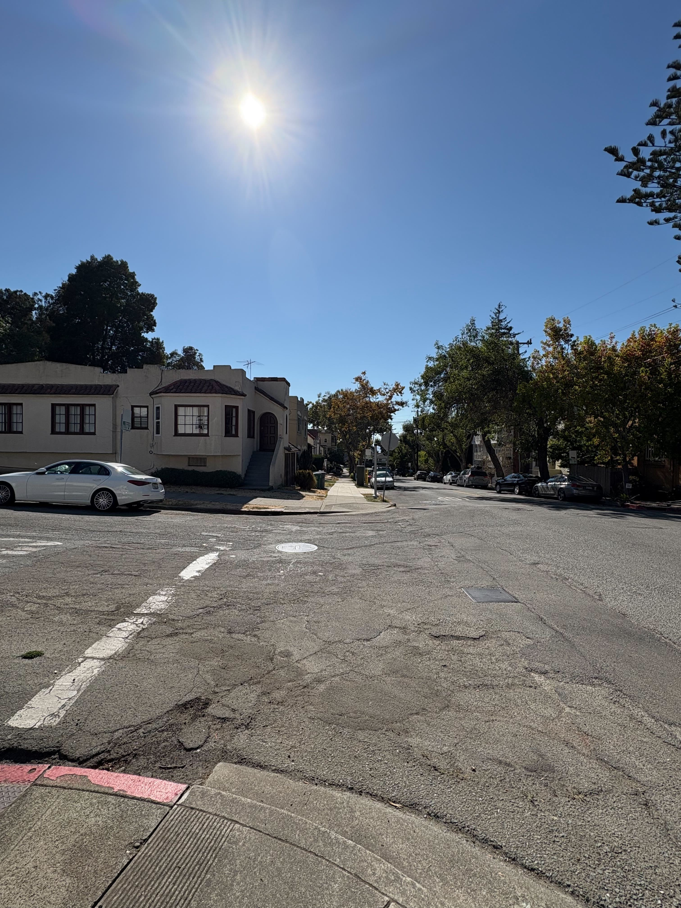

<link href="https://fonts.googleapis.com/css2?family=Inter:wght@300;400;600;800&family=Playfair+Display:wght@600;700&display=swap" rel="stylesheet">

  

<h2 align="center" style="font-family: 'Playfair Display', serif; font-size: 2.2rem; margin: 0.2rem 0 0.4rem; letter-spacing: 0.3px; background: linear-gradient(90deg, #5B8DEF, #A78BFA); -webkit-background-clip: text; background-clip: text; -webkit-text-fill-color: transparent; color: transparent;">Alper Gel — Project 0</h2>

<h3 style="font-family: 'Inter', -apple-system, BlinkMacSystemFont, 'Segoe UI', Roboto, 'Helvetica Neue', Arial; font-weight: 700; margin: 12px 0 10px; color: #0f172a; letter-spacing: 0.2px;">Part 1: Selfie — The Wrong Way vs. The Right Way</h3>

<table>
  <tr>
    <td>
      

        
         
        Close up image, 1x zoom, face framed by camera grid lines
      

    </td>
    <td>
      

        
         
        Farther away image, 2x zoom, face framed by same camera grid lines
      

    </td>
 
  </tr>
</table>

<h3 style="font-family: 'Inter', -apple-system, BlinkMacSystemFont, 'Segoe UI', Roboto, 'Helvetica Neue', Arial; font-weight: 700; margin: 12px 0 10px; color: #0f172a; letter-spacing: 0.2px;">Part 2: Architectural Perspective Compression</h3>

<table>
  <tr>
    <td>
      

        
         
        2x zoom around 3 feet away from photo 2 capture position
      

    </td>
    <td>
      

        
         
        1x zoom of street from same position as photo 3
      

    </td>
    <td>
      

        
         
        0.5x zoom of street from same position as photo 2
      

    </td>
  </tr>
</table>

<h3 style="font-family: 'Inter', -apple-system, BlinkMacSystemFont, 'Segoe UI', Roboto, 'Helvetica Neue', Arial; font-weight: 700; margin: 12px 0 10px; color: #0f172a; letter-spacing: 0.2px;">Part 3: The Dolly Zoom</h3>

This dolly zoom showcases my roommates car. This was done by aligning and leveling the car to a grid square, taking a picture, then moving back, then zooming enough for the Totoro to be aligned within the same grid square again.

  
   

