<link href="https://fonts.googleapis.com/css2?family=Inter:wght@300;400;600;800&family=Playfair+Display:wght@600;700&display=swap" rel="stylesheet">

  

<h2 align="center" style="font-family: 'Playfair Display', serif; font-size: 2.2rem; margin: 0.2rem 0 0.4rem; letter-spacing: 0.3px; background: linear-gradient(90deg, #5B8DEF, #A78BFA); -webkit-background-clip: text; background-clip: text; -webkit-text-fill-color: transparent; color: transparent;">Alper Gel — Project 1</h2>

<h2 id="project-overview" style="font-family: 'Playfair Display', serif; font-size: 1.7rem; margin: 0.5rem 0 1rem;">Project Overview</h2>

Welcome to my CS180 Project 1 site! This page provides a comprehensive overview of my implementation, results, and analysis for the Prokudin-Gorskii image alignment project. 

<ul style="margin: 0 0 12px 18px; color: #334155;">
  <li><b>Visual Results:</b> Click on each image in the galleries below to expand it!</li>
  <li><b>Logs & Analysis:</b> Logs from each of the alignment methods can be clicked and expanded to show the displacements found for each image in terms of dy, dx, and the time the method took to run all 14 images</li>
</ul>

<h3 id="required-part-1" style="font-size: 1.4rem; margin: 18px 0 8px;">Required Part 1: Single Scale Approach</h3>

For part 1, programmed in the file process.py, I implemented a simple single-scale exhaustive search approach to align the three color channels of the given historical Prokudin-Gorskii glass plate photographs.
The alignment process begins by splitting the grayscale input image into three equal vertical sections representing the blue (top), green (middle), and red (bottom) channels. In order to provide results for all 14 in our dataset, for computational efficiency, images larger than 2000 pixels in height are downsampled by a factor of 4 before processing. The green channel is used as the reference that is not moved, and both blue and red channels are aligned to it independently.
The core matching algorithm in the align_single_scale function performs an exhaustive search over a window of possible displacements (typically ±20 pixels in both x and y directions). For each candidate displacement, it shifts one channel relative to the other and computes a the Sum of Squared Differences (SSD) as its matching criterion. All SSD does is calculating the squared difference between overlapping pixel intensities and summing them up. The displacement that yields the minimum SSD score is selected as the best alignment.
To improve matching results, and avoid influence by the problematic borders, I excluded the border regions (20% margin on each side) when computing the similarity score. The algorithm only evaluates the inner portion of the image where actual content is present, ensuring that the matching focuses on meaningful image features rather than scanning artifacts.
Once the optimal displacements are found, the final step applies these shifts using np.roll to align the blue and red channels with the green reference. The three aligned channels are then stacked together to create the final color image. As expected in the project spec, this naive approach works effectively for smaller images but has limitations with larger, high-resolution images where a multi-scale pyramid approach (as implemented in process_pyramid.py) would be more appropriate.

  <figure style="margin: 0;">
    
    <figcaption style="font-size: 0.9rem; color: #64748b; margin-top: 6px;">Result 01</figcaption>
  </figure>
  <figure style="margin: 0;">
    
    <figcaption style="font-size: 0.9rem; color: #64748b; margin-top: 6px;">Result 02</figcaption>
  </figure>
  <figure style="margin: 0;">
    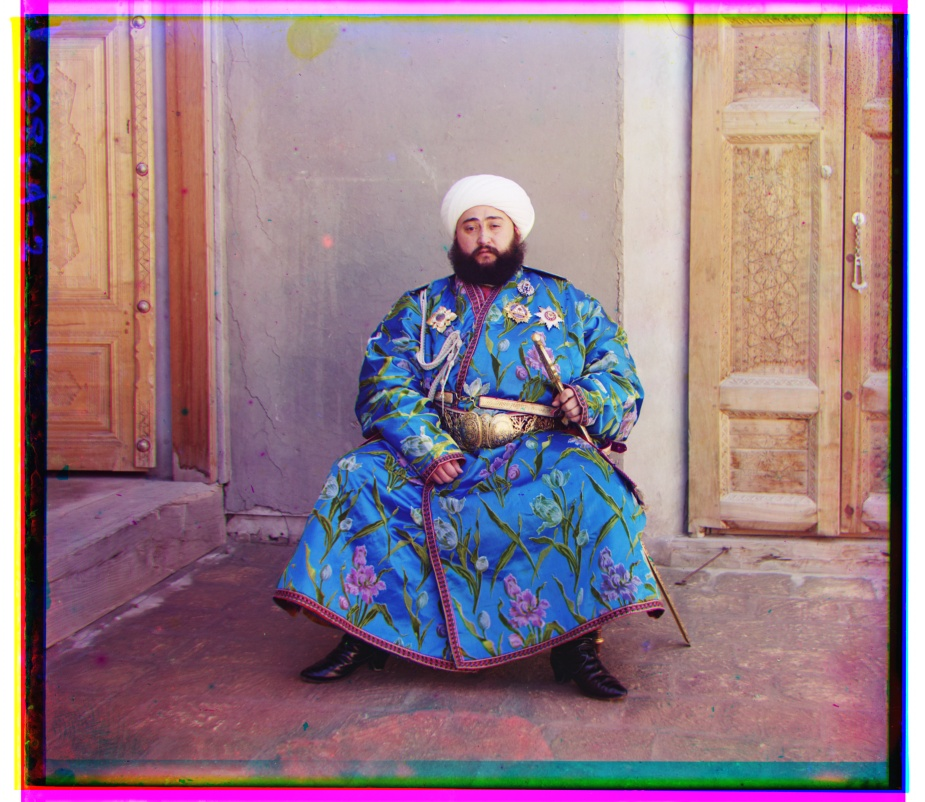
    <figcaption style="font-size: 0.9rem; color: #64748b; margin-top: 6px;">Result 03</figcaption>
  </figure>
  <figure style="margin: 0;">
    
    <figcaption style="font-size: 0.9rem; color: #64748b; margin-top: 6px;">Result 04</figcaption>
  </figure>
  <figure style="margin: 0;">
    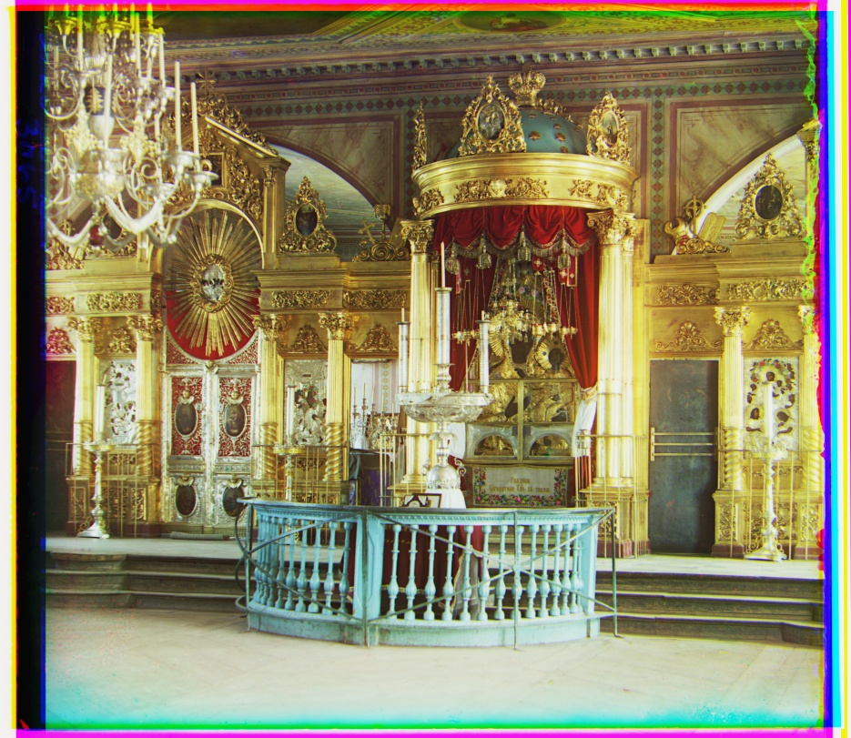
    <figcaption style="font-size: 0.9rem; color: #64748b; margin-top: 6px;">Result 05</figcaption>
  </figure>
  <figure style="margin: 0;">
    
    <figcaption style="font-size: 0.9rem; color: #64748b; margin-top: 6px;">Result 06</figcaption>
  </figure>
  <figure style="margin: 0;">
    
    <figcaption style="font-size: 0.9rem; color: #64748b; margin-top: 6px;">Result 07</figcaption>
  </figure>
  <figure style="margin: 0;">
    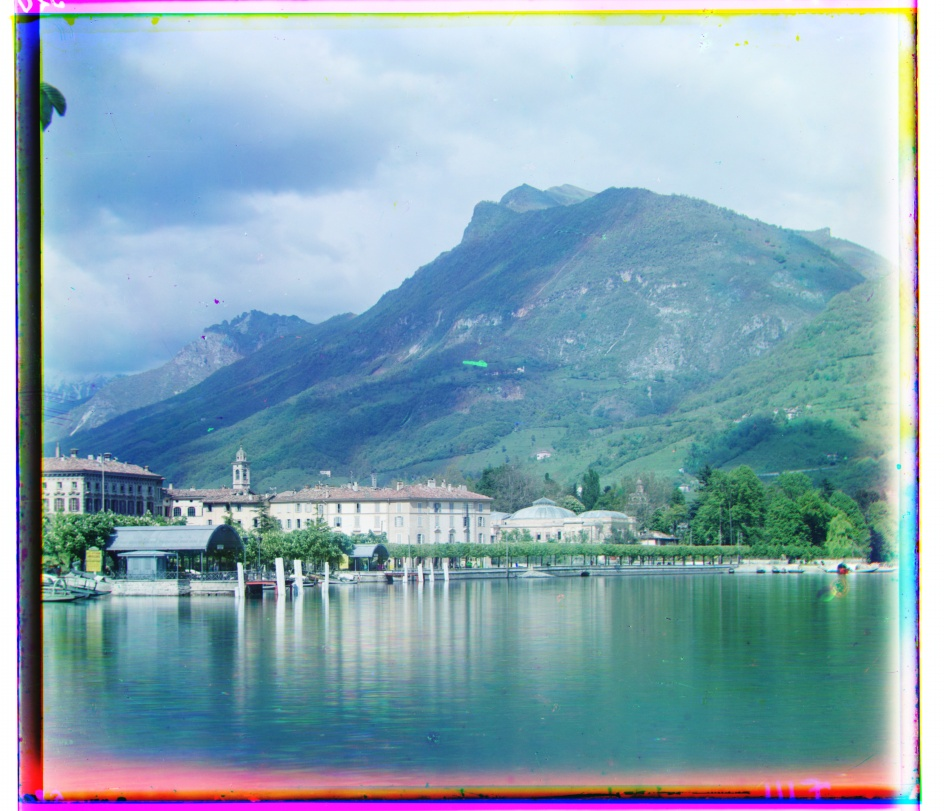
    <figcaption style="font-size: 0.9rem; color: #64748b; margin-top: 6px;">Result 08</figcaption>
  </figure>
  <figure style="margin: 0;">
    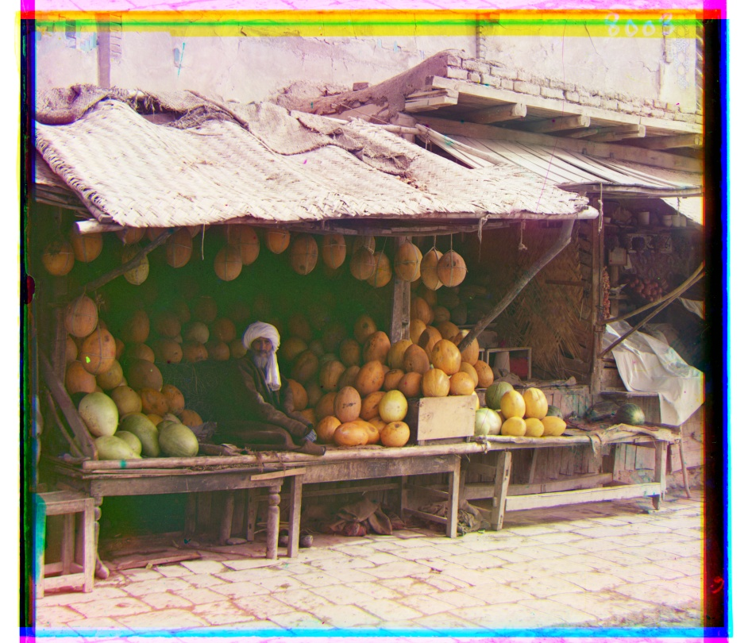
    <figcaption style="font-size: 0.9rem; color: #64748b; margin-top: 6px;">Result 09</figcaption>
  </figure>
  <figure style="margin: 0;">
    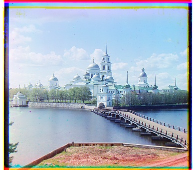
    <figcaption style="font-size: 0.9rem; color: #64748b; margin-top: 6px;">Result 10</figcaption>
  </figure>
  <figure style="margin: 0;">
    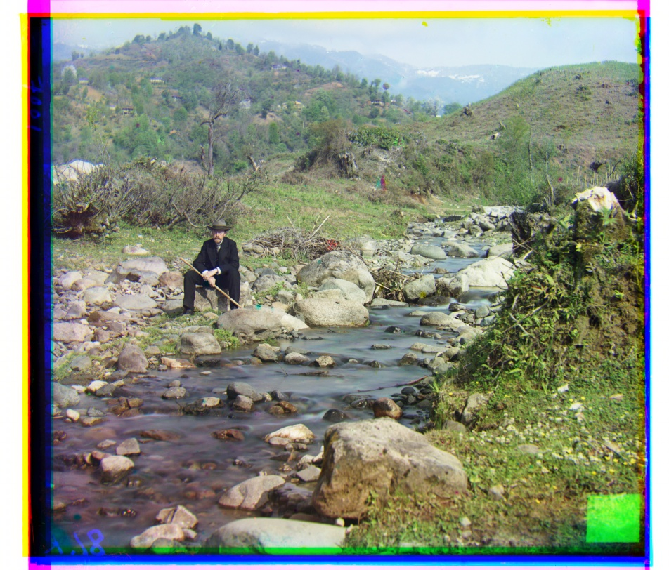
    <figcaption style="font-size: 0.9rem; color: #64748b; margin-top: 6px;">Result 11</figcaption>
  </figure>
  <figure style="margin: 0;">
    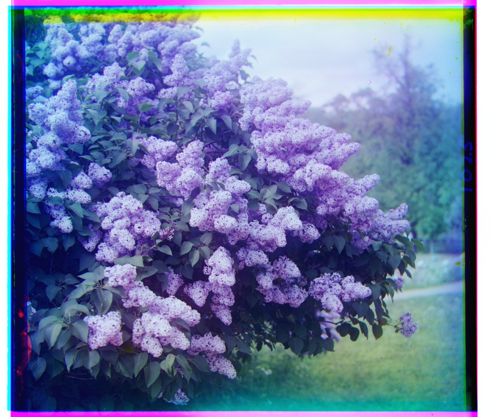
    <figcaption style="font-size: 0.9rem; color: #64748b; margin-top: 6px;">Result 12</figcaption>
  </figure>
  <figure style="margin: 0;">
    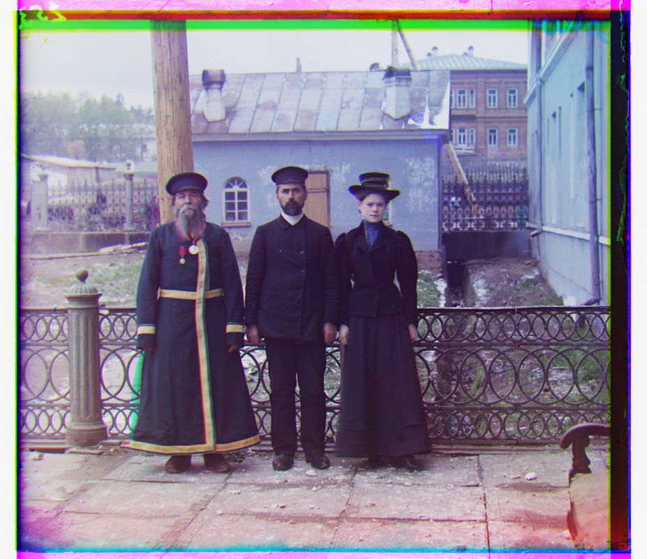
    <figcaption style="font-size: 0.9rem; color: #64748b; margin-top: 6px;">Result 13</figcaption>
  </figure>
  <figure style="margin: 0;">
    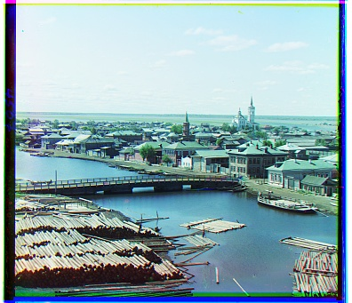
    <figcaption style="font-size: 0.9rem; color: #64748b; margin-top: 6px;">Result 14</figcaption>
  </figure>

  <!-- Image Lightbox Overlay -->
  

    

      <button type="button" id="img-lightbox-close" aria-label="Close image" style="position: absolute; top: -10px; right: -10px; background: #0f172a; color: #fff; border: none; border-radius: 999px; width: 36px; height: 36px; cursor: pointer; font-size: 20px; line-height: 36px; text-align: center;">×</button>
      
      

    

  

  

  
View logs

  <pre style="white-space: pre-wrap; background: #f8fafc; border: 1px solid #e5e7eb; border-radius: 8px; padding: 10px; color: #0f172a; margin-top: 8px;">
  (base) root@MSI:/mnt/c/Users/aalis/Documents/Code/Class/FA25/CS180/Project-1# python3 process.py Inputs/  Output_naive/ -d 50
    Found 14 images to process
    Using displacement: ±50
    --------------------------------------------------
    Processing cathedral:  shape (1024, 390)
    Blue-Green Dy: -5; Dx: -2
    Red-Green Dy: 7; Dx: 1
    Output saved to: Output_naive/cathedral/aligned_out.jpg
    Processing monastery:  shape (1024, 391)
    Blue-Green Dy: 3; Dx: -2
    Red-Green Dy: 6; Dx: 1
    Output saved to: Output_naive/monastery/aligned_out.jpg
    Processing tobolsk:  shape (1024, 396)
    Blue-Green Dy: -3; Dx: -3
    Red-Green Dy: 4; Dx: 1
    Output saved to: Output_naive/tobolsk/aligned_out.jpg
    Processing church:  shape (9607, 3634)
    Resizing church By 4
    Blue-Green Dy: -6; Dx: -1
    Red-Green Dy: 8; Dx: -2
    Output saved to: Output_naive/church/aligned_out.jpg
    Processing emir:  shape (9627, 3702)
    Resizing emir By 4
    Blue-Green Dy: -12; Dx: -6
    Red-Green Dy: 14; Dx: 4
    Output saved to: Output_naive/emir/aligned_out.jpg
    Processing harvesters:  shape (9656, 3683)
    Resizing harvesters By 4
    Blue-Green Dy: -14; Dx: -4
    Red-Green Dy: 16; Dx: -1
    Output saved to: Output_naive/harvesters/aligned_out.jpg
    Processing icon:  shape (9732, 3741)
    Resizing icon By 4
    Blue-Green Dy: -10; Dx: -4
    Red-Green Dy: 12; Dx: 1
    Output saved to: Output_naive/icon/aligned_out.jpg
    Processing italil:  shape (9693, 3719)
    Resizing italil By 4
    Blue-Green Dy: -9; Dx: -5
    Red-Green Dy: 9; Dx: 4
    Output saved to: Output_naive/italil/aligned_out.jpg
    Processing lastochikino:  shape (9723, 3700)
    Resizing lastochikino By 4
    Blue-Green Dy: 1; Dx: 1
    Red-Green Dy: 20; Dx: -2
    Output saved to: Output_naive/lastochikino/aligned_out.jpg
    Processing lugano:  shape (9733, 3779)
    Resizing lugano By 4
    Blue-Green Dy: -10; Dx: 4
    Red-Green Dy: 13; Dx: -3
    Output saved to: Output_naive/lugano/aligned_out.jpg
    Processing melons:  shape (9724, 3770)
    Resizing melons By 4
    Blue-Green Dy: -20; Dx: -3
    Red-Green Dy: 24; Dx: 1
    Output saved to: Output_naive/melons/aligned_out.jpg
    Processing self_portrait:  shape (9754, 3810)
    Resizing self_portrait By 4
    Blue-Green Dy: -19; Dx: -7
    Red-Green Dy: 24; Dx: 2
    Output saved to: Output_naive/self_portrait/aligned_out.jpg
    Processing siren:  shape (9752, 3817)
    Resizing siren By 4
    Blue-Green Dy: -12; Dx: 1
    Red-Green Dy: 11; Dx: -5
    Output saved to: Output_naive/siren/aligned_out.jpg
    Processing three_generations:  shape (9629, 3714)
    Resizing three_generations By 4
    Blue-Green Dy: -13; Dx: -4
    Red-Green Dy: 15; Dx: -1
    Output saved to: Output_naive/three_generations/aligned_out.jpg
    --------------------------------------------------
    Processing completed: 14/14 images successful
    Total processing time: 215.29 seconds
  </pre>

<h3 id="required-part-2" style="font-size: 1.4rem; margin: 18px 0 8px;">Required Part 2: Image Pyramid Approach</h3>

The image matching methodology in process_pyramid.py implements a multi-scale pyramid alignment approach that significantly improves upon the previous single-scale method for cases where we have to handle large, high-resolution images.
The pyramid construction begins with the build_pyramid function, which creates a hierarchical representation of each image by repeatedly downsampling by a factor of 2, and using INTER_AREA interpolation provided by OpenCV. The number of pyramid levels is dynamically calculated based on image dimensions, ensuring the coarsest level has a minimum dimension of around 256 pixels. I originally tried 32 pixels, but then it over-optimized it, and caused major visual artifacts, so increasing the final layer resolution allowed for an actual searchable image. This creates a sequence of images from coarse (heavily downsampled) to fine (original resolution), allowing the algorithm to capture both large-scale structural alignment and fine detail matching.
The multi-scale alignment process in align_pyramid works by starting at the coarsest pyramid level where the search is computationally cheap and large misalignments are easier to detect. At each level, it performs the same exhaustive search as the single-scale method using SSD (Sum of Squared Differences) within a displacement window. However, the main difference is that the optimal displacement (dx, dy) found at each previous level is propagated to the next level (which has higher res) as an initial center point. Thus, when moving to a finer level, the displacement must be doubled (given the image is twice as large in pixel count) and the search window is halved, in order to focus the search around the existing approximate alignment from the previous level. 
Overall, this coarse-to-fine approach allows for dramatically less computation time by limiting search space at finer resolutions, improves robustness by capturing large displacements at coarse scales that could be missed at finer resolutions (local minima), and is only 1/3 more memory in terms of the efficiency of the image pyramid. 
The final aligment applies the accumulated displacement from all pyramid levels to the original full resolution image using the given np.roll function. Exactly like the single-scale, it excludes 20% border margins when computing the similarity scores to avoid the scanning artifacts from biasing the calculation. This pyramid approach enables accurate alignment of very large images that would be difficult in single-scale exhaustive search, while maintaining (and in some edge-cases improving) the alignment quality through iterative hierarchical refinement.

  <figure style="margin: 0;">
    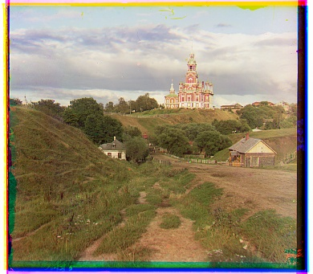
    <figcaption style="font-size: 0.9rem; color: #64748b; margin-top: 6px;">Result 01</figcaption>
  </figure>
  <figure style="margin: 0;">
    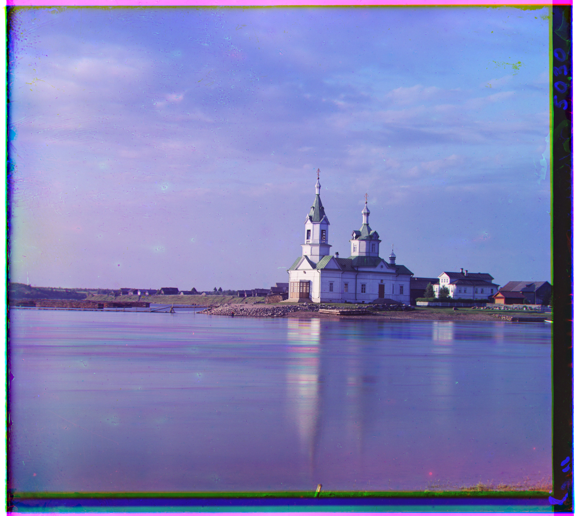
    <figcaption style="font-size: 0.9rem; color: #64748b; margin-top: 6px;">Result 02</figcaption>
  </figure>
  <figure style="margin: 0;">
    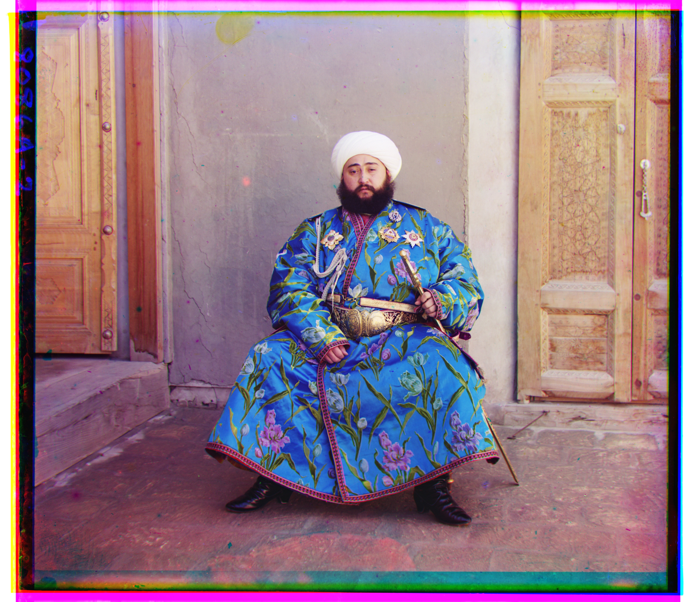
    <figcaption style="font-size: 0.9rem; color: #64748b; margin-top: 6px;">Result 03</figcaption>
  </figure>
  <figure style="margin: 0;">
    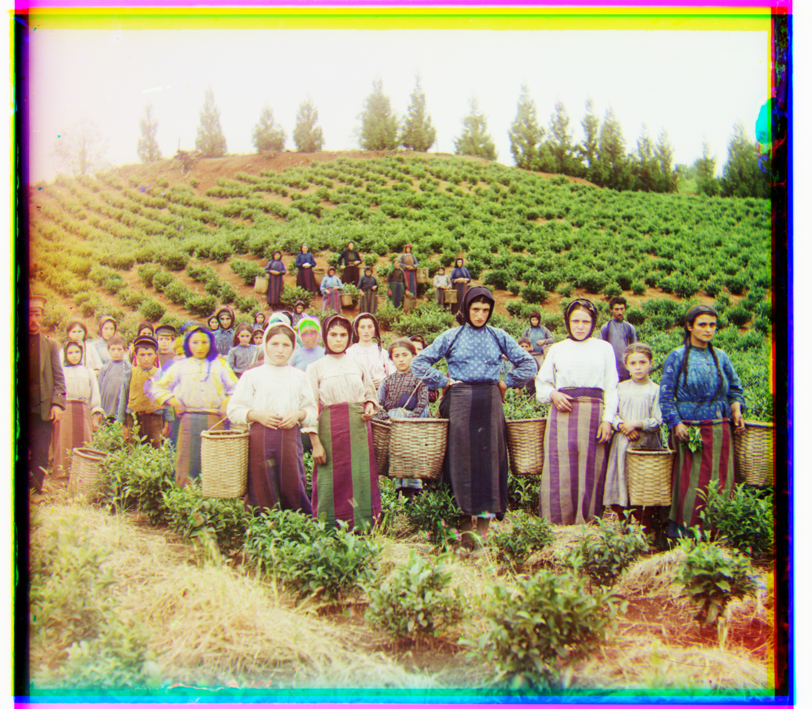
    <figcaption style="font-size: 0.9rem; color: #64748b; margin-top: 6px;">Result 04</figcaption>
  </figure>
  <figure style="margin: 0;">
    
    <figcaption style="font-size: 0.9rem; color: #64748b; margin-top: 6px;">Result 05</figcaption>
  </figure>
  <figure style="margin: 0;">
    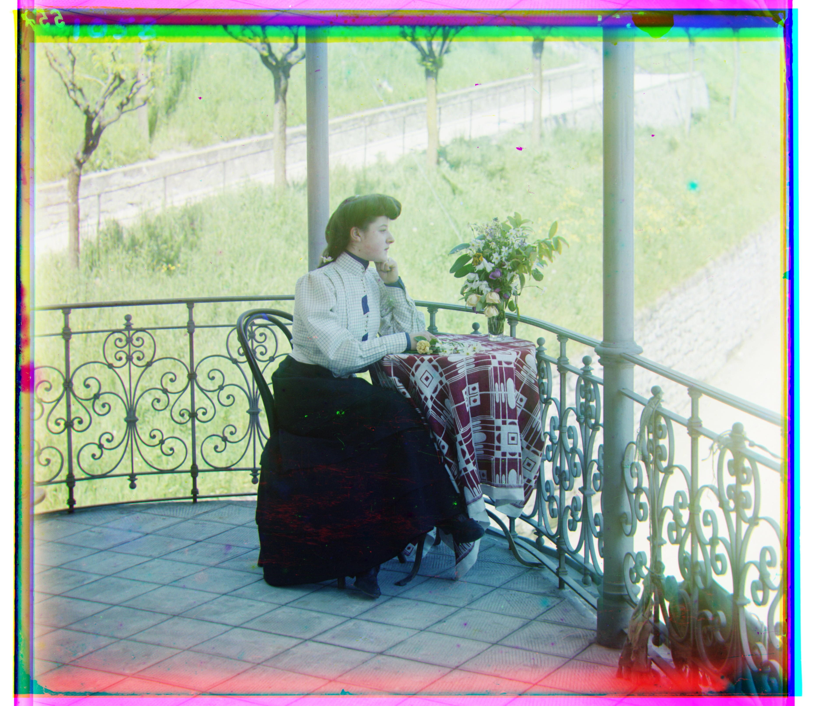
    <figcaption style="font-size: 0.9rem; color: #64748b; margin-top: 6px;">Result 06</figcaption>
  </figure>
  <figure style="margin: 0;">
    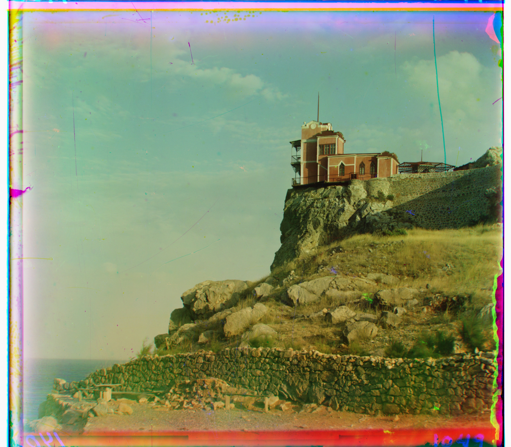
    <figcaption style="font-size: 0.9rem; color: #64748b; margin-top: 6px;">Result 07</figcaption>
  </figure>
  <figure style="margin: 0;">
    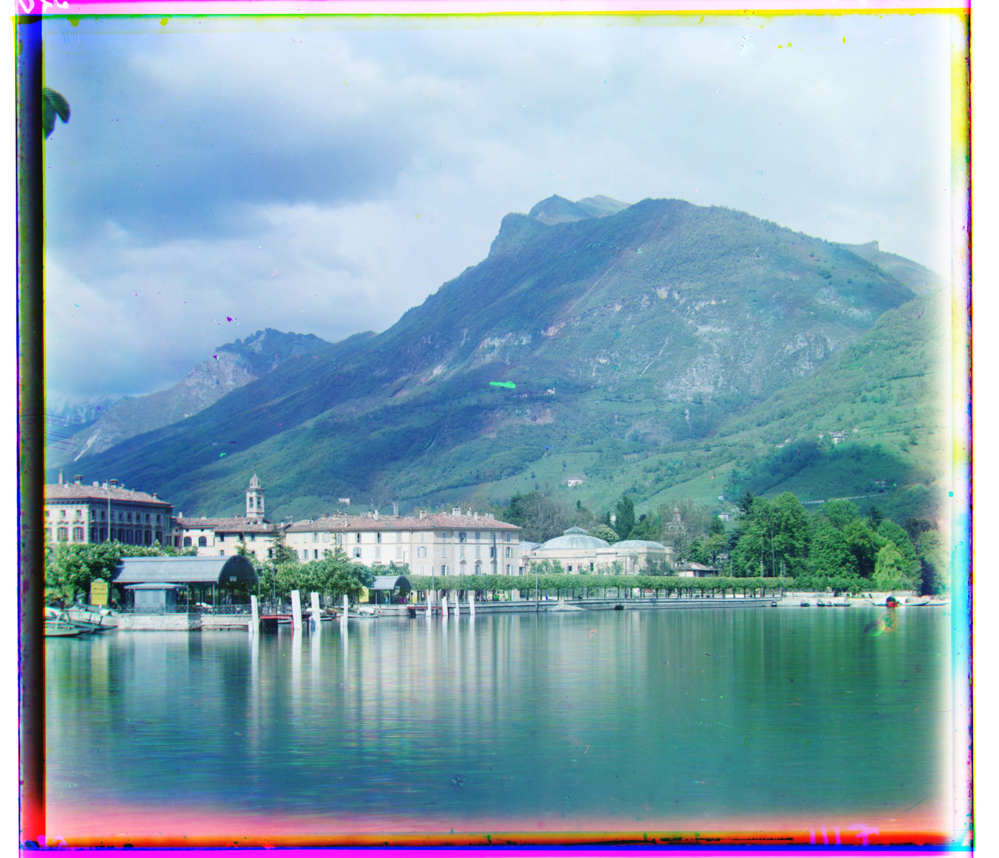
    <figcaption style="font-size: 0.9rem; color: #64748b; margin-top: 6px;">Result 08</figcaption>
  </figure>
  <figure style="margin: 0;">
    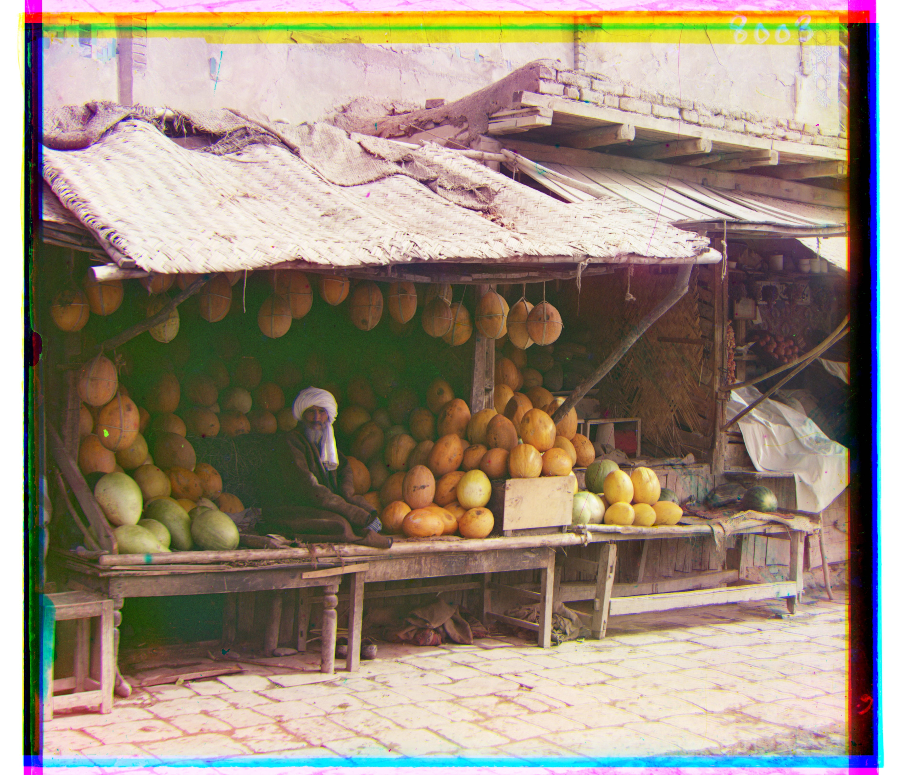
    <figcaption style="font-size: 0.9rem; color: #64748b; margin-top: 6px;">Result 09</figcaption>
  </figure>
  <figure style="margin: 0;">
    
    <figcaption style="font-size: 0.9rem; color: #64748b; margin-top: 6px;">Result 10</figcaption>
  </figure>
  <figure style="margin: 0;">
    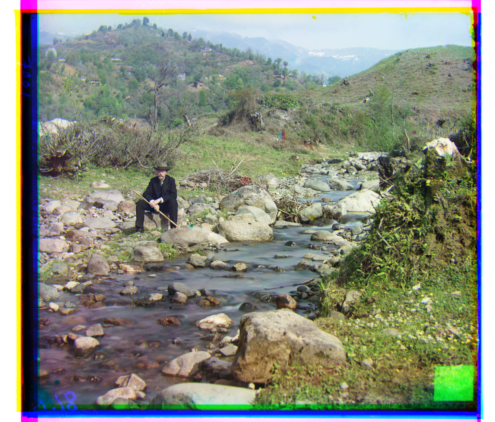
    <figcaption style="font-size: 0.9rem; color: #64748b; margin-top: 6px;">Result 11</figcaption>
  </figure>
  <figure style="margin: 0;">
    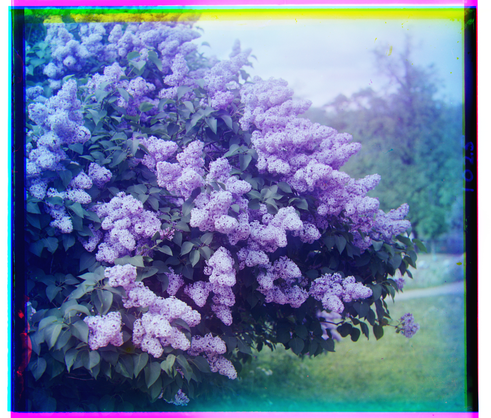
    <figcaption style="font-size: 0.9rem; color: #64748b; margin-top: 6px;">Result 12</figcaption>
  </figure>
  <figure style="margin: 0;">
    
    <figcaption style="font-size: 0.9rem; color: #64748b; margin-top: 6px;">Result 13</figcaption>
  </figure>
  <figure style="margin: 0;">
    
    <figcaption style="font-size: 0.9rem; color: #64748b; margin-top: 6px;">Result 14</figcaption>
  </figure>

  
View logs

  <pre style="white-space: pre-wrap; background: #f8fafc; border: 1px solid #e5e7eb; border-radius: 8px; padding: 10px; color: #0f172a; margin-top: 8px;">
    (base) root@MSI:/mnt/c/Users/aalis/Documents/Code/Class/FA25/CS180/Project-1# python3 process_pyramid.py Inputs/  Output_pyr/
    Blue-Green Dy: -5; Dx: -2
    Red-Green Dy: 7; Dx: 1
    Processed cathedral.jpg: output shape (341, 390, 3)
    Blue-Green Dy: 3; Dx: -2
    Red-Green Dy: 6; Dx: 1
    Processed monastery.jpg: output shape (341, 391, 3)
    Blue-Green Dy: -3; Dx: -3
    Red-Green Dy: 4; Dx: 1
    Processed tobolsk.jpg: output shape (341, 396, 3)
    Blue-Green Dy: -25; Dx: -4
    Red-Green Dy: 33; Dx: -8
    Processed church.tif: output shape (3202, 3634, 3)
    Blue-Green Dy: -49; Dx: -24
    Red-Green Dy: 57; Dx: 17
    Processed emir.tif: output shape (3209, 3702, 3)
    Blue-Green Dy: -59; Dx: -17
    Red-Green Dy: 65; Dx: -3
    Processed harvesters.tif: output shape (3218, 3683, 3)
    Blue-Green Dy: -41; Dx: -17
    Red-Green Dy: 48; Dx: 5
    Processed icon.tif: output shape (3244, 3741, 3)
    Blue-Green Dy: -38; Dx: -21
    Red-Green Dy: 39; Dx: 15
    Processed italil.tif: output shape (3231, 3719, 3)
    Blue-Green Dy: 3; Dx: 2
    Red-Green Dy: 78; Dx: -7
    Processed lastochikino.tif: output shape (3241, 3700, 3)
    Blue-Green Dy: -41; Dx: 16
    Red-Green Dy: 53; Dx: -13
    Processed lugano.tif: output shape (3244, 3779, 3)
    Blue-Green Dy: -82; Dx: -11
    Red-Green Dy: 96; Dx: 3
    Processed melons.tif: output shape (3241, 3770, 3)
    Blue-Green Dy: -78; Dx: -29
    Red-Green Dy: 98; Dx: 8
    Processed self_portrait.tif: output shape (3251, 3810, 3)
    Blue-Green Dy: -50; Dx: 5
    Red-Green Dy: 47; Dx: -19
    Processed siren.tif: output shape (3250, 3817, 3)
    Blue-Green Dy: -52; Dx: -14
    Red-Green Dy: 59; Dx: -3
    Processed three_generations.tif: output shape (3209, 3714, 3)

    Total processing time: 134.69 seconds
  </pre>

<h3 id="bells-1" style="font-size: 1.4rem; margin: 18px 0 8px;">Bells and Whistles 1: Automatic Border Cropping</h3>

Due to the visually jarring nature of the vertical and horizontal single-color segments, I decided to try and remove these automatically. I did a pipeline design, where after the image matching stage, the output image is saved, then gets passed into remove_vertical_border, which takes out any approximately single color columns near the borders of the image, this outputs the mask used to remove the column and the post-processed image. Then the post-processed image gets put through remove_horizontal_border, which does the same thing, but for horizontal segments. Both remove_vertical_border and remove_horizontal_border functions work by detecting and removing uniform color bands that appear as borders in scanned images. The methods follow a similar color-based detection approach but operate in perpendicular directions.
The vertical border removal function analyzes each column of pixels near the image border to find vertical bands of uniform color. It first converts the image to HSV color space and applies median blur for noise reduction. For each column, it calculates the median HSV values and then checks how many pixels in that column are within the specified color tolerance thresholds (for hue, saturation, and value) of the median. If at least the threshold value [85%] of pixels in a column match the median color, that column is marked as uniform. Continuous uniform columns that are at least 3 pixels wide are grouped into bands. The function then creates a mask for these bands, applies morphological operations (closing to fill small gaps and dilation to ensure clean edges), and finally removes the masked columns by keeping only the unmasked portions of the image.
The horizontal border removal function operates identically but analyzes rows instead of columns to detect horizontal bands. It calculates per-row median HSV values and identifies rows where at least 85% of pixels match their row's median color. The key difference is an additional constraint: only bands that appear at the very top (within 5 pixels) or bottom (within 5 pixels) of the image are considered as borders to remove. This prevents the function from removing horizontal bands that might appear in the middle of the image content. After identifying qualifying bands, it creates a mask, applies morphological operations for cleanup, and crops out the masked rows to produce the cleaned image.

This method was not integrated into single-scale, was integrated as an additional output into pyramid method, and was integrated as default into the XFeat method. 

In the images below, I have provided 2 different examples that are directly post-processed from the pyramid method output results in the section above. For each of the two image scenes below, the first image shows the post-process input image, the second is the vertical column cleaning stage, and the third is the horizontal border row cleaning stage. Please note that the cleaned sections of the borders are tough to see, so please click the image to zoom! 

  <figure style="margin: 0;">
    
    <figcaption style="font-size: 0.9rem; color: #64748b; margin-top: 6px;">Input Image</figcaption>
  </figure>
  <figure style="margin: 0;">
    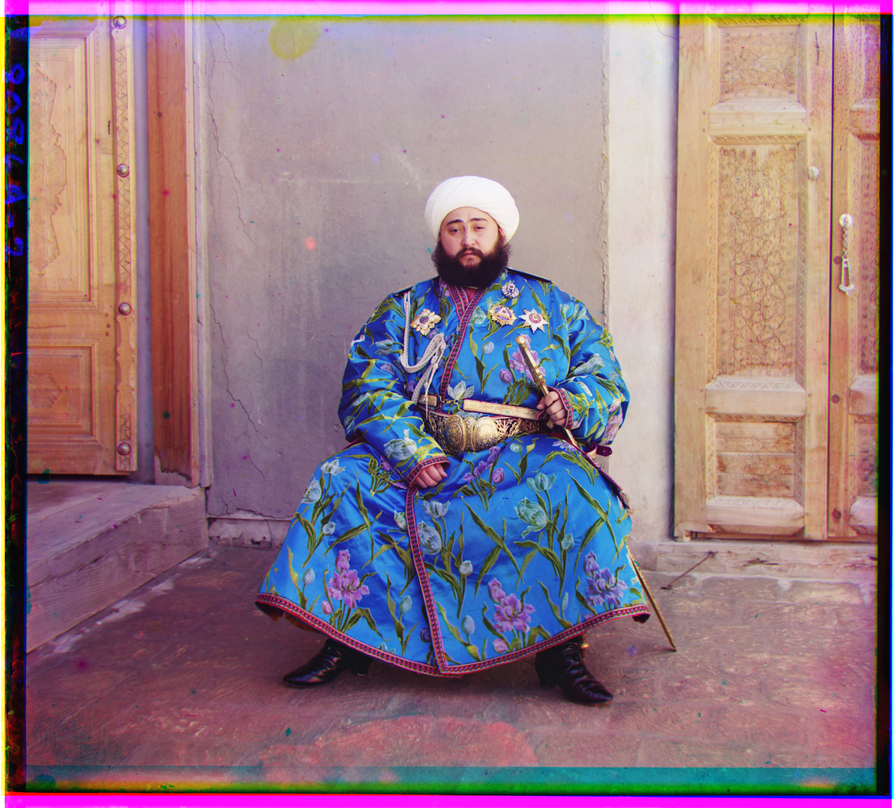
    <figcaption style="font-size: 0.9rem; color: #64748b; margin-top: 6px;">Vertically Cleaned Image</figcaption>
  </figure>
  <figure style="margin: 0;">
    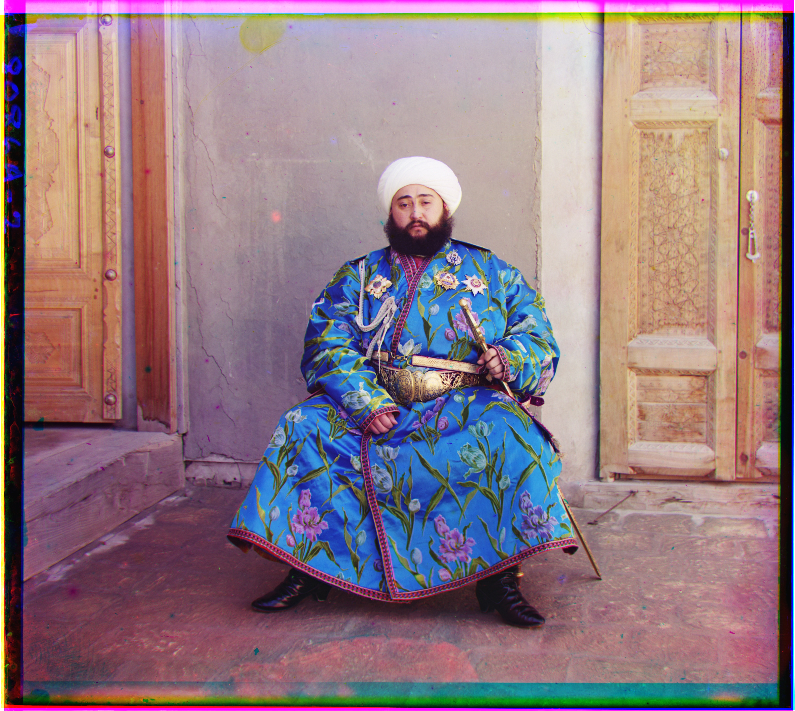
    <figcaption style="font-size: 0.9rem; color: #64748b; margin-top: 6px;">Horizontally Cleaned Image Final Output</figcaption>
  </figure>
  <figure style="margin: 0;">
    
    <figcaption style="font-size: 0.9rem; color: #64748b; margin-top: 6px;">Input Image</figcaption>
  </figure>
  <figure style="margin: 0;">
    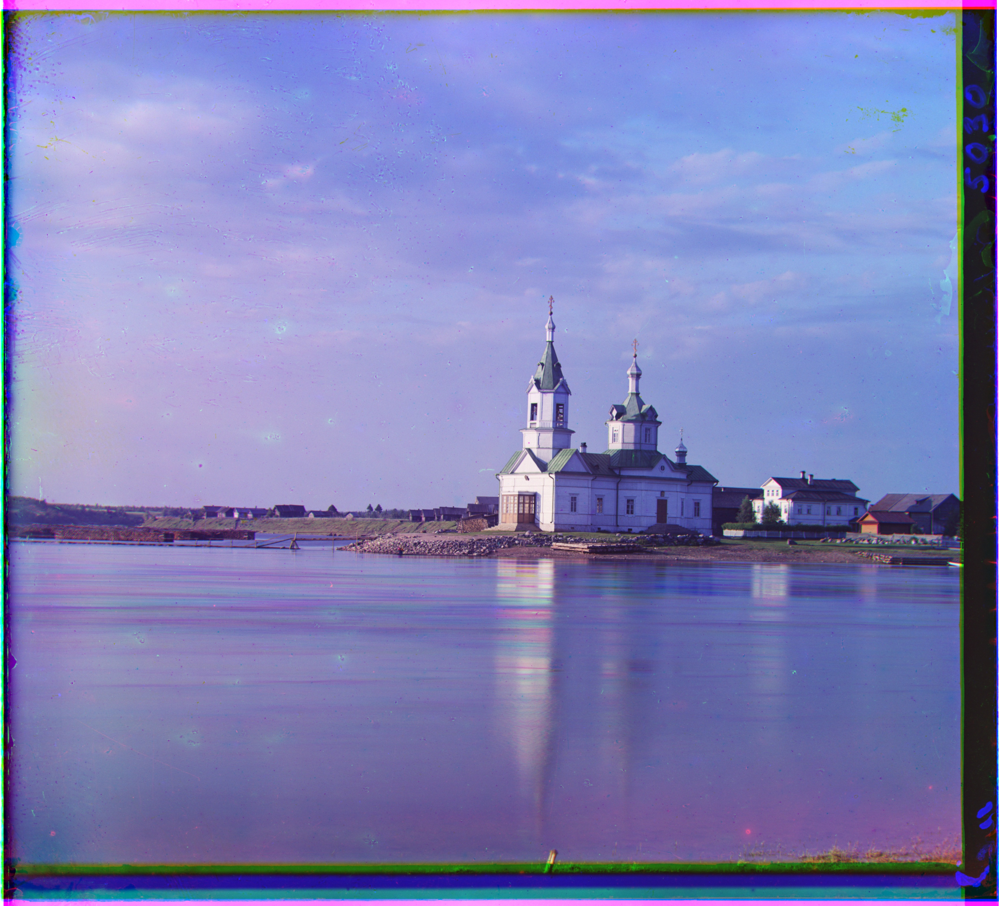
    <figcaption style="font-size: 0.9rem; color: #64748b; margin-top: 6px;">Vertically Cleaned Image</figcaption>
  </figure>
  <figure style="margin: 0;">
    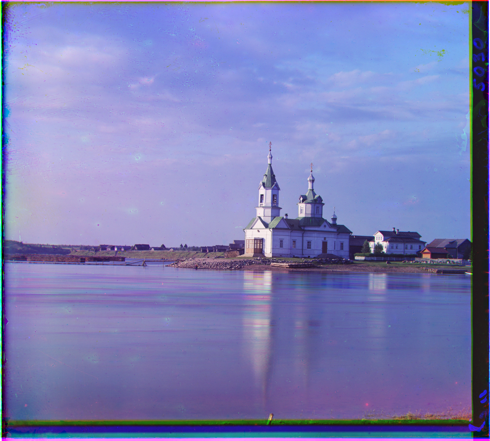
    <figcaption style="font-size: 0.9rem; color: #64748b; margin-top: 6px;">Horizontally Cleaned Image Final Output</figcaption>
  </figure>

<h3 id="bells-2" style="font-size: 1.4rem; margin: 18px 0 8px;">Bells and Whistles 2: Deep Learning Fast Feature Matching</h3>

Based on my significant recent experience using 'learned' feature extractors for Structure from Motion (specifically the hloc library), I decided to use a very fast, and efficient deep learning feature extractor called XFeat (accelerated features), and its 'LighterGlue' smart matching strategy. The inputs are exactly the same as the previous methods, except the two grayscale channel images are converted to RGB 3-channel format (even though visually the images are still grayscale). Then, using the pre-trained XFeat model loaded from PyTorch Hub, the function detects keypoints and computes descriptors for both images, extracting up to 4096 feature points per image. These features are then matched using XFeat's built-in LighterGlue matcher, which uses a lightweight neural network to find correspondences between the detected features. The function returns matched keypoint pairs from both images, requiring a minimum of 10 matches to proceed. If the visualization arg is enabled, it also displays the matches and draws a warped bounding box showing the estimated transformation.
The alignment process in align_with_xfeat() takes the matched keypoint pairs and estimates a geometric transformation to align one channel to another. It uses RANSAC-based estimation of an affine transformation (specifically estimateAffinePartial2D from opencv), which allows for translation, rotation, and uniform scaling while being robust to outliers in the matches. The RANSAC algorithm iteratively finds the best transformation that satisfies the most inlier matches within a 5-pixel reprojection threshold. Once the transformation matrix is computed, it applies the transformation using cv2.warpAffine() to align the second image to the first. This provides us the blue-green or red-green alignment. After alignment, the three channels are stacked to create a color image. 
The method is particularly effective because XFeat provides robust,  learning-based local features that are invariant to various transformations and can handle the challenges of aligning historical photographs where traditional pixel-intensity based feature detectors might struggle. The use of affine transformation provides a good balance between flexibility and stability, preventing unrealistic warping while still correcting for the typical misalignments found in these historical three-channel images. Finally, XFeat is quite quick, even on CPU. In fact, it performed around 20 seconds faster than the pyramid method when doing a full run. Further, I didn't spend any time optimizing, so I think it could be even faster. 

The images below show the result of XFeat matching on the dataset of 14 images.

  <figure style="margin: 0;">
    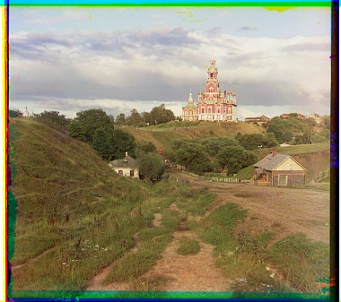
    <figcaption style="font-size: 0.9rem; color: #64748b; margin-top: 6px;">Result 01</figcaption>
  </figure>
  <figure style="margin: 0;">
    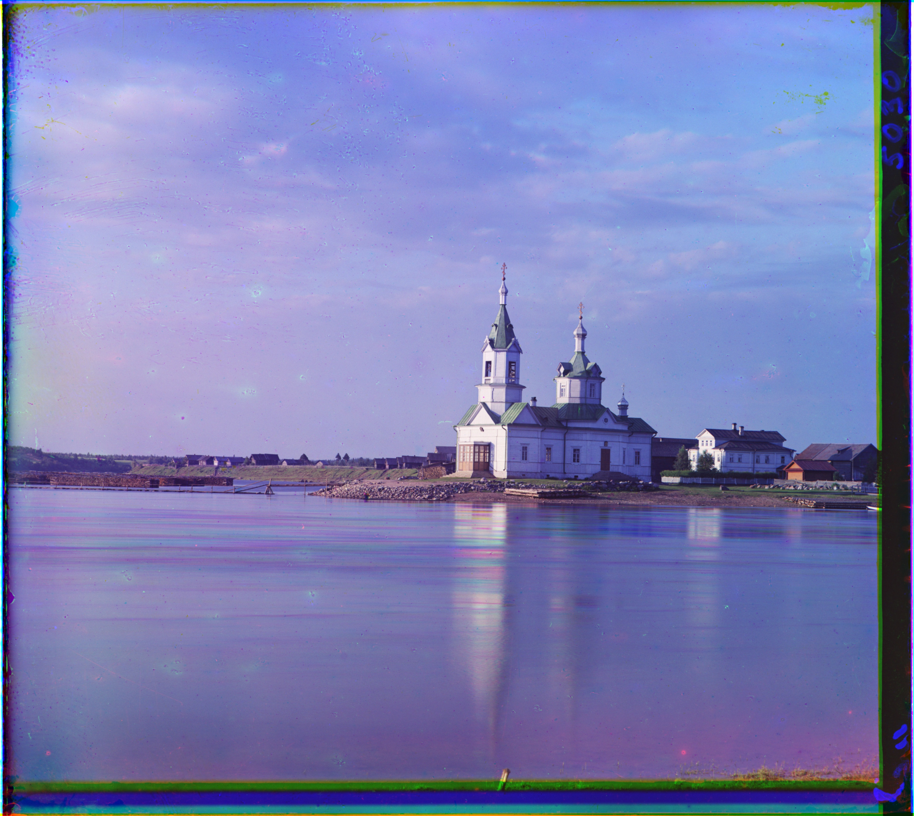
    <figcaption style="font-size: 0.9rem; color: #64748b; margin-top: 6px;">Result 02</figcaption>
  </figure>
  <figure style="margin: 0;">
    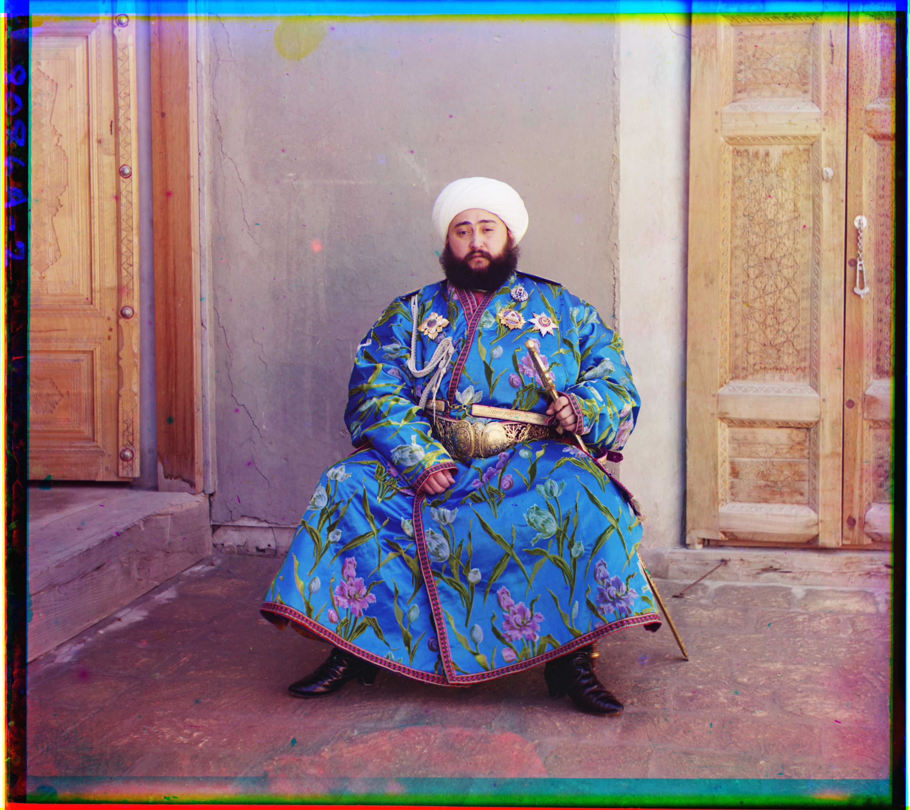
    <figcaption style="font-size: 0.9rem; color: #64748b; margin-top: 6px;">Result 03</figcaption>
  </figure>
  <figure style="margin: 0;">
    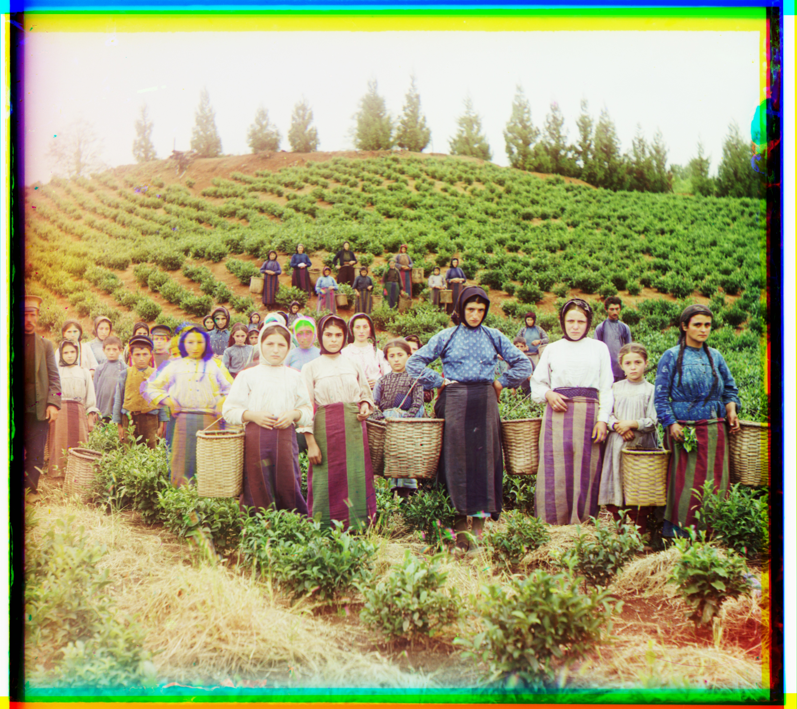
    <figcaption style="font-size: 0.9rem; color: #64748b; margin-top: 6px;">Result 04</figcaption>
  </figure>
  <figure style="margin: 0;">
    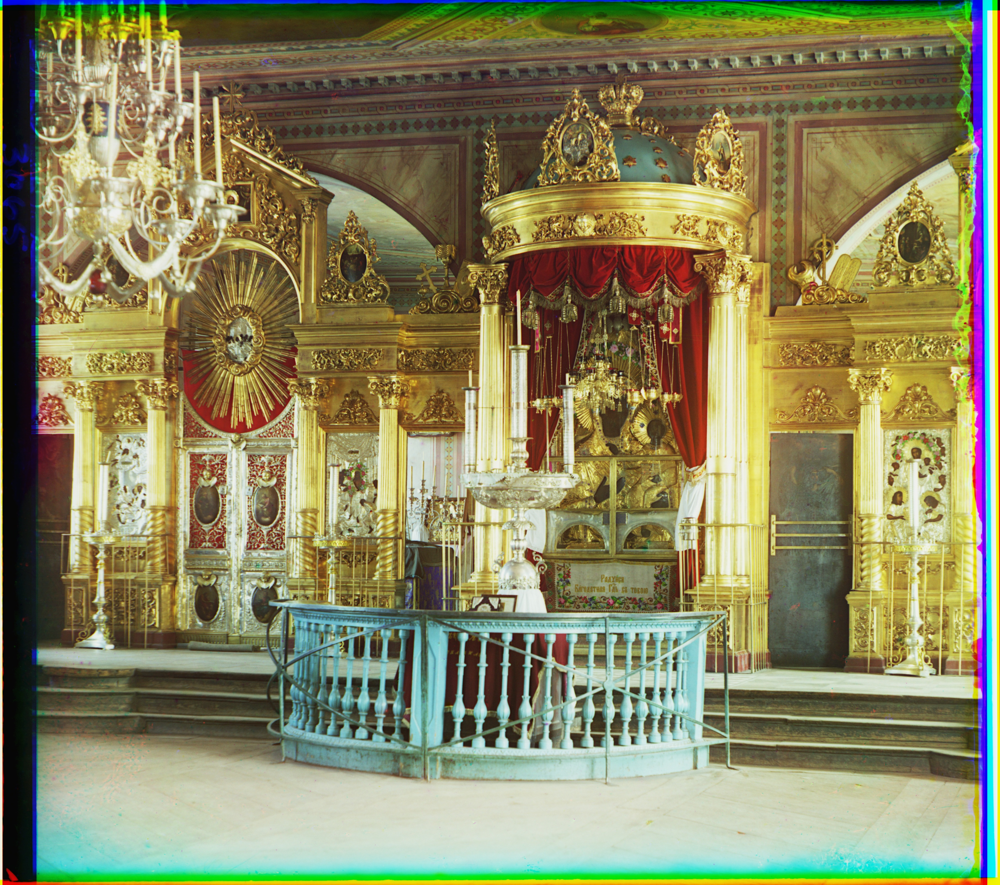
    <figcaption style="font-size: 0.9rem; color: #64748b; margin-top: 6px;">Result 05</figcaption>
  </figure>
  <figure style="margin: 0;">
    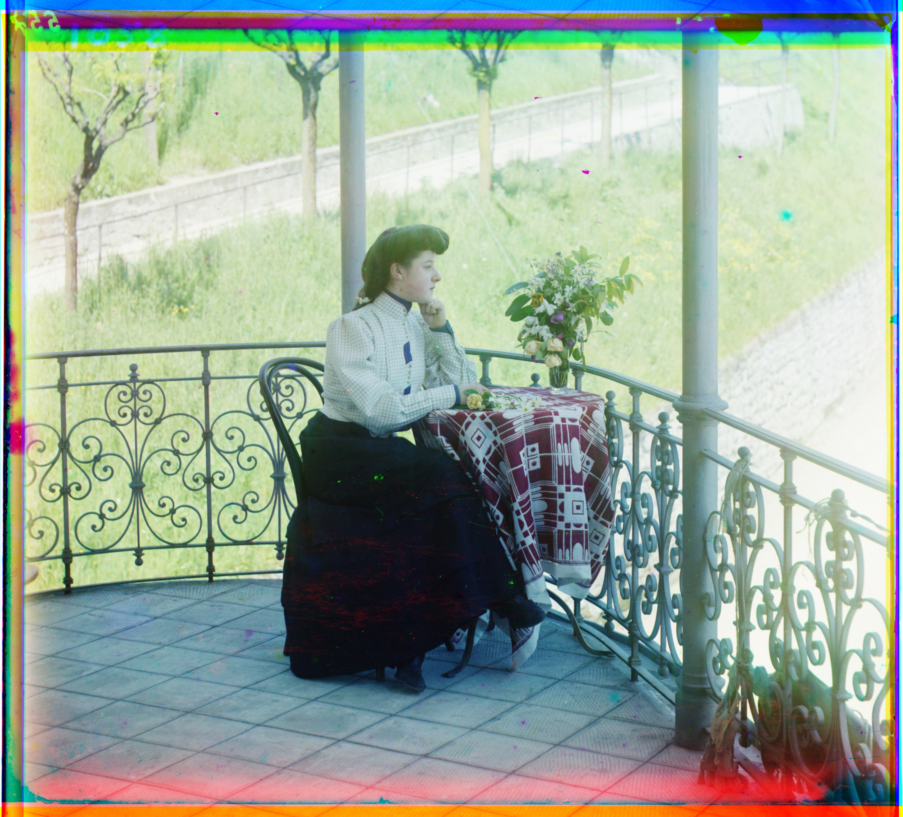
    <figcaption style="font-size: 0.9rem; color: #64748b; margin-top: 6px;">Result 06</figcaption>
  </figure>
  <figure style="margin: 0;">
    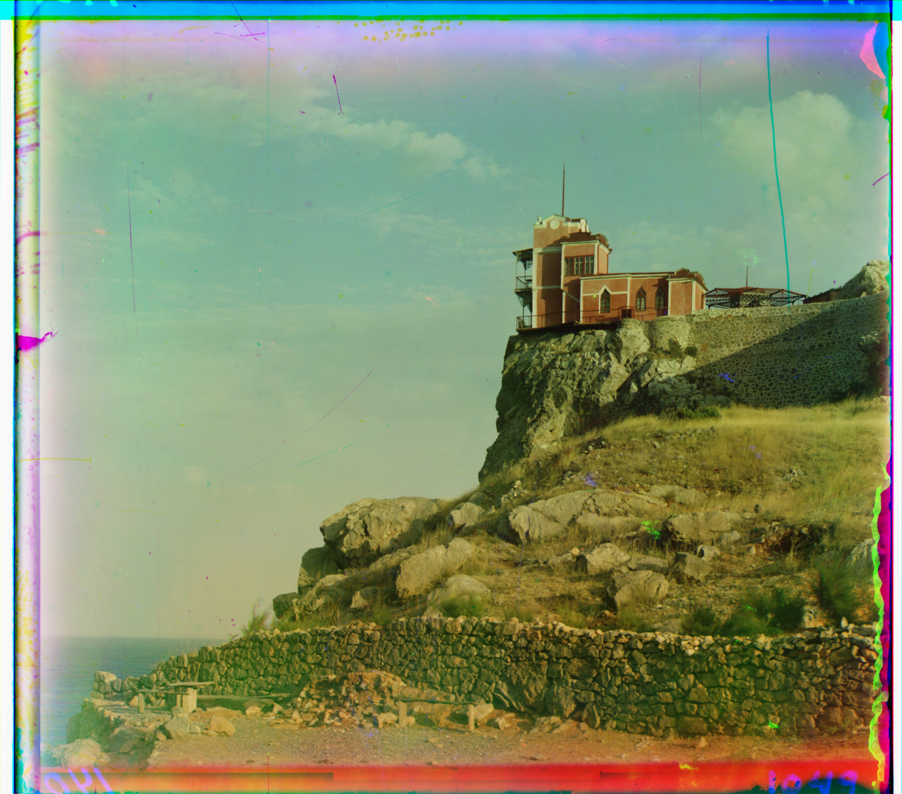
    <figcaption style="font-size: 0.9rem; color: #64748b; margin-top: 6px;">Result 07</figcaption>
  </figure>
  <figure style="margin: 0;">
    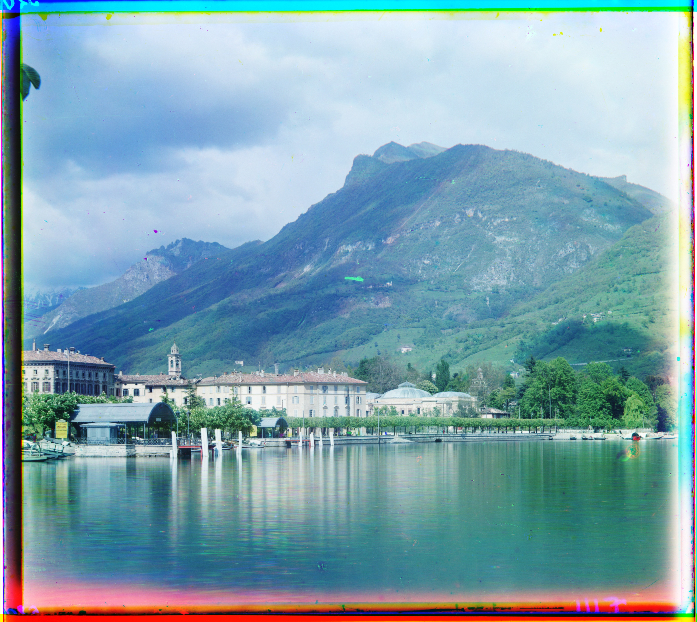
    <figcaption style="font-size: 0.9rem; color: #64748b; margin-top: 6px;">Result 08</figcaption>
  </figure>
  <figure style="margin: 0;">
    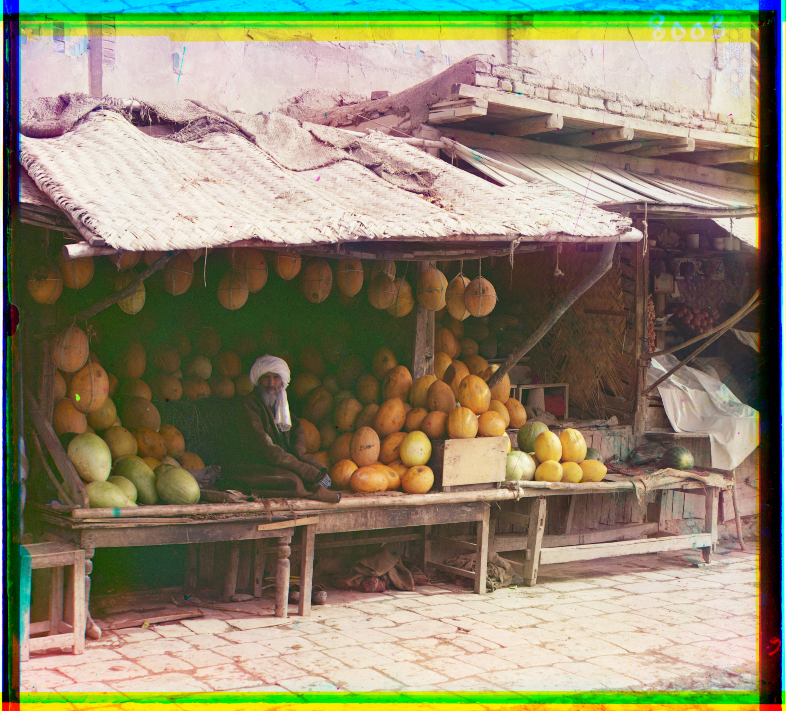
    <figcaption style="font-size: 0.9rem; color: #64748b; margin-top: 6px;">Result 09</figcaption>
  </figure>
  <figure style="margin: 0;">
    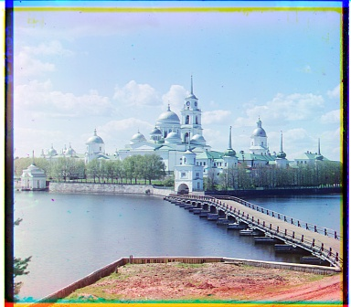
    <figcaption style="font-size: 0.9rem; color: #64748b; margin-top: 6px;">Result 10</figcaption>
  </figure>
  <figure style="margin: 0;">
    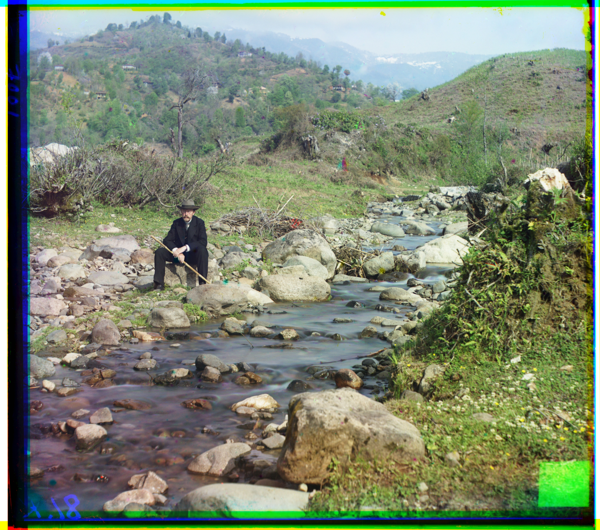
    <figcaption style="font-size: 0.9rem; color: #64748b; margin-top: 6px;">Result 11</figcaption>
  </figure>
  <figure style="margin: 0;">
    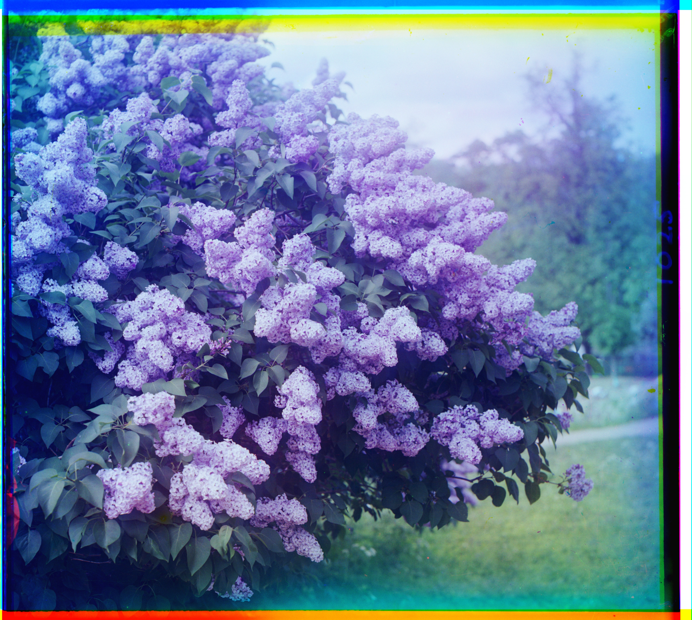
    <figcaption style="font-size: 0.9rem; color: #64748b; margin-top: 6px;">Result 12</figcaption>
  </figure>
  <figure style="margin: 0;">
    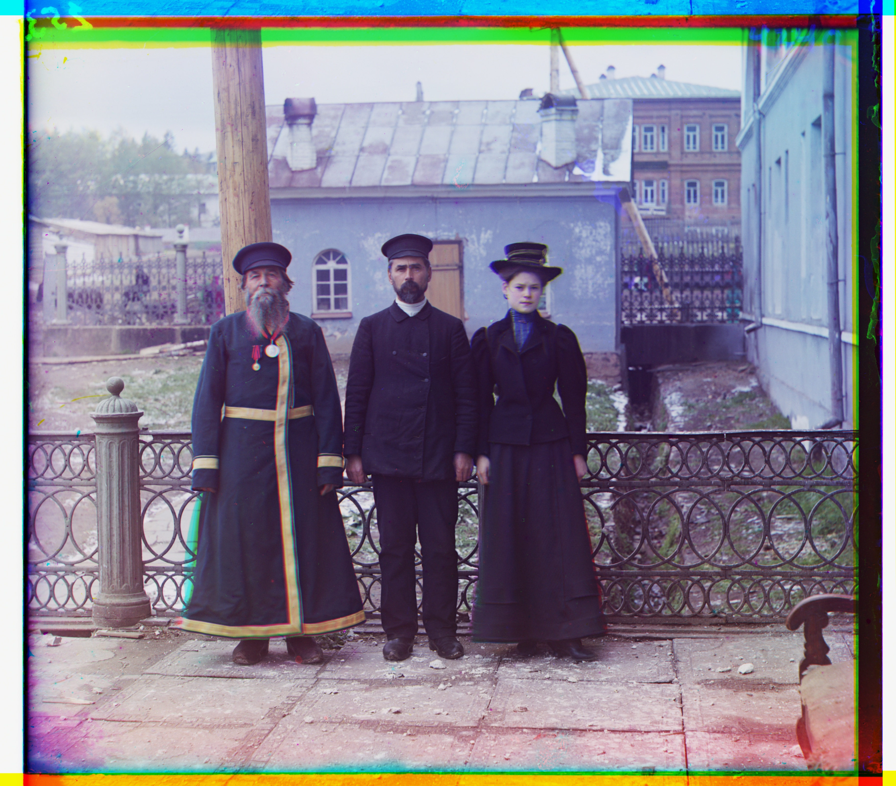
    <figcaption style="font-size: 0.9rem; color: #64748b; margin-top: 6px;">Result 13</figcaption>
  </figure>
  <figure style="margin: 0;">
    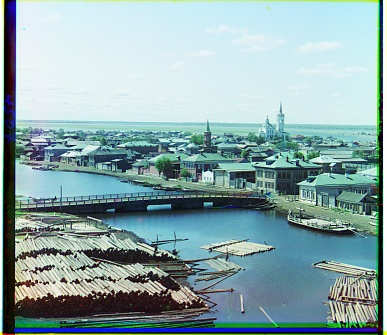
    <figcaption style="font-size: 0.9rem; color: #64748b; margin-top: 6px;">Result 14</figcaption>
  </figure>

The image below shows the pipeline described:
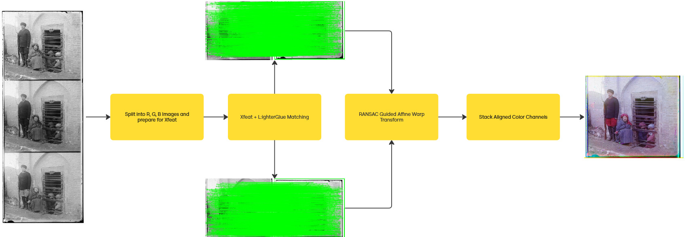

  
View logs

  <pre style="white-space: pre-wrap; background: #f8fafc; border: 1px solid #e5e7eb; border-radius: 8px; padding: 10px; color: #0f172a; margin-top: 8px;">
  (base) root@MSI:/mnt/c/Users/aalis/Documents/Code/Class/FA25/CS180/Project-1# python3 process_xfeat.py Inputs/  -o Output_xfeat/
    Loading XFeat model...
    Using cache found in /root/.cache/torch/hub/verlab_accelerated_features_main
    XFeat loaded on device: cuda
    Processing image: Inputs/cathedral.jpg

    Aligning blue channel to green...
    Loaded LightGlue model
    Found 1128 feature matches
    Estimated affine transformation with 1087 inliers

    Aligning red channel to green...
    Found 1338 feature matches
    Estimated affine transformation with 1304 inliers

    Output saved to: Output_xfeat/cathedral/out_xfeat.jpg
    Processing image: Inputs/monastery.jpg

    Aligning blue channel to green...
    Found 742 feature matches
    Estimated affine transformation with 728 inliers

    Aligning red channel to green...
    Found 894 feature matches
    Estimated affine transformation with 865 inliers

    Output saved to: Output_xfeat/monastery/out_xfeat.jpg
    Processing image: Inputs/tobolsk.jpg

    Aligning blue channel to green...
    Found 885 feature matches
    Estimated affine transformation with 877 inliers

    Aligning red channel to green...
    Found 948 feature matches
    Estimated affine transformation with 937 inliers

    Output saved to: Output_xfeat/tobolsk/out_xfeat.jpg
    Processing image: Inputs/church.tif

    Aligning blue channel to green...
    Found 1619 feature matches
    Estimated affine transformation with 1202 inliers

    Aligning red channel to green...
    Found 1753 feature matches
    Estimated affine transformation with 1384 inliers

    Output saved to: Output_xfeat/church/out_xfeat.jpg
    Processing image: Inputs/emir.tif

    Aligning blue channel to green...
    Found 1539 feature matches
    Estimated affine transformation with 839 inliers

    Aligning red channel to green...
    Found 1525 feature matches
    Estimated affine transformation with 967 inliers

    Output saved to: Output_xfeat/emir/out_xfeat.jpg
    Processing image: Inputs/harvesters.tif

    Aligning blue channel to green...
    Found 1371 feature matches
    Estimated affine transformation with 765 inliers

    Aligning red channel to green...
    Found 1469 feature matches
    Estimated affine transformation with 993 inliers

    Output saved to: Output_xfeat/harvesters/out_xfeat.jpg
    Processing image: Inputs/icon.tif

    Aligning blue channel to green...
    Found 1388 feature matches
    Estimated affine transformation with 857 inliers

    Aligning red channel to green...
    Found 1510 feature matches
    Estimated affine transformation with 1065 inliers

    Output saved to: Output_xfeat/icon/out_xfeat.jpg
    Processing image: Inputs/italil.tif

    Aligning blue channel to green...
    Found 1640 feature matches
    Estimated affine transformation with 1163 inliers

    Aligning red channel to green...
    Found 1772 feature matches
    Estimated affine transformation with 1342 inliers

    Output saved to: Output_xfeat/italil/out_xfeat.jpg
    Processing image: Inputs/lastochikino.tif

    Aligning blue channel to green...
    Found 1195 feature matches
    Estimated affine transformation with 676 inliers

    Aligning red channel to green...
    Found 1492 feature matches
    Estimated affine transformation with 1046 inliers

    Output saved to: Output_xfeat/lastochikino/out_xfeat.jpg
    Processing image: Inputs/lugano.tif

    Aligning blue channel to green...
    Found 1643 feature matches
    Estimated affine transformation with 1221 inliers

    Aligning red channel to green...
    Found 1630 feature matches
    Estimated affine transformation with 1125 inliers

    Output saved to: Output_xfeat/lugano/out_xfeat.jpg
    Processing image: Inputs/melons.tif

    Aligning blue channel to green...
    Found 1625 feature matches
    Estimated affine transformation with 1307 inliers

    Aligning red channel to green...
    Found 1572 feature matches
    Estimated affine transformation with 1281 inliers

    Output saved to: Output_xfeat/melons/out_xfeat.jpg
    Processing image: Inputs/self_portrait.tif

    Aligning blue channel to green...
    Found 1297 feature matches
    Estimated affine transformation with 854 inliers

    Aligning red channel to green...
    Found 1458 feature matches
    Estimated affine transformation with 1229 inliers

    Output saved to: Output_xfeat/self_portrait/out_xfeat.jpg
    Processing image: Inputs/siren.tif

    Aligning blue channel to green...
    Found 1321 feature matches
    Estimated affine transformation with 808 inliers

    Aligning red channel to green...
    Found 1387 feature matches
    Estimated affine transformation with 1005 inliers

    Output saved to: Output_xfeat/siren/out_xfeat.jpg
    Processing image: Inputs/three_generations.tif

    Aligning blue channel to green...
    Found 1520 feature matches
    Estimated affine transformation with 1124 inliers

    Aligning red channel to green...
    Found 1614 feature matches
    Estimated affine transformation with 1149 inliers

    Output saved to: Output_xfeat/three_generations/out_xfeat.jpg

    Total processing time: 107.38 seconds
  </pre>

<h3 id="time-analysis" style="font-size: 1.4rem; margin: 18px 0 8px;">Time Analysis: Single Scale vs. Pyramid vs. Feature-Based Methods</h3>

A key consideration in image alignment is the tradeoff between accuracy and computational efficiency. Below is a summary of the total processing times for all 14 images using each of the three approaches implemented in this project:

<table style="width: 100%; border-collapse: collapse; margin-bottom: 16px;">
  <thead>
    <tr style="background: #f1f5f9;">
      <th style="padding: 8px; border: 1px solid #e5e7eb; text-align: left;">Method</th>
      <th style="padding: 8px; border: 1px solid #e5e7eb; text-align: left;">Total Time (s)</th>
    </tr>
  </thead>
  <tbody>
    <tr>
      <td style="padding: 8px; border: 1px solid #e5e7eb;">Single Scale (process.py)</td>
      <td style="padding: 8px; border: 1px solid #e5e7eb;">215.29</td>
    </tr>
    <tr>
      <td style="padding: 8px; border: 1px solid #e5e7eb;">Image Pyramid (process_pyramid.py)</td>
      <td style="padding: 8px; border: 1px solid #e5e7eb;">134.69</td>
    </tr>
    <tr>
      <td style="padding: 8px; border: 1px solid #e5e7eb;">Feature-Based (process_xfeat.py)</td>
      <td style="padding: 8px; border: 1px solid #e5e7eb;">107.38</td>
    </tr>
  </tbody>
</table>

<ul style="color: #64748b; margin-bottom: 10px;">
  <li><b>Single Scale:</b> The naive exhaustive search is computationally expensive, especially for high-resolution images, resulting in the longest total runtime.</li>
  <li><b>Image Pyramid:</b> The multi-scale approach dramatically reduces computation by limiting the search at finer scales, making it the fastest method overall while maintaining high alignment quality.</li>
  <li><b>Feature-Based:</b> The feature-matching method (using xfeat) is robust and relatively fast, providing the same (if not better) accuracy, while being 30 seconds faster than the image pyramid approach.</li>
</ul>

<h3 id="additional-results" style="font-size: 1.4rem; margin: 18px 0 8px;">Additional Results: Method Comparison Matrix</h3>

Below is a 3&times;3 matrix of additional aligned images. Each row shows a different image, outside of the original dataset provided, and found from the library of Congress website. Each column compares the result from the Single Scale, Image Pyramid, and Feature-Based (xfeat) methods, respectively:

<table style="width: 100%; border-collapse: collapse; margin: 12px 0 18px;">
  <thead>
    <tr style="background: #f1f5f9;">
      <th style="padding: 8px; border: 1px solid #e5e7eb; text-align: center;">Single Scale</th>
      <th style="padding: 8px; border: 1px solid #e5e7eb; text-align: center;">Image Pyramid</th>
      <th style="padding: 8px; border: 1px solid #e5e7eb; text-align: center;">Feature-Based (xfeat)</th>
    </tr>
  </thead>
  <tbody>
    <tr>
      <td style="padding: 8px; border: 1px solid #e5e7eb; text-align: center;">
        
        
master-pnp-prok-00000-00011u

      </td>
      <td style="padding: 8px; border: 1px solid #e5e7eb; text-align: center;">
        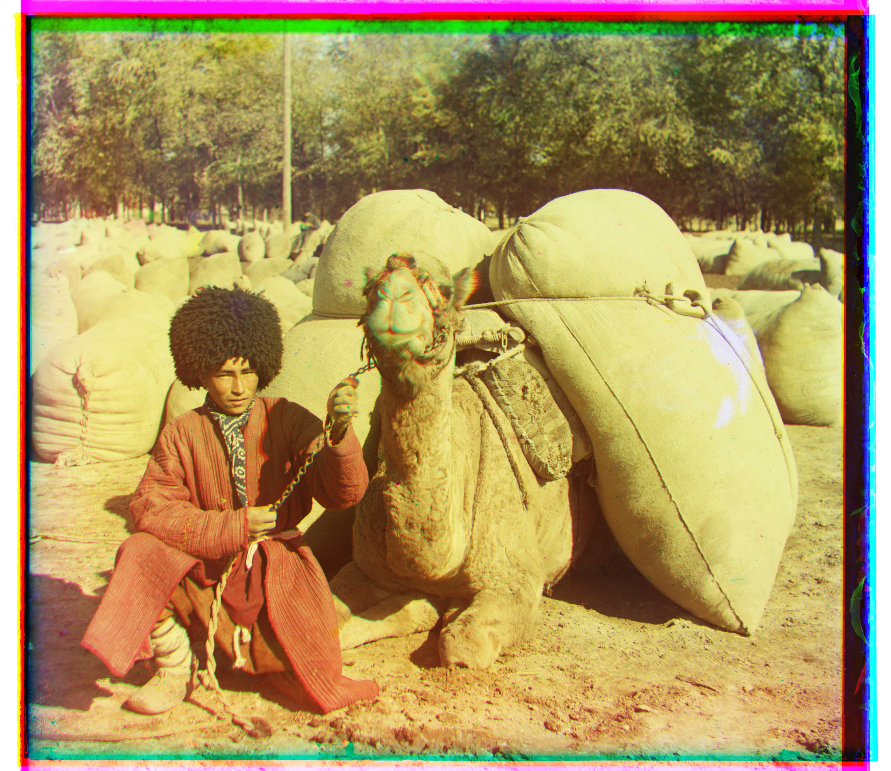
        
master-pnp-prok-00000-00011u

      </td>
      <td style="padding: 8px; border: 1px solid #e5e7eb; text-align: center;">
        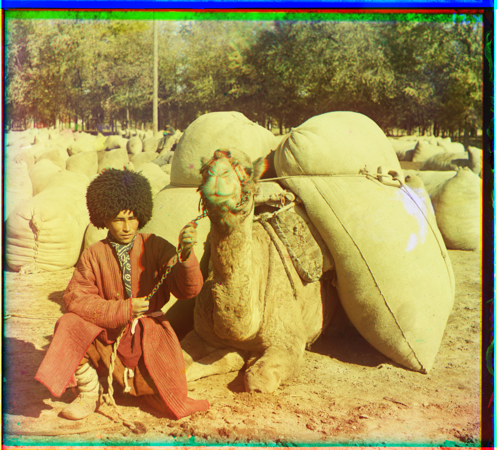
        
master-pnp-prok-00000-00011u

      </td>
    </tr>
    <tr>
      <td style="padding: 8px; border: 1px solid #e5e7eb; text-align: center;">
        
        
master-pnp-prok-00000-00086u

      </td>
      <td style="padding: 8px; border: 1px solid #e5e7eb; text-align: center;">
        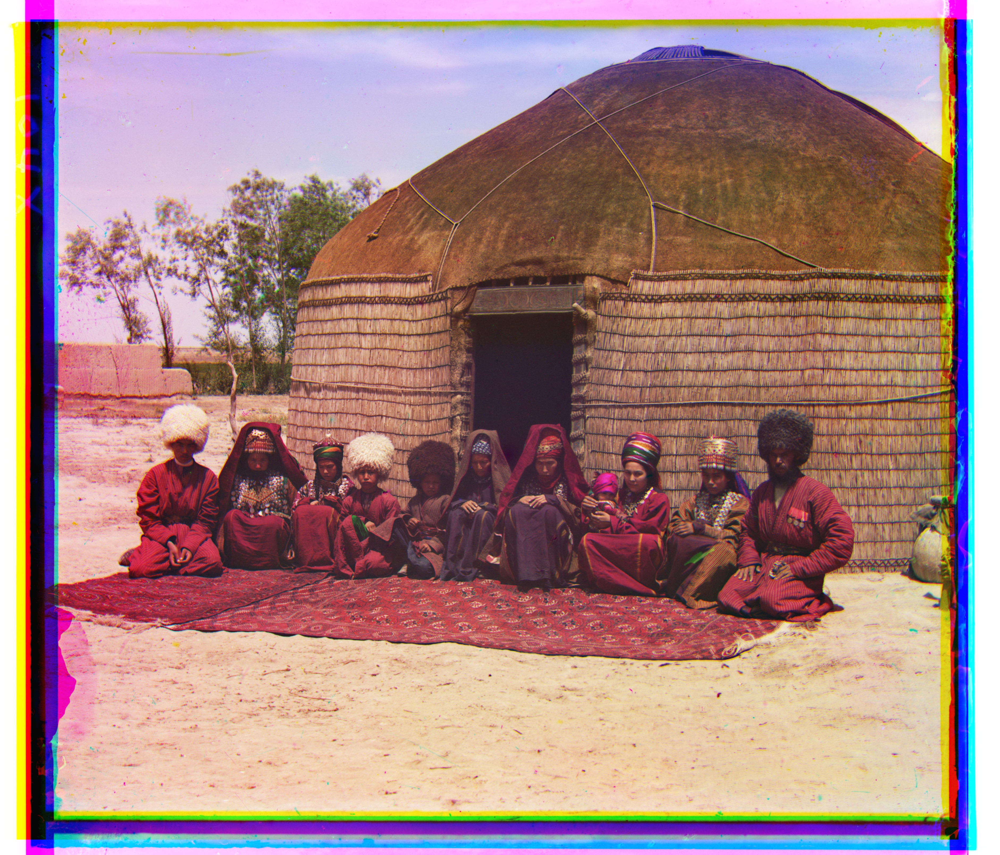
        
master-pnp-prok-00000-00086u

      </td>
      <td style="padding: 8px; border: 1px solid #e5e7eb; text-align: center;">
        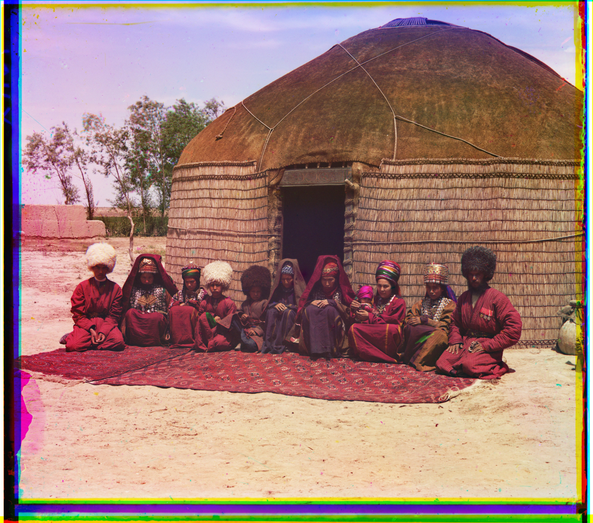
        
master-pnp-prok-00000-00086u

      </td>
    </tr>
    <tr>
      <td style="padding: 8px; border: 1px solid #e5e7eb; text-align: center;">
        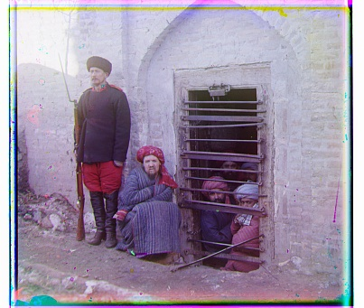
        
service-pnp-prok-00100-00130v

      </td>
      <td style="padding: 8px; border: 1px solid #e5e7eb; text-align: center;">
        
        
service-pnp-prok-00100-00130v

      </td>
      <td style="padding: 8px; border: 1px solid #e5e7eb; text-align: center;">
        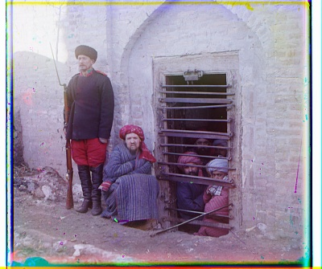
        
service-pnp-prok-00100-00130v

      </td>
    </tr>
  </tbody>
</table>

