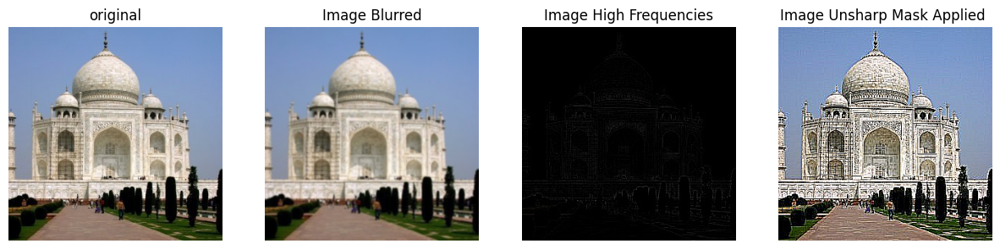

<link href="https://fonts.googleapis.com/css2?family=Inter:wght@300;400;600;800&family=Playfair+Display:wght@600;700&display=swap" rel="stylesheet">

<div style="max-width: 1100px; margin: 0 auto; padding: 12px 18px; font-family: 'Inter', -apple-system, BlinkMacSystemFont, 'Segoe UI', Roboto, 'Helvetica Neue', Arial, 'Noto Sans', 'Apple Color Emoji', 'Segoe UI Emoji', 'Segoe UI Symbol'; color: #0f172a; line-height: 1.6;">
<style>
/* Gallery appearance: rounded black frame; non-white inner background; images stay square */
figure { background: #f1f5f9; padding: 6px; border: 1px solid #000; border-radius: 10px; }
figure img { border-radius: 0 !important; border: none !important; box-shadow: none !important; display: block; }
/* Lightbox: subtle 1px border, no shadow */
#img-lightbox-img { border-radius: 0 !important; border: 1px solid #000 !important; box-shadow: none !important; }
</style>
<p align="center" style="margin: 0 0 10px;">
  

<h2 align="center" style="font-family: 'Playfair Display', serif; font-size: 2.2rem; margin: 0.2rem 0 0.4rem; letter-spacing: 0.3px; background: linear-gradient(90deg, #5B8DEF, #A78BFA); -webkit-background-clip: text; background-clip: text; -webkit-text-fill-color: transparent; color: transparent;">Alper Gel — Project 2</h2>

<hr style="border: none; border-top: 1px solid #e5e7eb; margin: 12px 0 16px;">
<h2 id="project-overview" style="font-family: 'Playfair Display', serif; font-size: 1.7rem; margin: 0.5rem 0 1rem;">Project Overview</h2>
<p style="margin: 0 0 12px; color: #334155;">
Welcome to my CS180 Project 2 site! 


<h2 id="required-part-1">Required Part 1: Filters and Edges</h2>
<h3>Part 1.1: Convolution with Box and Gaussian Filters</h3>
<p style="margin: 0 0 10px; color: #334155;">
<b>Convolutions from Scratch:</b> I implemented the 
four-loop convolution by first flipping the kernel left to 
right, then flipping it up-down. Next I zero pad the original 
image array by creating a matrix of 0's with height equal to 
image height + kernel height -1 and width equal to image 
width + kernel width - 1, and placed the image at exactly 
center of the zero matrix. Then we simply instantiate a zero 
array with same dims as image to be the output. For each pixel location (row, col) in the output image, I loop over every position (k_row, k_col) in the kernel. At each step, I multiply the value of the kernel at (k_row, k_col) by the corresponding value in the zero-padded image at (row + k_row, col + k_col), and add this product to the running total for that output pixel. This way, each output pixel is computed as the sum of elementwise products between the kernel and the corresponding region of the padded image. The process is repeated for every pixel in the image, resulting in the full convolved output. Implementation below: 

```
def four_loop_conv(img, kernel):
    # Flip kernel (this is the difference between conv and corr)
    kernel = np.flipud(np.fliplr(kernel))
    # Get Image and Kernel Shapes
    h, w = img.shape
    kh, kw = kernel.shape
    # Put original image inside the zero array
    zero_pad = np.full((h+kh-1,w+kw-1),0)
    zero_pad[kh//2:kh//2+h, kw//2:kw//2+w] = img
    # Now do the 4 for loops as requested
    conv_res = np.zeros((h,w))
    for row in range(h):
        for col in range(w):
            for k_row in range(kh):
                for k_col in range(kw):
                    conv_res[row,col] = conv_res[row,col] + zero_pad[k_row + row,k_col +col] * kernel[k_row,k_col]
    return conv_res
```
<p style="margin: 0 0 10px; color: #334155;">To implement the two for loop convolution, I did the same pre-processing steps done in the four loop. However, for each pixel location (row, col) in the output image, we calculate patch results at a time by getting the relevant patch from the zero padded array slicing from (row:row+kernel height, col:col +kernel width), and set the pixel value at the pixel location of the output to be the sum of the path multiplied by the kernel.```
def two_loop_conv(img, kernel):
    # Flip kernel (this is the difference between conv and corr)
    kernel = np.flipud(np.fliplr(kernel))
    # Get Image and Kernel Shapes
    h, w = img.shape
    kh, kw = kernel.shape
    # Put original image inside the zero array
    zero_pad = np.full((h+kh-1,w+kw-1),0)
    zero_pad[kh//2:kh//2+h, kw//2:kw//2+w] = img
    # Now we can use 2 for loops instead of 4 by grabbing the entire patch instead of the single pixel value for each iteration then using np.sum of the matrix-matrix elementwise multiplication to get the result for the output pixel
    conv_res = np.zeros((h,w))
    for row in range(h):
        for col in range(w):
            patch = zero_pad[row:row+kh, col:col+kw]
            conv_res[row,col] = np.sum(patch * kernel)
    return conv_res
``` 
<p style="margin: 0 0 10px; color: #334155;">Using the python 'time' library, I did a runtime analysis, finding that when convolving a 9x9 box filter with a 612x612 grayscale image, we get the following runtimes:<table>
  <tr>
    <th>Method</th>
    <th>Runtime (seconds)</th>
  </tr>
  <tr>
    <td>Four Loop Convolution</td>
    <td>26.59</td>
  </tr>
  <tr>
    <td>Two Loop Convolution</td>
    <td>3.05</td>
  </tr>
  <tr>
    <td>Scipy 2D Convolution</td>
    <td>0.09</td>
  </tr>
</table>
<p align="center" style="margin: 16px 0;">
  
  <br>
  <span style="font-size: 0.95rem; color: #64748b;">Figure: Visual comparison of four loop, two loop, and Scipy convolution methods on a 612x612 image with a 9x9 filter.</span>
<p style="margin: 0 0 10px; color: #334155;">Looking at the image output, we see that the two and four for loop convolution implementations output the same result, with a proper zero-pad border, which is expected. However, when we compare them to the scipy signal.convolve2d we see that the inside of the image has the same result, but the zero-pad edge has a darker intensity. I used the following command for scipy, and verified the kernel was the same in all three, but was unable to figure out why the border has a darker intensity. I believe it might be a display normalization issue rather than an issue with the convolution.
```
img_scipy = signal.convolve2d(img, kernel, boundary='fill', fillvalue=0)
```

<p style="margin: 0 0 10px; color: #334155;">We visualize the finite difference operators Dx and Dy as follows:
<p align="center" style="margin: 18px 0;">
  
  
  <br>
  <span style="font-size: 0.95rem; color: #64748b;">
    <b>Left:</b> Visualization of the image derivatives kernel in respect to x (named Dx). <b>Right:</b> Visualization of the image derivatives kernel in respect to y (named Dy).
  </span>
<p align="center" style="margin: 18px 0;">
  
  
  <br>
  <span style="font-size: 0.95rem; color: #64748b;">Figure: Stacked visualization of <b>dy_heart</b> which shows convolutions of the original image with the Dy kernel(top) and <b>dx_heart</b> which shows convolutions of the original image with the Dy kernel (bottom) images. </span>


<h3>Part 1.2: Image Derivatives</h3>
<p style="margin: 0 0 10px; color: #334155;">
<b>Partial Derivatives:</b> Using the same Dx, Dy kernels visualized above, I convolved the cameraman image with each kernel, using symmetric boundaries and 'same' mode, as shown in the code snippet below. That convolution process gives us grad_x and grad_y images, which we then squareroot the sum of squares to get the magnitude of the gradient vector at each pixel, giving us the most basic edge detector we can make! We can then threshold this noisy result to focus on the outline of the cameraman by setting an arbitrary threshold that maximizes the aesthetic appeal of the image.

```
img = cv2.imread('Input/Part1/cameraman.png', cv2.IMREAD_GRAYSCALE)
img = img.astype(float)
Dx = np.array([[1, 0, -1]])
Dy = np.array([[1], [0], [-1]])
Ix = convolve2d(img, Dx, mode='same', boundary='symm')
Iy = convolve2d(img, Dy, mode='same', boundary='symm')
grad_mag = np.sqrt(Ix**2 + Iy**2)

thresh = 80
edge_img = grad_mag > thresh
```

<p style="margin: 0 0 10px; color: #334155;">Comparing the two images below, we see that setting the threshold in this case to 80 reduces salt and pepper noise while minimizing edge signal loss compared to setting the threshold at 70<p align="center" style="margin: 18px 0;">
  
  
  <br>
  <span style="font-size: 0.95rem; color: #64748b;">
    <b>Left:</b> Edge map with threshold = 70. <b>Right:</b> Edge map with threshold = 80.<br>
    Increasing the threshold reduces noise but may also remove faint edges.
  </span>

<h3>Part 1.3: Derivative of Gaussian (DoG) Filter</h3>

<p style="margin: 0 0 10px; color: #334155;">
<b>Setting up Kernel:</b> Following the hint, we generate the 2D gaussian kernel by using OpenCV's cv2.getGaussianKernel() functionality, which gives us a 1D gaussian kernel. We then take the dot product of the 1D kernel with its own transpose, giving us a 2D kernel. To preserve the normalized property of kernels, we then normalize all entries of the 2D kernel with its sum. Then, we perform a 2D convolution between the gaussian kernel and Dx (from before), then the same process for Dy, using scipy's convolve2d with mode='same', boundary='symm' settings. We can visualize those kernels, with gray cmap and bilinear interpolation for better viewing below:
<p align="center" style="margin: 24px 0;">
  
  <br>
  <span style="font-size: 1.05rem; color: #64748b;">Figure: Visualization of the Gaussian, DoG-X, and DoG-Y kernels.</span>
<p style="margin: 0 0 10px; color: #334155;"><b>Blur then Take Gradient:</b> We first show the effect of applying a gaussian blur to the image before passing it through our edge detector. We see that the gradient magnitude image is much less noisy when we apply the gaussian blur before the edge detection. As a result, the eventual thresholded image is also better, which can be seen in the next section.</p>


<p align="center" style="margin: 24px 0;">
  
  
  <br>
  <span style="font-size: 0.95rem; color: #64748b;">
    <b>Top:</b> Gradient magnitude without blurring. <b>Bottom:</b> Gradient magnitude after Gaussian blur.<br>
    Blurring the image before taking the gradient significantly reduces noise in the gradient magnitude image, making edges more distinct and the result less sensitive to small pixel-level variations.
  </span>

<p style="margin: 0 0 10px; color: #334155;"><b>Apply Blur to Kernels via DoG:</b> Using the DoG approach, we create DoG-x (or named dx_blur in code) and DoG-y (named dy_blur in code) as follows:</p>
```
Dx = np.array([[1, 0, -1]])
Dy = np.array([[1], [0], [-1]])
gau1D = cv2.getGaussianKernel(10,1)
gau_kern = np.dot(gau1D,gau1D.T)
gau_kern /= gau_kern.sum()
dx_blur = convolve2d(gau_kern, Dx,mode='same', boundary='symm')
dy_blur = convolve2d(gau_kern, Dy,mode='same', boundary='symm')
Ix = convolve2d(img, dx_blur, mode='same', boundary='symm')
Iy = convolve2d(img, dy_blur, mode='same', boundary='symm')
```
<p style="margin: 0 0 10px; color: #334155;">This pre-convolves the gaussian kernel with the finite difference operator kernels, taking advantage of the convolution combination properties. As seen in the comparison image below, we show that applying the gaussian blur improves the final thresholded edge image, but doing a seperate gaussian convolution before the edge detection versus using the DoG filters has absolutely no visual difference, which is to be expected given the mathematical properties of convolution.</p> 

<p align="center" style="margin: 32px 0;">
  
  <br>
  <span style="font-size: 1.08rem; color: #64748b;">Figure: Comparison of edge detection results using (left) no gaussian blurring, (middle) Gaussian blur followed by gradient, and (right) DoG filter. The results are visually identical, confirming the equivalence of the two approaches.</span>


<h3>Bells and Whistles: Gradient Orientation Visualization</h3>
<p style="margin: 0 0 10px; color: #334155;">To visualize the angle of the gradient vector at each point, we just use basic vector notation math. We know that the magnitude of the vector is the square root of the (gradient w.r.t x)^2 + the (gradient w.r.t y)^2. Then, drawing the gradient as a vector coming out of the origin, its trivial to see that the angle of the vector is given by the inverse tangent of (gradient w.r.t y) / (gradient w.r.t x). Then, to fit the angle into a [0,1] set, we just normalize the angle by 360, giving us a hue value between [0,1]. Then, by definition of the hsv colorspace, we set the first of 3 channels to the hue, the second to saturation = 1.0 (just assumed) then the last to the normalized magnitude of the gradient vector. Then we get the result below:</p>
<p align="center" style="margin: 32px 0;">
  
  <br>
  <span style="font-size: 1.05rem; color: #64748b;">
    <b>Figure:</b> Visualization of gradient orientation using HSV color mapping.<br>
    Each pixel's hue encodes the direction of the gradient (angle), and the value encodes the gradient magnitude. This allows us to see both the strength and direction of edges in the image at a glance.
  </span>
<p style="margin: 0 0 10px; color: #334155;">Code as follows:</p>

```
import matplotlib
# convert from cartesian to polar to get grad vector for each pixel
mag = np.sqrt(Ix**2 + Iy**2)
angle = np.degrees(np.arctan2(Iy,Ix)) 

hue = angle / 360.0  # [0,1]
hsv = np.zeros((*angle.shape, 3), dtype=np.float32)
hsv[..., 0] = hue           # Hue: orientation
hsv[..., 1] = 1.0           # Saturation: full
hsv[..., 2] = mag / mag.max()  # Value: normalized magnitude

# Convert HSV to RGB for display
rgb = matplotlib.colors.hsv_to_rgb(hsv)

plt.figure(figsize=(8,8))
plt.imshow(rgb)
plt.title("Gradient Direction (HSV color wheel)\n360 degrees normalized to [0,1]")
plt.colorbar()
plt.axis('off')
plt.show()
```

<h2 id="required-part-2">Required Part 2: Fun with Frequencies</h2>
<h3>Part 2.1: Image "Sharpening"</h3>
<p style="margin: 0 0 10px; color: #334155;">
<b>Sharpening Filter:</b> To get the unsharp mask filter, we use the same gaussian kernel setup as before (using cv2.getGaussianKernel, dot product with transpose, normalizing...). We then apply that kernel to each color channel of the image (b,g,r), then merge those color channels into a blurred image. Then, we get the high frequencies of the image by subtracting the blurred image from the original image. All the unsharp mask does is adding additional high frequencies, making edges (high frequency) parts of the image have a higher emphasis, tricking our brains to think that the whole image is sharper, since human visual system places higher importance in high-frequency aspects of scenes. We decide a scalar value, named alpha, which dictates how much more of the high frequencies we want, s.t. sharpened image = original image + alpha * image high frequencies. We can see that process below, and to correctly visualize everything I reversed channel order to render RGB and clipped the sharpened image and high frequency image between 0,1.
<p align="center" style="margin: 32px 0;">
  
  <br>
  <span style="font-size: 1.05rem; color: #64748b;">
    <b>Figure:</b> Visualization of the high frequency components of the Taj Mahal image.<br>
    The high frequency image is obtained by subtracting the blurred (low-pass filtered) image from the original, highlighting edges and fine details.
  </span>
</p>
In the following image, we can also see how varying the value of alpha affects the final sharpened image.
<p align="center" style="margin: 32px 0;">
  
  <br>
  <span style="font-size: 1.05rem; color: #64748b;">
    <b>Figure:</b> Effect of varying the <code>alpha</code> parameter in the unsharp mask sharpening filter.<br>
    Increasing <code>alpha</code> amplifies the high-frequency details, making the image appear sharper, but too high a value can introduce artifacts.
  </span>
</p>

Now, we can generalize to a test-set of images that we want to blur then sharpen to see if we can reconstruct. In the last column, I have also included the resulting image from sharpening the original image with no blurring. All sharpening operations used an alpha of 5. 
<p align="center" style="margin: 32px 0;">
  
  <br>
  <span style="font-size: 1.05rem; color: #64748b;">
    <b>Figure:</b> Results of applying the unsharp mask sharpening filter to a test set of images.<br>
    The first column shows the original images, the second column shows the blurred images, the third column shows the sharpened (reconstructed) images, and the last column shows the result of sharpening the original image with no blurring. All sharpening operations used <code>alpha = 5</code>.
  </span>
</p>


