

<link href="https://fonts.googleapis.com/css2?family=Inter:wght@300;400;600;800&family=Playfair+Display:wght@600;700&display=swap" rel="stylesheet">

<h2 style="font-family: 'Playfair Display', serif; font-size: 2.2rem; margin: 0.2rem 0 0.4rem; letter-spacing: 0.3px; background: linear-gradient(90deg, #5B8DEF, #A78BFA); -webkit-background-clip: text; background-clip: text; -webkit-text-fill-color: transparent; color: transparent;">Alper Gel — Project 3</h2>

<h2 id="required-part-1">Section A</h2>
<h3>Part A.1: Shoot the Pictures</h3>

The following images were captured on an iPhone 16 by starting on the center image, then while keeping my body and arms in place, slightly rotating the phone itself left and right from the center pose. Further, a leveling indicator was utilized to make sure each image had approx the sane COP.

  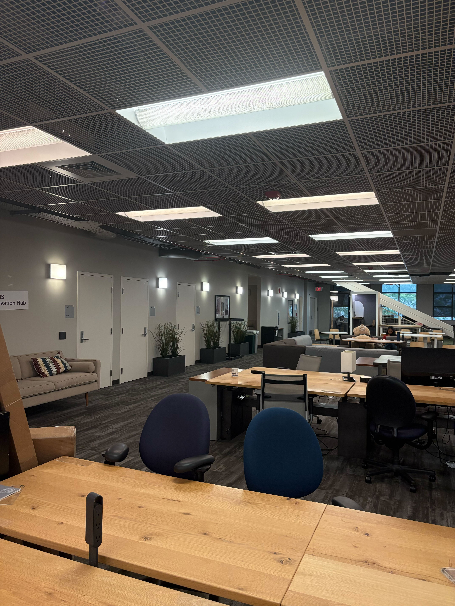
  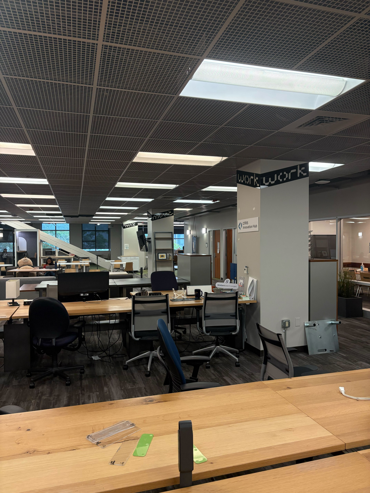
   
  
    <b>Set 1:</b> Two images from the first set.
  

  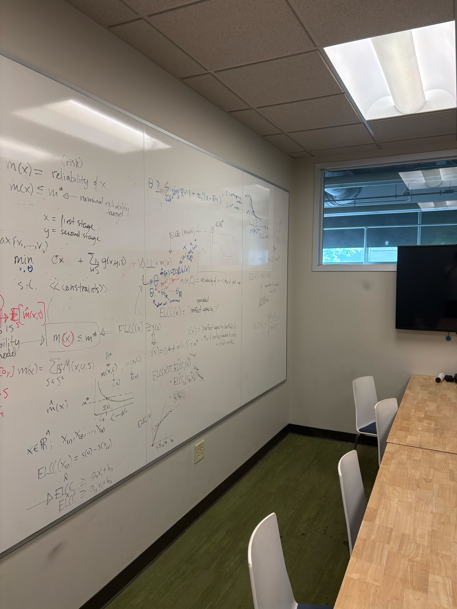
  
   
  
    <b>Set 2:</b> Two images from the second set.
  

<h3>Part A.2: Recover Homographies</h3>

The homography recovery process involves solving a system of linear equations. For each correspondence point (x, y) → (u, v), we set up the following system of equations:

<h4 style="margin-top: 0; color: #1e40af;">System of Equations for Homography Recovery</h4>

For n correspondence points, we have 2n equations plus 1 constraint equation:

<strong>For each correspondence (xᵢ, yᵢ) → (uᵢ, vᵢ):</strong>

Row 2i (u-equation):

xᵢh₁ + yᵢh₂ + h₃ - uᵢxᵢh₇ - uᵢyᵢh₈ - uᵢh₉ = 0

Row 2i+1 (v-equation):

xᵢh₄ + yᵢh₅ + h₆ - vᵢxᵢh₇ - vᵢyᵢh₈ - vᵢh₉ = 0

<strong>Scale constraint:</strong>

h₉ = 1

<strong>Matrix form:</strong>

A · h = b

Where:

<ul style="margin: 10px 0; padding-left: 20px;">
<li><strong>A</strong> is a (2n+1) × 9 matrix</li>
<li><strong>h</strong> = [h₁, h₂, h₃, h₄, h₅, h₆, h₇, h₈, h₉]ᵀ is the homography matrix flattened</li>
<li><strong>b</strong> = [0, 0, ..., 0, 1]ᵀ is the constraint vector</li>
</ul>

<strong>Structure of matrix A:</strong>

For each point i, rows 2i and 2i+1 are:

Row 2i: [xᵢ, yᵢ, 1, 0, 0, 0, -uᵢxᵢ, -uᵢyᵢ, -uᵢ]

Row 2i+1: [0, 0, 0, xᵢ, yᵢ, 1, -vᵢxᵢ, -vᵢyᵢ, -vᵢ]

Final row (constraint): [0, 0, 0, 0, 0, 0, 0, 0, 1]

In matrix notation, the homography vector <b>h</b> can be solved directly as <b>h = A-1 · b</b> (when A is invertible). However, since we usually want MORE than 4 points, we set this problem up as a least squares problem using the Numpy lstsq() function. However, we can get an even more optimized solution by taking advantage of some linear algebra knowledge with the SVD decomposition. The rightmost singular vector provides us with H, which we then reshape into a 3 x 3 matrix. 

 
As I was seeing some numerical stability issues, I researched some ways to improve consistency and homography stability, and stumbled upon the concept of Hartley normalization, which allows you to improve the condition number of the matrix (high condition number high instability and likely no proper solution). With Hartley normalization, the identified correspondance points are recentered and rescaled so that the overal linear system is balanced. Math below:

  <b>Hartley Normalization (Point Normalization for Homography)</b>
    
  

    Given a set of 2D points {(xi, yi)}Ni=1, define the centroid:
  

  

    
      
        \(\bar{x} = \frac{1}{N} \sum_{i=1}^N x_i,\quad \bar{y} = \frac{1}{N} \sum_{i=1}^N y_i\)
      
    
  

  

    Center the points:
  

  

    
      \(x'_i = x_i - \bar{x},\quad y'_i = y_i - \bar{y}\)
    
  

  

    Compute the mean Euclidean distance of the centered points to the origin:
  

  

    
      \(\bar{d} = \frac{1}{N} \sum_{i=1}^N \sqrt{(x'_i)^2 + (y'_i)^2}\)
    
  

  

    Choose the isotropic scale so that the <b>average distance becomes</b> \(\sqrt{2}\):
  

  

    
      \(s = \frac{\sqrt{2}}{\bar{d}}\)
    
  

  

    The <b>normalization transform</b> (apply to homogeneous points \([x\ y\ 1]^T\)) is:
  

  

    
      \(T = \begin{bmatrix}
        s & 0 & -s\bar{x} \\
        0 & s & -s\bar{y} \\
        0 & 0 & 1
      \end{bmatrix}\)
    
  

  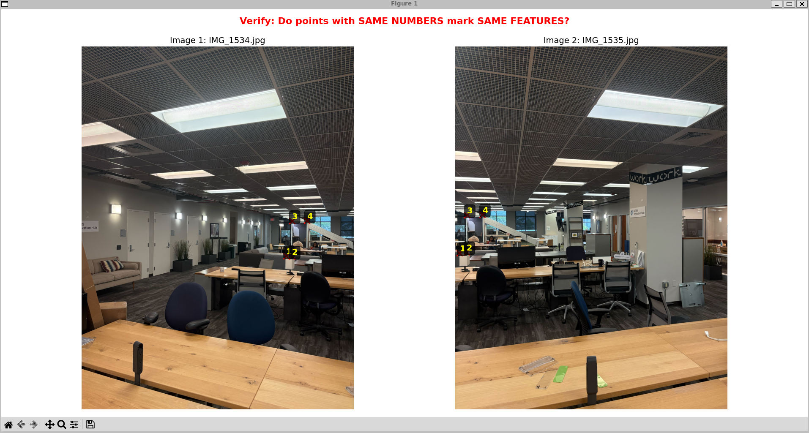
   
  
    <b>Set 1:</b> Visualization of Correspondance Points.
  

<strong>Set 1 Homography Matrix:</strong>

<pre><code>H = [[-1.50030413e-01 -4.10444775e-01  2.20066913e+03]
 [-3.61015852e-01 -4.24241792e-01  3.03414021e+03]
 [-1.03412057e-04 -1.59095473e-04  1.00000000e+00]]
</code></pre>

  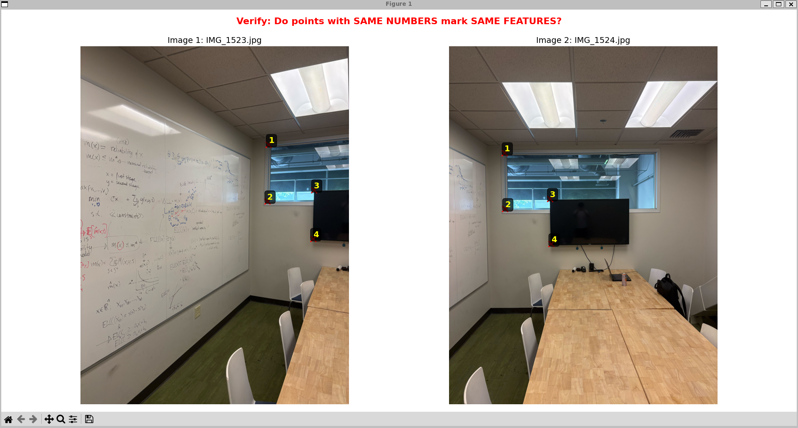
   
  
    <b>Set 2:</b> Visualization of Correspondance Points.
  

<strong>Set 2 Homography Matrix:</strong>

<pre><code>H = [[ 2.35072803e+00  4.96191253e-02 -5.44933219e+03]
 [ 8.53326606e-01  1.87472103e+00 -2.24930721e+03]
 [ 3.33232293e-04 -4.26128816e-05  1.00000000e+00]]
</code></pre>

<h3>Part A.3: Warp The Images</h3>

Using the two image warping techniques we made (Nearest Neighbor and Bilinear Interpolation) we can now rectify rectangular objects via a combination of the following pipeline:

<ol style="margin: 0 0 10px 0; padding-left: 24px;">
  <li><strong>Input Image</strong></li>
  <li>Identify keypoints of the rectangular object</li>
  <li>Calculate the target rectangle size</li>
  <li>Compute the Homography Matrix</li>
  <li>Apply the inverse Homography Matrix and chosen warping method (Nearest Neighbor or Bilinear Interpolation) to output the rectified rectangular object (see below)</li>
</ol>

  
   
  
    <b>Left:</b> Correspondance points bounding box. <b>Center:</b>Rectified output using Bilinear Interpolation. <b>Right:</b> Rectified output using Nearest Neighbor Warping.
  
   
  
   
  
    <b>Left:</b> Correspondance points bounding box. <b>Center:</b>Rectified output using Bilinear Interpolation. <b>Right:</b> Rectified output using Nearest Neighbor Warping.
  
   

As is clear in the comparison images above, we can see that both images provide a successfully rectified rectangular object output, however, the bilinear interpolation offers higher visual quality. It is worthwhile to note that Nearest Neighbor approach is considerably faster than the Bilinear Interpolation approach. 

<h3>Part A.4: Blend the Images Into a Mosaic</h3>
For the panorama creation, I created a CLI that takes in a folder, the number of correspondances you want (default 4). The process then sorts the image files in the folder, selects the center index and starts to map all other images to that center image. It iterates through all the images that are not the center image, makes you provide a point correspondance between the image and the center image. Then the H matrix is calculated, which allows for the warp to be calculated. The warped image, validity mask, and origin of the new image are then appended to a list. Once all images in the folder have been warped properly, a global canvas for the pano is calculated, then the warped images are placed onto the canvas at their respective origin points. Finally we utilize feather blending to soften the edges between the placed images. I did put a laplacian stack blending implementation, but commented it out as it simply takes too long with more than 2+ images in a folder. For the same reason, I opted to use nearest neighbor warping for RAM and time efficiency during the panorama process. 

  
   
  

    
View logs

    <pre style="white-space: pre-wrap; background: #f8fafc; border: 1px solid #e5e7eb; border-radius: 8px; padding: 10px; color: #0f172a; margin-top: 8px;">
    python3 Part-A/Code/mosaic.py Part-A/Images/Bears/ --n 6
    Found 3 images.
    Center image index: 1 (4.jpg)
    Finding Points for Image 0
    Finding Points for Center Image
    Showing correspondence verification...
    Calculating Homography Matrix
    Computed Homography Matrix:
    [[ 1.10596714e+00  1.50557145e-02 -1.73021348e+03]
    [ 3.22255162e-02  1.13419403e+00  1.94257634e+02]
    [ 2.67113480e-05  1.33429548e-05  1.00000000e+00]]
    Calculating Bilinear Image Warp
      -> Warped image size: 4430 x 6007 (origin: (np.int64(-1731), np.int64(194)))
    Finding Points for Image 2
    Finding Points for Center Image
    Showing correspondence verification...
    Calculating Homography Matrix
    Computed Homography Matrix:
    [[ 6.27886267e-01 -9.36538310e-03  1.17606068e+03]
    [-2.31602812e-01  7.83915153e-01  4.66872240e+02]
    [-6.42962807e-05 -1.67825804e-05  1.00000000e+00]]
    Calculating Bilinear Image Warp
      -> Warped image size: 4888 x 7012 (origin: (np.int64(1176), np.int64(-725)))
    Calculating Final Canvas Size
    Computing global bounding box...
    Canvas size: 7795 x 7012
    3it [00:03,  1.17s/it]
    Panorama Complete
    </pre>
  

  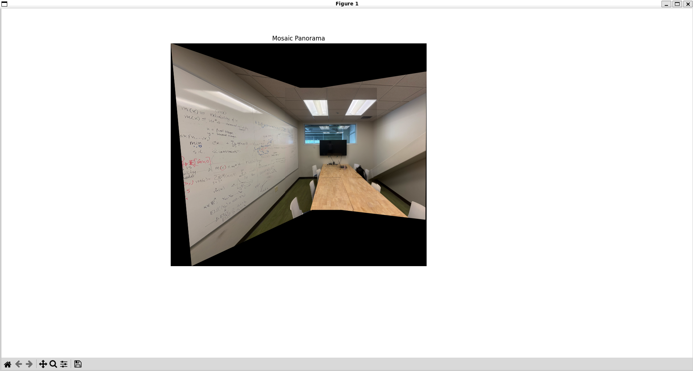
   
  

    
View logs

    <pre style="white-space: pre-wrap; background: #f8fafc; border: 1px solid #e5e7eb; border-radius: 8px; padding: 10px; color: #0f172a; margin-top: 8px;">
    (base) python3 Part-A/Code/mosaic.py Part-A/Images/Meeting_Room/ --n 6
    Found 3 images.
    Center image index: 1 (IMG_1524.jpg)
    Finding Points for Image 0
    Finding Points for Center Image
    Showing correspondence verification...
    Calculating Homography Matrix
    Computed Homography Matrix:
    [[ 2.28295915e+00  9.86497906e-02 -5.34150670e+03]
    [ 7.22662945e-01  1.96430129e+00 -2.09080462e+03]
    [ 2.83751490e-04  1.65466493e-05  1.00000000e+00]]
    Calculating Bilinear Image Warp
      -> Warped image size: 7508 x 10432 (origin: (np.int64(-5342), np.int64(-2091)))
    Finding Points for Image 2
    Finding Points for Center Image
    Showing correspondence verification...
    Calculating Homography Matrix
    Computed Homography Matrix:
    [[ 8.79112020e-01 -3.26996043e-03  1.52457005e+03]
    [-1.49192544e-01  9.76215645e-01  2.69442845e+01]
    [-4.65402129e-05  6.42737401e-07  1.00000000e+00]]
    Calculating Bilinear Image Warp
      -> Warped image size: 5108 x 6937 (origin: (np.int64(1500), np.int64(-765)))
    Calculating Final Canvas Size
    Computing global bounding box...
    Canvas size: 11950 x 10432
    3it [00:06,  2.09s/it]
    Panorama Complete
    </pre>
  

  
   
  

    
View logs

    <pre style="white-space: pre-wrap; background: #f8fafc; border: 1px solid #e5e7eb; border-radius: 8px; padding: 10px; color: #0f172a; margin-top: 8px;">
    python3 Part-A/Code/mosaic.py Part-A/Images/Haas/ --n 8  
    Found 2 images.
    Center image index: 1 (2.jpg)
    Finding Points for Image 0
    Finding Points for Center Image
    Showing correspondence verification...
    Calculating Homography Matrix
    Computed Homography Matrix:
    [[ 1.09437525e+00  9.49213866e-03 -2.22045796e+03]
    [ 1.15794764e-01  1.06255943e+00 -5.85197716e+02]
    [ 2.34247713e-05 -5.66387522e-06  1.00000000e+00]]
    Calculating Bilinear Image Warp
      -> Warped image size: 4601 x 6254 (origin: (np.int64(-2239), np.int64(-586)))
    Calculating Final Canvas Size
    Computing global bounding box...
    Canvas size: 6523 x 6298
    2it [00:02,  1.21s/it]
    Panorama Complete
    </pre>
    
  

<h2 id="required-part-2">Section B</h2>

<h3>Part B.1: Harris Corner Detection</h3>
The Harris corner detection process begins by converting the image to grayscale. We then compute the image gradients in the x and y directions using the Sobel kernels (shown below). With these gradients, we calculate the products Ix², Iy², and IxIy at each pixel. To smooth these values, a Gaussian blur (low-pass filter) is applied to each of Ixx, Iyy, and Ixy. After smoothing, we construct the Harris matrix at every pixel and compute its response using the formula: R = det(M) - k · (trace(M))², where M is the 2x2 matrix of the blurred gradient products and k is a constant parameter.

The Sobel gradient kernels used for detecting corners are:

<pre style="background: #f8fafc; border-radius: 8px; border-left: 4px solid #0ea5e9; padding: 16px;">
$$
s_x =
\begin{bmatrix}
-1 & 0 & 1 \\
-2 & 0 & 2 \\
-1 & 0 & 1 \\
\end{bmatrix}
$$

$$
s_y =
\begin{bmatrix}
-1 & -2 & -1 \\
0 & 0 & 0 \\
1 & 2 & 1 \\
\end{bmatrix}
$$
</pre>

However, since harris corner detector can give an overwhelming amount of points in near-proximity to each other, we need to apply an NMS to the output of the harris detector. We apply a threshold based on a percentage of the maximum response value from the Harris detector, and we identify all candidate points that exceed this threshold. These candidates are then sorted in descending order by their response strength scores, ensuring that we are guaranteed to use the strongest features. Then, we iterate through the candidate points by adding the next coord in the list to the final output list, and removing all nearby candidates to that current coord within a specified radius to prevent dense clusters of points. When we activate adaptive NMS, points with stronger response values get a larger suppression radius, which distributes points more evenly across the image. Finally, to calculate the radial distance, we just use l2 distance for efficiency, and points are kept ONLY if theyre farther than the suppression radius. 

In the images below, we compare the Non-Adaptive Non-Maximal Suppression Harris Response and the Adaptive Non-Maximal Suppression Harris Response.

  
  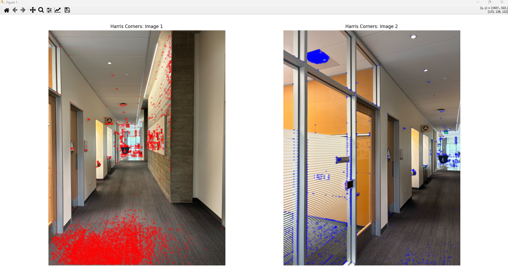
   
  
    <b>No ANMS</b> (top) vs <b>ANMS</b> (bottom)
  

  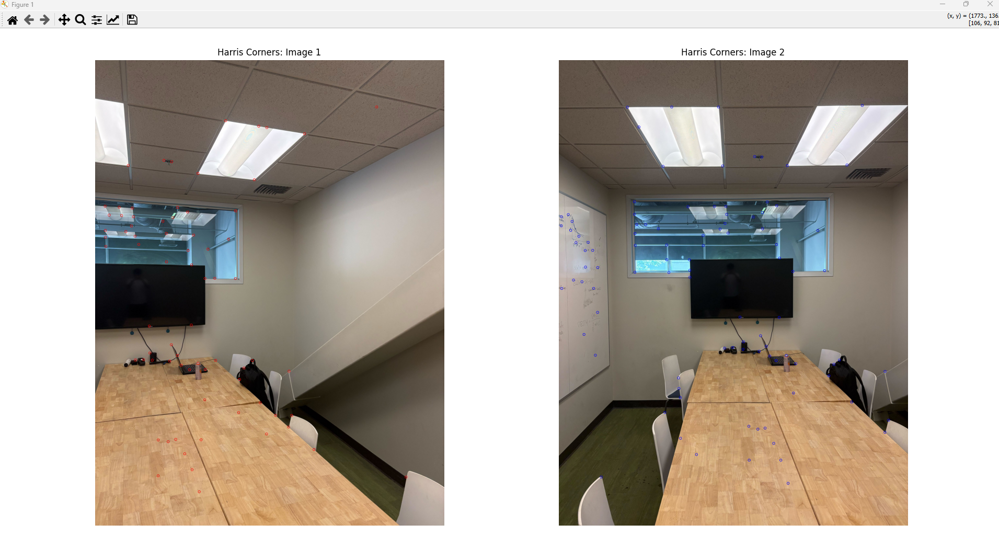
  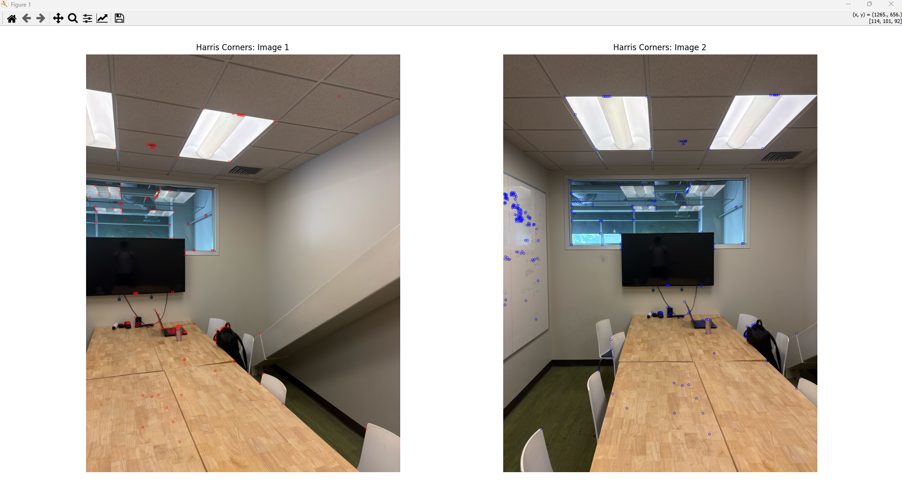
   
  
    <b>No ANMS</b> (top) vs <b>ANMS</b> (bottom)
  

  
  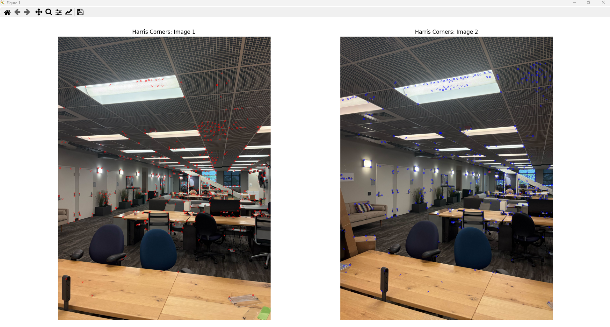
   
  
    <b>No ANMS</b> (top) vs <b>ANMS</b> (bottom)
  

<h3>Part B.2: Feature Descriptor Extraction</h3>
To extract the feature descriptors we take the image, convert it to grayscale, then pad it so that we can use 40x40 window size sampling without any issues. Then we adjust the corner positions based off the padding. Next, we iterate through all the corners output from the harris corner + NMS then get 40 x 40 patches with the corner as its centroid. Then, we just apply a blur on it, and downsample to 8x8 and bias/gain normalize it. After iterating through all the corners, we get some patches that look like the following images:

  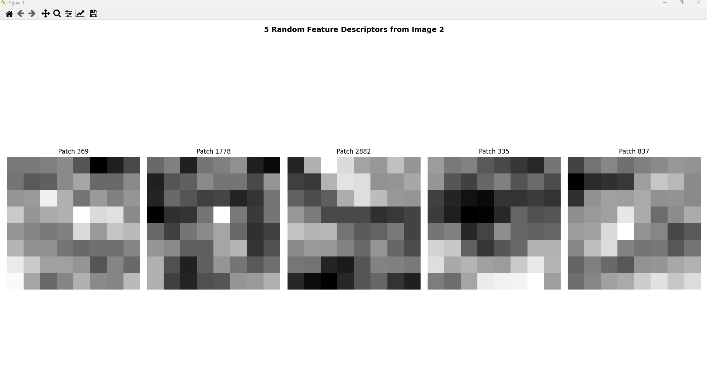
  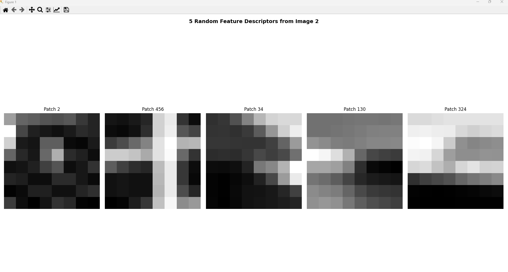
  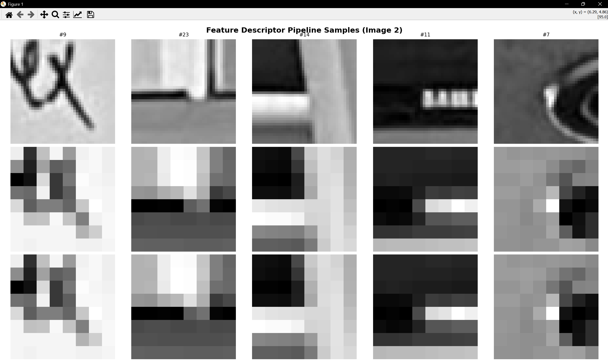
   
  
    <b>Feature Descriptors:</b> Extracted 8x8 normalized feature descriptors from three different images. Bear Image (First), CITRIS Room Image (Second), Meeting Room Image (Third)
  

<h3>Part B.3: Feature Matching</h3>

Implement Feature Matching (referencing "Section 5 of the paper"). This involves finding pairs of features that are similar and likely to be good matches. For thresholding, use Lowe's approach: thresholding on the ratio between the first and second nearest neighbors. Consult "Figure 6b in the paper" for picking the threshold and ignore "Section 6 of the paper."

<strong>Deliverables:</strong> Show matched features between image pairs.

  
   
  
    <b>Feature Matching:</b> Matched features between image pairs using Lowe's ratio test.
  

<h3>Part B.4: RANSAC for Robust Homography</h3>

For "step 4", use 4-point RANSAC as described in class to compute robust homography estimates. Then, produce mosaics by adapting code from "Part A". You can use the same images from Part A but must show both manually and automatically stitched results side by side. Produce at least three mosaics.

<strong>Deliverables:</strong> Implement 4-point RANSAC from scratch. Show comparison of stitching manually and automatically. Create >=3 automatic mosaics.

  
   
  
    <b>Manual vs Automatic:</b> Comparison of manually and automatically stitched results.
  

  
   
  
    <b>Automatic Mosaic 1:</b> First automatically generated mosaic using RANSAC.
  

  
   
  
    <b>Automatic Mosaic 2:</b> Second automatically generated mosaic using RANSAC.
  

  
   
  
    <b>Automatic Mosaic 3:</b> Third automatically generated mosaic using RANSAC.
  

