

<link href="https://fonts.googleapis.com/css2?family=Inter:wght@300;400;600;800&family=Playfair+Display:wght@600;700&display=swap" rel="stylesheet">

  

<h2 align="center" style="font-family: 'Playfair Display', serif; font-size: 2.2rem; margin: 0.2rem 0 0.4rem; letter-spacing: 0.3px; background: linear-gradient(90deg, #5B8DEF, #A78BFA); -webkit-background-clip: text; background-clip: text; -webkit-text-fill-color: transparent; color: transparent;">Alper Gel — Project 4</h2>

<h2 id="required-part-1">Part 0: Camera Calibration and 3D Scanning</h2>

I utilized an ARUCO PDF generator tool to create an ARUCO tag of size 0.1 meters, and displayed that as close as possible to scale on my tablet. I captured around 30 images to calibrate with that and got the following calibration parameters:
<strong>Camera Matrix</strong>:
<table style="margin-bottom: 0.6em;">
  <tr>
    <td>5188.76</td>
    <td>0.00</td>
    <td>2068.00</td>
  </tr>
  <tr>
    <td>0.00</td>
    <td>5090.70</td>
    <td>1535.21</td>
  </tr>
  <tr>
    <td>0.00</td>
    <td>0.00</td>
    <td>1.00</td>
  </tr>
</table>

<strong>Distortion Coefficients</strong>:
<ul style="margin-top: 0;">
  <li>k₁ = 0.07885</li>
  <li>k₂ = 0.12868</li>
  <li>p₁ = -0.05880</li>
  <li>p₂ = -0.00659</li>
  <li>k₃ = -0.23006</li>
</ul>

Then, I placed a hat next to the same ARUCO tag setup, and captured around 35 images from all angles, attempting to maximize perspectives. Then, I utilized the calibration JSON generated earlier, and ran it through my PNP.py script in order to generate accurate poses for each image in the dataset. At the end of my PNP script, I utilized the provided viser boilerplate code in order to visualize the frustums. 

  
  
   
  
    <b>Figure 1:</b> Viser Frustums of Custom Dataset From Afar and Upclose
  

<h2>Part 1: Fit a Neural Field to a 2D Image </h2>

For my 2D NeRF I had a sequential setup where I would first pass the input through my SinPosEnc module, which had a 2D input, and an output of input dim (2) + 2*(encoding frequency) * (input dim). That would pass to a linear layer of input dim equal to the SinPosEnc output, and layer width set by the hyperparameters. After that, there was a ReLU activation then 2 more linear layers with ReLU's in between. Finally there is a linear layer of input equivalent to layer width, and output 3, since we want to output RGB (3 channels), followed by a sigmoid activation. I used an LR of 1e-2 and an Adam optimizer. The default layer width is set to 256, and default PE frequency is set at 10.

The following figure shows the training progression visualization for the provided test image for L = 10, Layer Width  = 256, Epochs = 5

  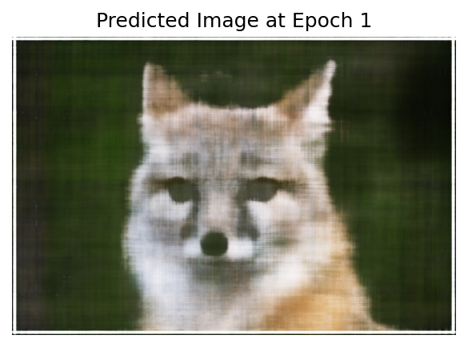
  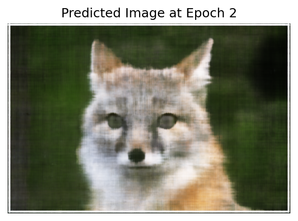
  
  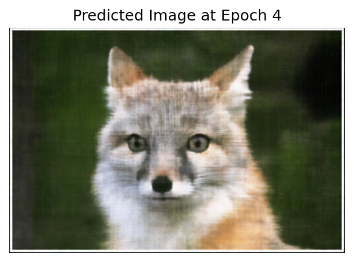
  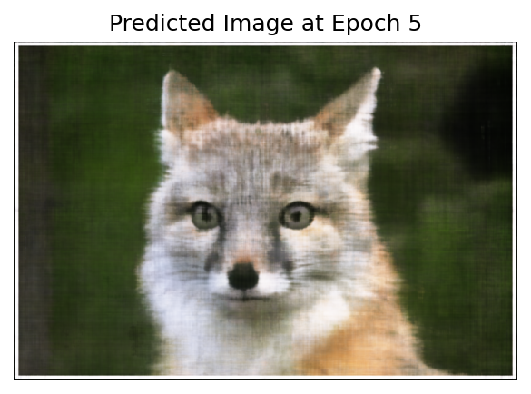

  <b>Figure 2:</b> Comparison of model output at 5 training stages (left&nbsp;→&nbsp;right: earliest to latest).

  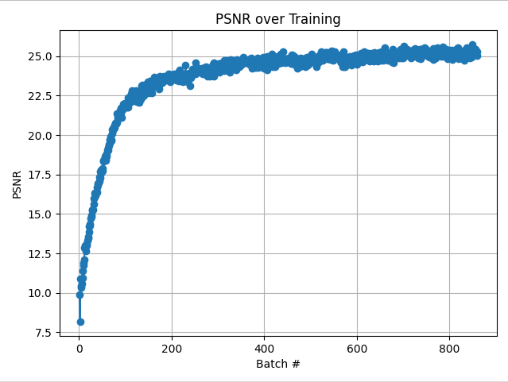
  
    <b>Figure 3:</b> PSNR curve across each batch
  
  
  
    <b>Original Image Used for Training</b>
  

The following figure shows the training progression visualization for my selected image for L = 10, Layer Width = 256, Epochs = 5

  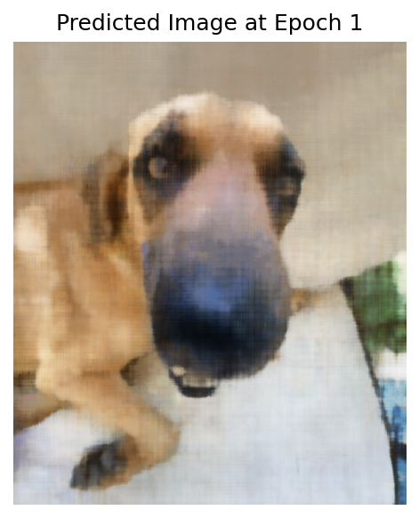
  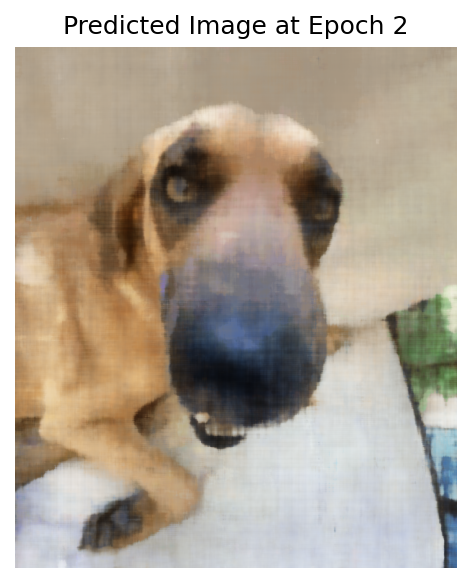
  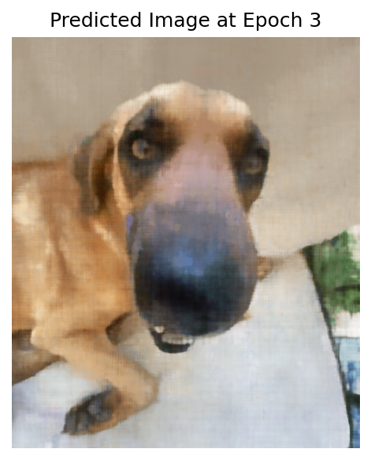
  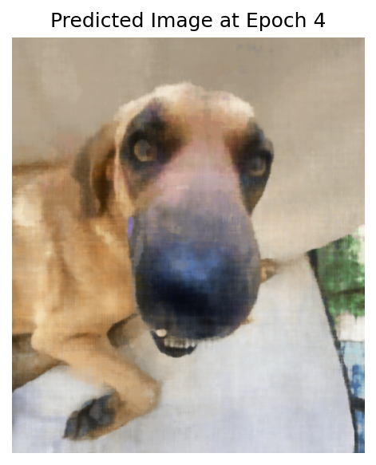
  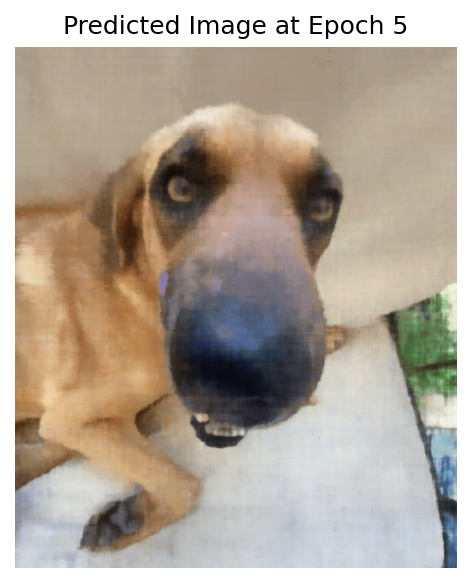

  <b>Figure 2:</b> Comparison of model output at 5 training stages (left&nbsp;→&nbsp;right: earliest to latest).

  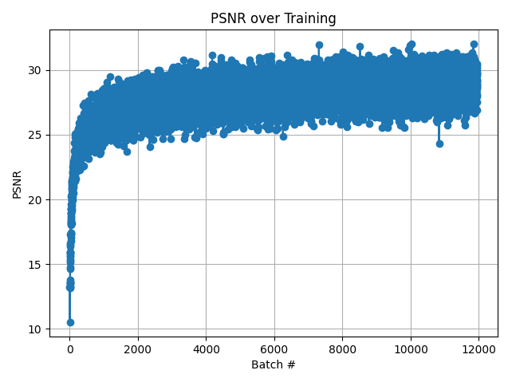
  
    <b>Figure 3:</b> PSNR curve across each batch
  
  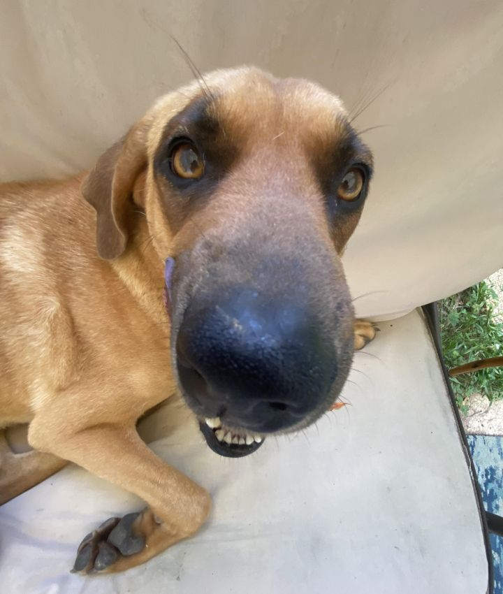
  
    <b>Original Image Used for Training</b>
  

For the Hyperparameter experimentation, I chose L values of 2 and 10, and Layer Width values of 256 and 512. The following figure shows the 2x2 grid of final result renderings (epoch 5) with the respective hyperparameters.

  

    

      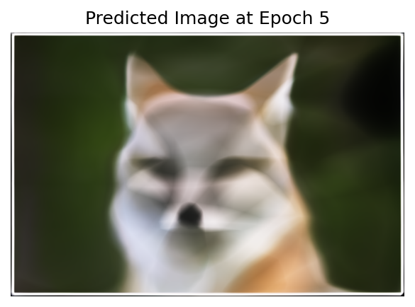
      L = 2, Width = 256
    

    

      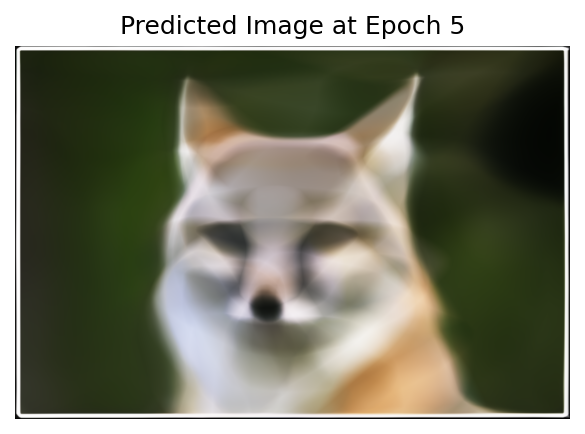
      L = 2, Width = 512
    

    

      
      L = 10, Width = 256
    

    

      
      L = 10, Width = 512
    

  

  
    <b>Figure 4:</b> 2×2 grid of model result images for different combinations of PE frequency  (L) and layer width. Top row: L=2, bottom row: L=10. Left: Width=256, Right: Width=512.
  

<h2>Part 2.1-2.5: Fit a Neural Radiance Field from Multi-view Images </h2>
To make the functionality of this section work, I had to create the following functions:
<h3>c2w_transform(c2w, x_c)</h3>

  Transforms 3D points from camera coordinate space to world coordinate space using the camera-to-world transformation matrix <code>c2w</code>. This function handles homogeneous coordinates by converting input points to 4D (if not already), applies the <code>4&times;4</code> <code>c2w</code> matrix via matrix multiplication, and then divides the XYZ components by the W component to obtain final 3D world coordinates. This is essential for NeRF because it lets us map points from the camera's perspective to the shared world coordinate system where the 3D scene is represented.

<h3>p2c_transform(K, uv, s)</h3>

  Converts image pixel coordinates <code>uv</code> to 3D camera coordinate points using the camera intrinsics matrix <code>K</code>. The pixel coordinates are first converted to homogeneous coordinates and are mapped with the inverse of <code>K</code> to get normalized camera coordinates. The result is normalized by its z (depth) component and scaled by parameter <code>s</code>. This operation is the inverse of projecting 3D points to pixels, and is vital for ray generation (to know which 3D camera direction corresponds to each pixel). An epsilon value is used internally for numerical stability.

<h3>pixel_to_ray(K, c2w, uv)</h3>

  Generates a ray in world coordinates for a given pixel position by combining <code>p2c_transform</code> and <code>c2w_transform</code>. It first maps the pixel <code>uv</code> to a 3D camera point (via <code>p2c_transform</code>), then transforms the point into world coordinates (via <code>c2w_transform</code>). The resulting ray origin is taken from the translation part of <code>c2w</code> (the camera center), and the ray direction is the normalized vector pointing from the camera center to the transformed 3D point. This works both for batched and individual pixel inputs, and is essential for sampling rays through the scene in NeRF.

<h3>sample_rays_from_images(imgs, c2w, K, N_rays, device)</h3>

  Randomly samples <code>N_rays</code> from a set of training images, returning for each ray: its world-space origin, direction, and the ground truth RGB value at the sampled pixel. For each ray, it randomly selects an image, picks a random pixel, generates a ray using <code>pixel_to_ray</code>, and samples from the pixel center (add 0.5 offset). Handles device transfer (CPU/GPU) as required and ensures all tensors share the device for efficient training. This is how training batches of rays are created when training a NeRF, so the model learns from diverse, non-duplicated rays.

<h3>sample_points_along_ray(ray_o_arr, ray_d_arr, near, far, n_samp, perturb)</h3>

  Samples <code>n_samp</code> evenly or randomly spaced 3D points along each input ray, between user-specified <code>near</code> and <code>far</code> bounds. Creates depth values using <code>linspace</code>, and uses stratified sampling (jittered intervals) if <code>perturb</code> is <code>True</code> (for better anti-aliasing and convergence during training). Computes 3D points using <code>point = o + d * t</code>. Also returns the per-segment deltas between sample depths, needed for volume rendering. The returned set of points for each ray is what NeRF will evaluate to estimate density and color for compositing the final image.

<h3>RaysData Class</h3>

  A PyTorch <code>Dataset</code> that precomputes all rays (origins, directions) for all pixels in all training images up front, storing them alongside ground truth RGB pixels, camera intrinsics, and c2w matrices. This design speeds up each training epoch by avoiding on-the-fly ray generation (at the cost of higher RAM usage). It enables efficient, fast random (or sequential) sampling of rays for NeRF training, and also stores intrinsic parameters (fx, fy, ox, oy) for use in other calculations.

<h3>RaysData _precompute_all_rays() Method</h3>

  Precomputes and stores all rays and associated RGB pixel data for every pixel in every image. Builds a meshgrid of all (image, row, col) tuples, computes UV coordinates (offset by 0.5 for pixel-center sampling as directed in the project instructions), and for each pixel, generates the ray in world space. All results are stored as numpy arrays (CPU) to minimize GPU memory usage. This method is run once, as part of dataset initialization, and ensures random ray batches can be sampled efficiently during training. 

<h3>RaysData sample_rays(B) Method</h3>

  Generates <code>B</code> (Batch count) random rays and associated ground-truth pixels by dynamic slicing, without using precomputed arrays. For each ray, randomly selects an image and a pixel location, computes the ray in world space, and queries the ground-truth RGB. Useful for debugging or for memory-constrained settings (lower memory use, but less efficient per batch). Returns ray origins, directions, and ground-truth RGBs as PyTorch tensors on the correct device.

<h3>RaysData __len__() Method</h3>

  Returns the total number of ray-pixel pairs in the dataset, i.e., <code>num_images &times; H &times; W</code>. This determines the iterable length for PyTorch <code>DataLoader</code>. 

<h3>RaysData __getitem__(idx) Method</h3>

  Implements the <code>Dataset</code> interface for random access: given an <code>idx</code>, instead of returning a deterministic result, it samples a new random ray via <code>sample_rays_from_images</code> every time. This enables random sampling for training, but ignores the index value (&mdash; for deterministic/precomputed ray access, index directly into self.rays_o, self.rays_d, and self.pixels arrays).

<h3>volrend(sigmas, rgbs, deltas, t_vals)</h3>

  Implements the core volume rendering equation that integrates density and color predictions along rays to produce final pixel colors. The function computes the transmittance T (how much light passes through the volume up to each sample point) by calculating the cumulative sum of sigma times delta (density times step size) for all previous samples, then exponentiating the negative of this sum. The transmittance is clamped between 0 and 50 to prevent numerical overflow in the exponential function. The weight for each sample point is computed as T multiplied by (1 - exp(-sigma_delta)), which represents the probability that a ray terminates at that point. These weights are then multiplied by the predicted RGB colors and summed across all samples along the ray to produce the final discretized RGB value. 
  
  If depth values (t_vals) are provided, the function also computes the expected depth by taking a weighted sum of the depth values using the same weights, which is useful for visualization and depth estimation. This volume rendering integral is what allows NeRF to learn a continuous 3D scene representation from discrete 2D images, so this is critical!

<h3>render_novel_view(model, c2w, K, H, W, near, far, n_samples, device, chunk_size)</h3>

  Renders a complete novel view image from a trained NeRF model by generating rays for every pixel in the output image and aggregating the model's predictions through volume rendering. The function first creates a grid of pixel coordinates covering the entire image (H x W pixels), offsetting each coordinate by 0.5 to sample from pixel centers. It then generates rays for all pixels using the pixel_to_ray function with the provided camera-to-world transformation matrix (c2w) and camera intrinsics (K). 
  
  To handle memory constraints when rendering high-resolution images, the function processes rays in chunks rather than all at once. For each chunk, it samples points along the rays between the near and far planes, flattens the points and ray directions for batch processing, and passes them through the NeRF model to get density and color predictions. The volrend function then integrates these predictions to produce the final color for each ray. 
  
  All rendered chunks are concatenated and reshaped into an H x W x 3 image array. The function operates in evaluation mode (model.eval()) with gradient computation disabled (torch.no_grad()) for efficient inference, and uses perturb=False during point sampling to ensure deterministic, high-quality renders without the random jittering used during training.

<h3>Viser Dataset Visualization</h3>
Utilizing these functions, we're able to generate the frustum, ray, and sample visualization, with the Lego dataset example shown below:

  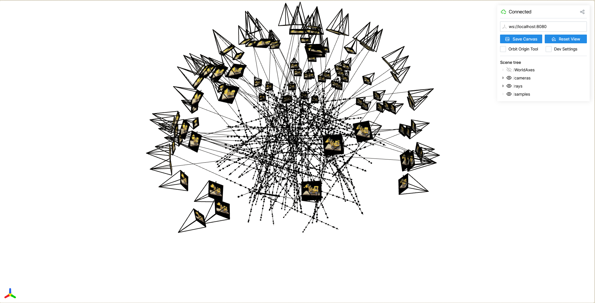
   
  
    Example of frustum, ray, and sample visualization for the Lego dataset.
  

<h3>3D NERF Model Report </h3>

    For the model itself, the architecture is almost exactly what is described in the project instructions, with a few training tweaks to provide better performance. Instead of using a single L value of 4 for both the spatial and view direction PE's, I used an L value of 10 for the spatial and 4 for the view direction, which showed around a 2 PSNR boost to my standard model. Further, I was seeing extremely non-deterministic results between each training run, so I setup a deterministic setting (on by default), which intiializes a random torch seed, enables deterministic CUDnn, and makes the dataloader provide data in a deterministic fashion. Initially I was noticing exploding gradients during training, so before the optimizer stepping I clipped the gradient, which tended to help in most cases. In the rare case that we want to train for more than 1 epoch (takes a while), I added an Exponental LR scheduler which adjusts the LR between epochs to optimize training convergence. Finally, I found that my model would not converge regularly when utilizing the recommended lr=5e-4, so I decided to use the more ADAM optimizer standard 1e-3 LR value, which made a huge difference in my model convergence.  

<h3>3D NERF Training </h3>

  Once we have the capabilities described above, we need to create a train function to train the 3D NERF MLP. As is standard, the trainer first facilitates setup (initializing criterion, optimizer, model, dataloader, etc). Then it sets the model in training state, and runs the NeRF model for a specified number of epochs, where each epoch iterates over batches of rays sampled from the dataset. For every batch, rays and their ground-truth colors (and optionally depth values from monocular depth estimation if enabled) are sampled and processed. Each batch is fed into the model to obtain predicted colors and densities, and points along each ray are sampled between near and far bounds. These outputs are passed through volumetric rendering to compute final RGB values and depths for the batch. 
  
  The training objective minimizes the difference between rendered and true RGB colors using a mean squared error loss.  Gradients are computed and applied to update the model parameters, with gradient clipping for stability (as mentioned above), and the learning rate is decayed after each epoch via a scheduler. During training, the model's performance is periodically visualized: rendered images are produced from both a training and a validation viewpoint and are saved to disk. PSNR is computed for each batch to quantitatively track reconstruction quality. 
  
  If enabled, the script will push updated views to viser server to show model progress from novel validation perspectives. Finally, the trained model is saved to disk as a pickle file, and all accumulated losses, the model, and PSNRs over training are plotted as needed.

<h3>LEGO Dataset Training</h3>
When trained on the LEGO dataset provided with the hyperparameters LR=1e-3, near=2.0, far=6.0, num_samples=64, we get the following training progression

  

    <figure style="text-align: center; margin: 0;">
      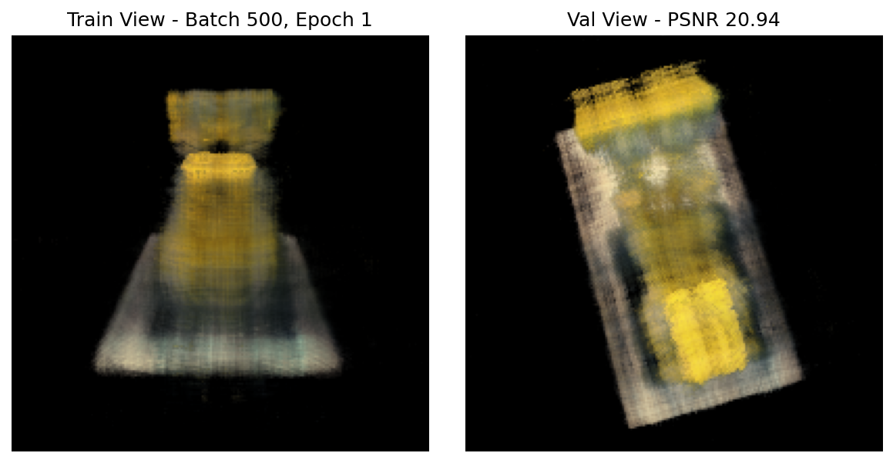
      <figcaption style="margin-top: 2px; color: #64748b; font-size: 1.12rem;">Epoch #1, Batch #500</figcaption>
    </figure>
    <figure style="text-align: center; margin: 0;">
      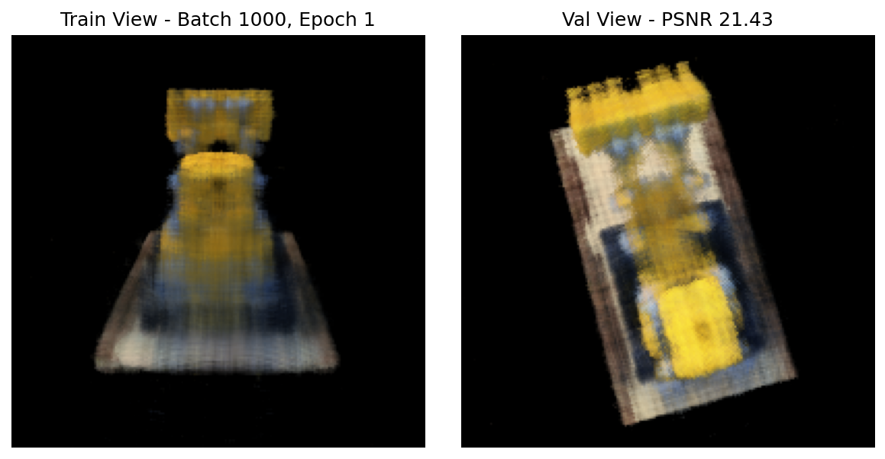
      <figcaption style="margin-top: 2px; color: #64748b; font-size: 1.12rem;">Epoch #1, Batch #1000</figcaption>
    </figure>
    <figure style="text-align: center; margin: 0;">
      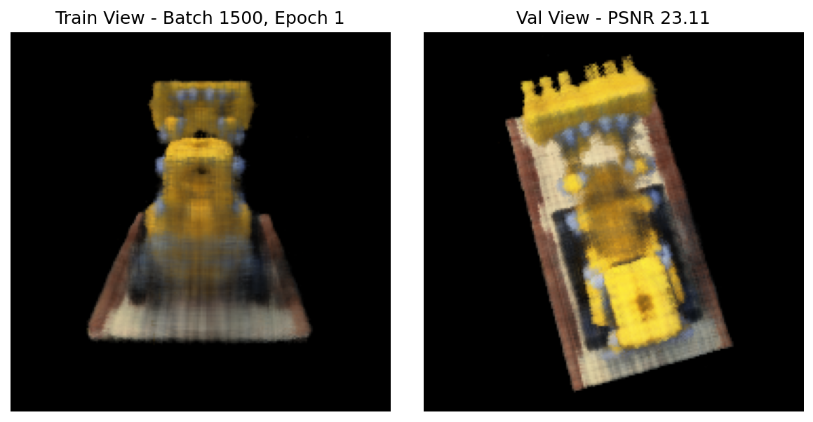
      <figcaption style="margin-top: 2px; color: #64748b; font-size: 1.12rem;">Epoch #1, Batch #1500</figcaption>
    </figure>
  

  

    <figure style="text-align: center; margin: 0;">
      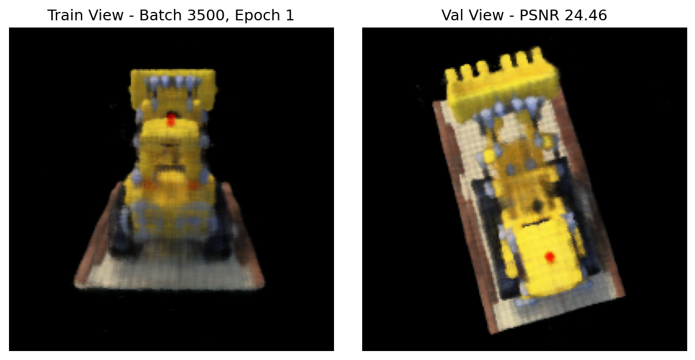
      <figcaption style="margin-top: 2px; color: #64748b; font-size: 1.12rem;">Epoch #1, Batch #3500</figcaption>
    </figure>
    <figure style="text-align: center; margin: 0;">
      
      <figcaption style="margin-top: 2px; color: #64748b; font-size: 1.12rem;">Epoch #2, Batch #5500</figcaption>
    </figure>
    <figure style="text-align: center; margin: 0;">
      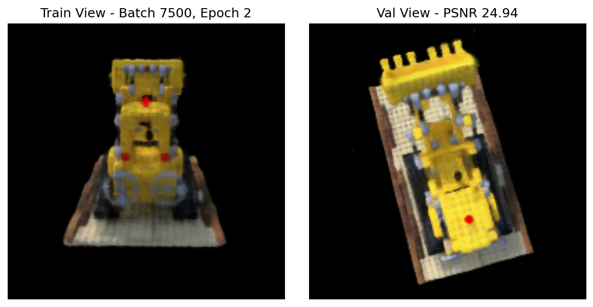
      <figcaption style="margin-top: 2px; color: #64748b; font-size: 1.12rem;">Epoch #2, Batch #7500 </figcaption>
    </figure>
  

The following figures show the training loss and PSNR metrics and the validation PSNR metrics respectively. 

  <figure style="text-align:center; margin:0;">
    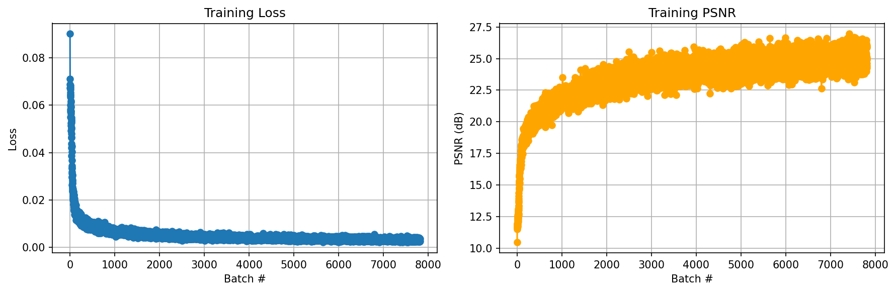
    <figcaption style="color: #64748b; font-size: 1.08rem; margin-top: 2px;">Training Loss</figcaption>
  </figure>
  <figure style="text-align:center; margin:0;">
    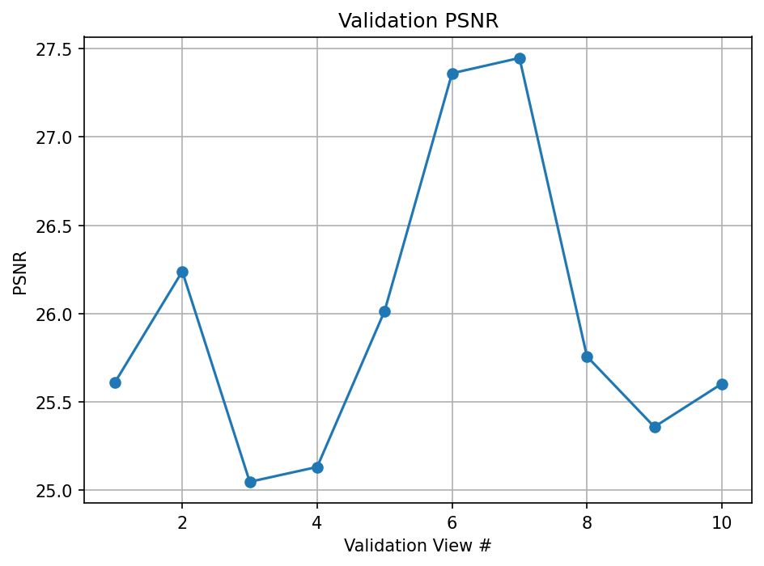
    <figcaption style="color: #64748b; font-size: 1.08rem; margin-top: 2px;">Validation PSNR</figcaption>
  </figure>

Finally, using the circular render boilerplate code provided + my render_novel_view function, we are able to generate the following GIF as an output of this training 

  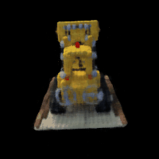
  <figcaption style="margin-top: 2px; color: #64748b; font-size: 1.12rem; text-align:center;">
    Rendered Novel View GIF
  </figcaption>

<h3>Lafufu Dataset Training</h3>
When trained on the LAFUFU dataset provided with the hyperparameters LR=5e-4, near=0.02, far=0.5, num_samples=64, we get the following training progression

  

    <figure style="text-align: center; margin: 0;">
      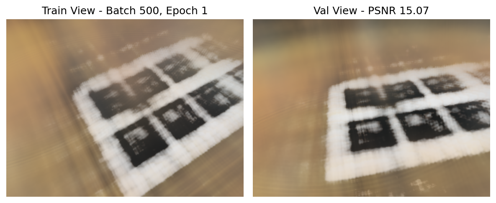
      <figcaption style="margin-top: 2px; color: #64748b; font-size: 1.12rem;">Epoch #1, Batch #500</figcaption>
    </figure>
    <figure style="text-align: center; margin: 0;">
      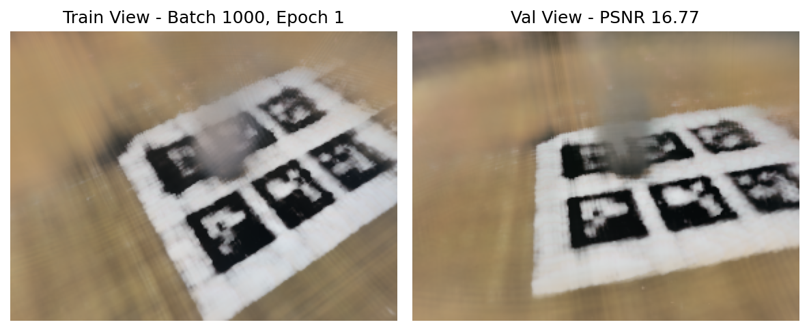
      <figcaption style="margin-top: 2px; color: #64748b; font-size: 1.12rem;">Epoch #1, Batch #1000</figcaption>
    </figure>
    <figure style="text-align: center; margin: 0;">
      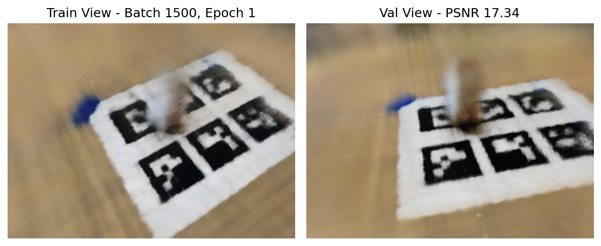
      <figcaption style="margin-top: 2px; color: #64748b; font-size: 1.12rem;">Epoch #1, Batch #1500</figcaption>
    </figure>
  

  

    <figure style="text-align: center; margin: 0;">
      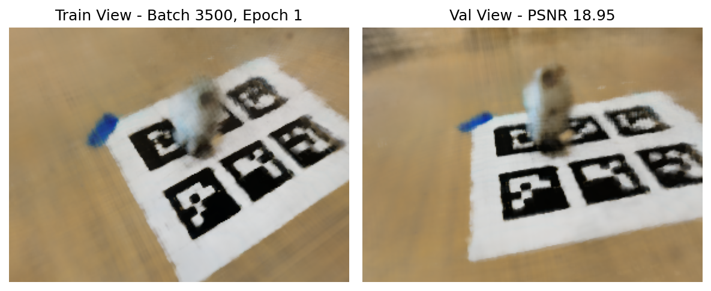
      <figcaption style="margin-top: 2px; color: #64748b; font-size: 1.12rem;">Epoch #1, Batch #3500</figcaption>
    </figure>
    <figure style="text-align: center; margin: 0;">
      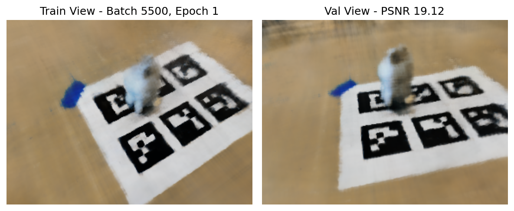
      <figcaption style="margin-top: 2px; color: #64748b; font-size: 1.12rem;">Epoch #2, Batch #5500</figcaption>
    </figure>
    <figure style="text-align: center; margin: 0;">
      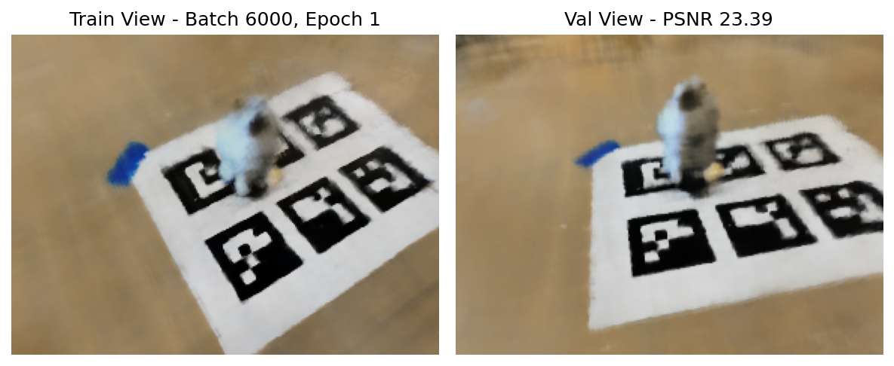
      <figcaption style="margin-top: 2px; color: #64748b; font-size: 1.12rem;">Epoch #2, Batch #6000 </figcaption>
    </figure>
  

The following figures show the training loss and PSNR metrics and the validation PSNR metrics respectively

  <figure style="text-align:center; margin:0;">
    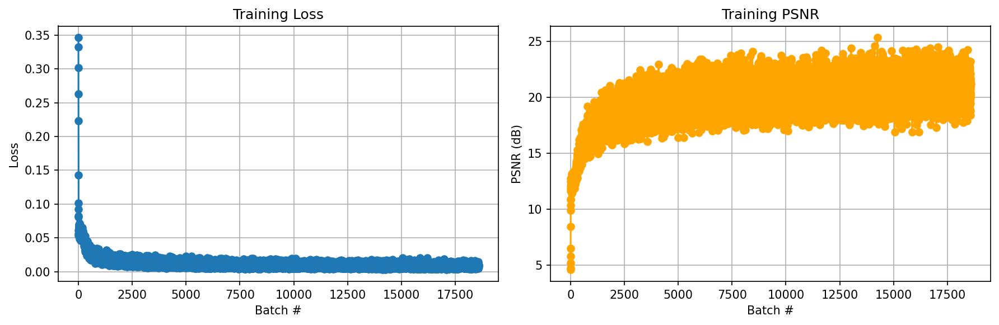
    <figcaption style="color: #64748b; font-size: 1.08rem; margin-top: 2px;">Training Loss</figcaption>
  </figure>
  <figure style="text-align:center; margin:0;">
    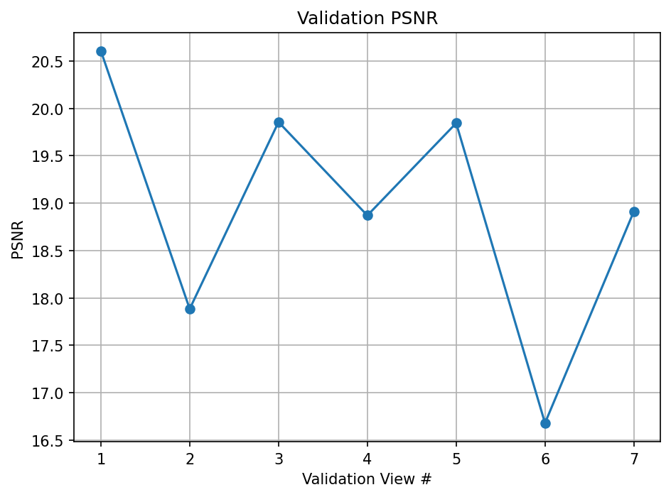
    <figcaption style="color: #64748b; font-size: 1.08rem; margin-top: 2px;">Validation PSNR</figcaption>
  </figure>

Generated GIF:

  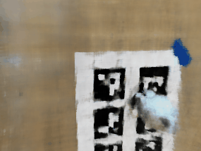
  <figcaption style="margin-top: 2px; color: #64748b; font-size: 1.12rem; text-align:center;">
    Rendered Novel View GIF
  </figcaption>

<h2>Part 2.6: Training with Your Own Data</h2>
To train on my own data, I collected around 35 images with the same ARUCO setup on my tablet and a matcha drink next to the tablet to be the scanned object. I ran the images through the pnp script given the previous camera calibration. The pnp script then output the poses in terms of an npz file. Then this npz file was passed into my 3d_nerf.py script and trained using the ADAMW optimizer with near =0.17, far = 1.39, lr = 1e-3, num_samples = 64, epochs = 5.

  <figure style="text-align:center; margin:0;">
    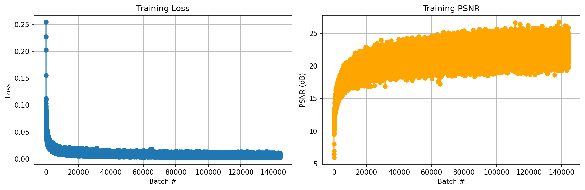
    <figcaption style="color: #64748b; font-size: 1.08rem; margin-top: 2px;">Training Loss and PSNR</figcaption>
  </figure>
  <figure style="text-align:center; margin:0;">
    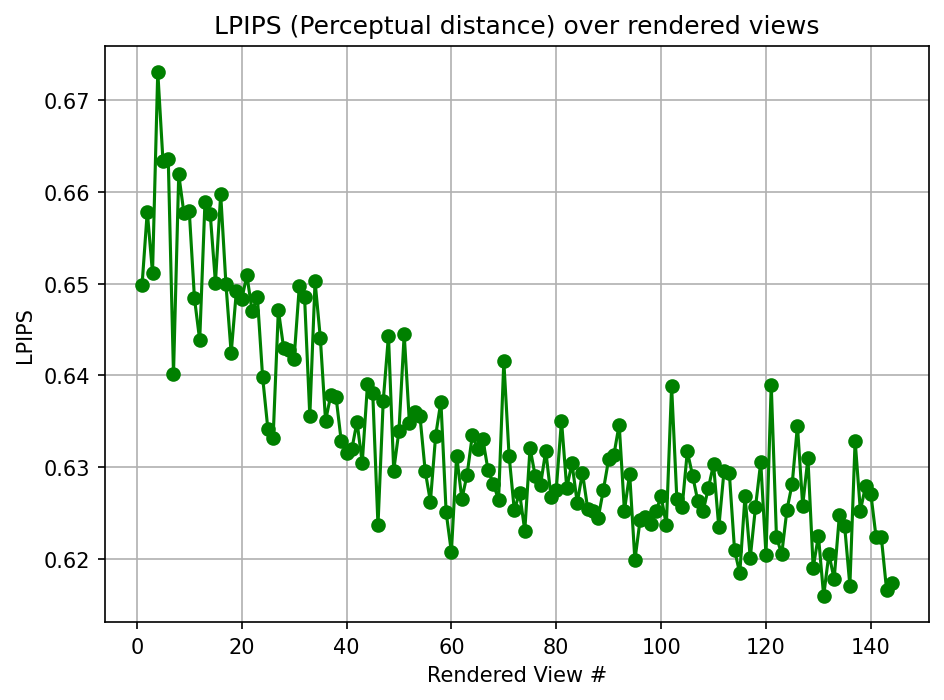
    <figcaption style="color: #64748b; font-size: 1.08rem; margin-top: 2px;">Validation LPIPS</figcaption>
  </figure>

Generated GIF:

  
  <figcaption style="margin-top: 2px; color: #64748b; font-size: 1.12rem; text-align:center;">
    Rendered Novel View GIF
  </figcaption>

<h2> Part 2.6 Splat Version </h2>
To compare, I also trained a gaussian splat of the same scene, shown below (Some browsers might not show the viewer) :

<h2>Extras Part 1: Optimizer Change</h2>
Since ADAM-W has given me better results in the past with other 3D reconstruction tasks like 3D gaussian splatting or monocular depth estimation, I wanted to try it out for training the 3D NeRF. I used a some-what standard weight decay of 1e-4 value. After multiple experiments, I saw that ADAM-W converged faster than using standard ADAM for my 3D NERF implementation. The following shows the comparison of an experiment using ADAM vs ADAM-W. Overall, we see that with the same amount of iterations and learning rate, ADAM-W is able to find a relatively better optima. 

  <figure style="text-align:center; margin:0;">
    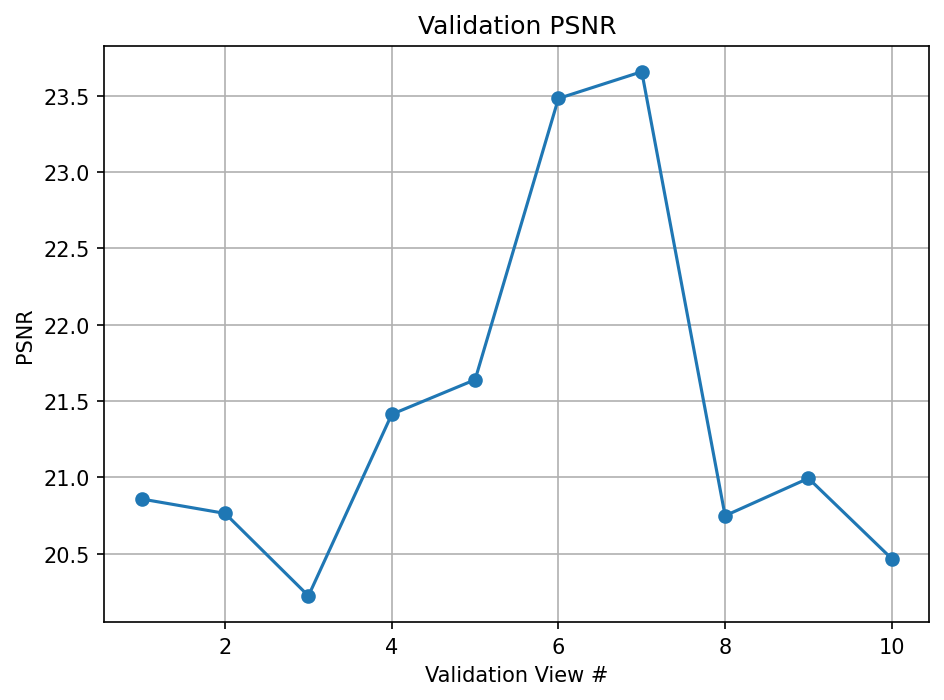
    <figcaption style="color: #64748b; font-size: 1.05rem; margin-top: 2px;">
      ADAM: Val PSNR
    </figcaption>
  </figure>
  <figure style="text-align:center; margin:0;">
    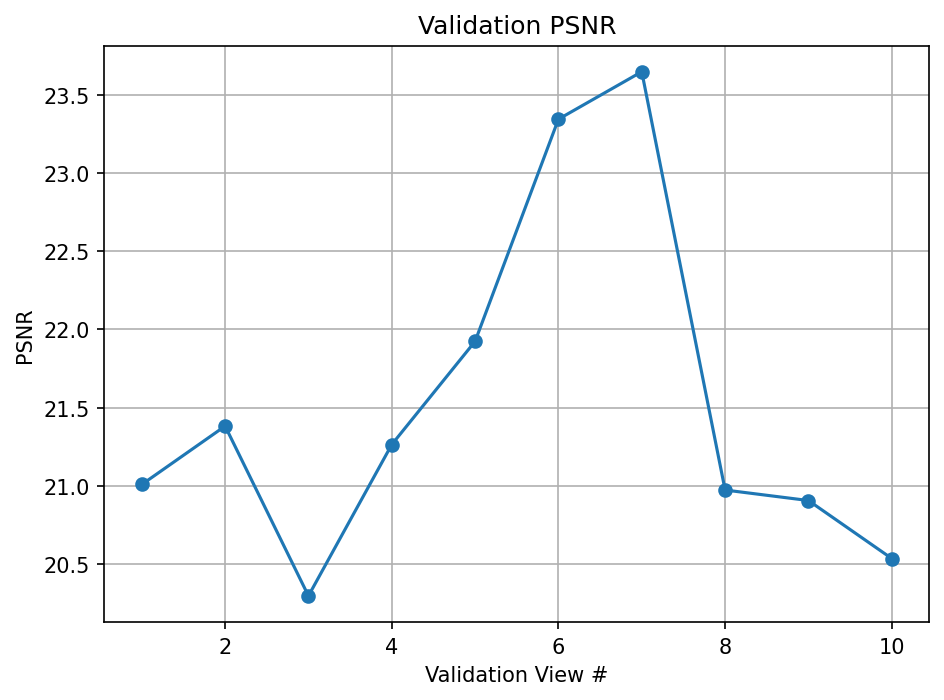
    <figcaption style="color: #64748b; font-size: 1.05rem; margin-top: 2px;">
      ADAM-W: Val PSNR
    </figcaption>
  </figure>

<h2>Extras Part 2: Monocular Depth Supervision</h2>
Monocular Depth Estimation (MDE) provides additional geometric supervision to the NeRF training process by leveraging pretrained depth estimation models to generate depth maps for training images. During initialization, if MDE is enabled, the system processes all training images through either a MoGeV2 or Depth-AnythingV2 model (user chooses through CLI) to produce dense depth predictions. These depth maps serve as pseudo-ground-truth depth values for each pixel in the training images. During training, the NeRF model renders not only RGB colors but also expected depth values along each ray through the volume rendering equation by taking the sum of ws_squeezed * t_vals. A depth loss term is computed using L1 loss between the normalized rendered depths and normalized MDE-predicted depths, weighted by a factor lambda_d (set at 0.1) and added to the standard color reconstruction loss. This depth supervision helps the NeRF model learn more accurate 3D geometry and scene structure by constraining the density field to produce depth values consistent with the MDE predictions, which is particularly beneficial when training data is limited or when the scene contains complex geometry that might be difficult to learn from RGB supervision alone.

However, since these depth estimation models struggle with multi-view consistency, they introduce significant depth noise. This noise in the loss calculation fights against the NeRF's theoretically perfect depth estimation. For that reason, the impact of the depth on the loss calculation needs to be decayed exponentially as training progresses so that it only serves as a good initialization, then provides less and less supervision.

<strong>Depth estimation visualizations from the Lafufu Dataset using MOGEv2 Metric Depth Estimation:</strong>

  <figure style="text-align:center; margin:0;">
    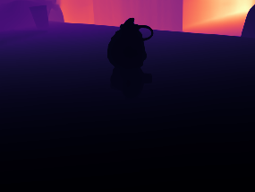
    <figcaption style="color: #64748b; font-size: 0.99rem; margin-top: 2px;">Depth Prediction 1</figcaption>
  </figure>
  <figure style="text-align:center; margin:0;">
    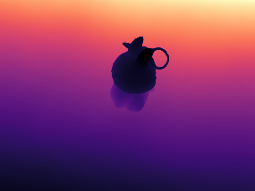
    <figcaption style="color: #64748b; font-size: 0.99rem; margin-top: 2px;">Depth Prediction 2</figcaption>
  </figure>
  <figure style="text-align:center; margin:0;">
    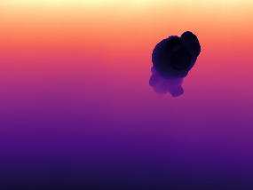
    <figcaption style="color: #64748b; font-size: 0.99rem; margin-top: 2px;">Depth Prediction 3</figcaption>
  </figure>

<h2>Extras Part 3: LPIPS Calculation</h2>
In honor of Professor Efros, whose work created the LPIPS metric, my training script automatically calculates LPIPS metric using the AlexNet version each 500 batches, and outputs a plot of LPIPS over time. If the model is accurately learning the geometry, LPIPS should go down over each training iteration.

The following LPIPS plot was generated from running an experiment on the LEGO dataset with num_samples = 16, LR = 1e-3, near = 2.0, far =6.0

LPIPS Metric Plot:

  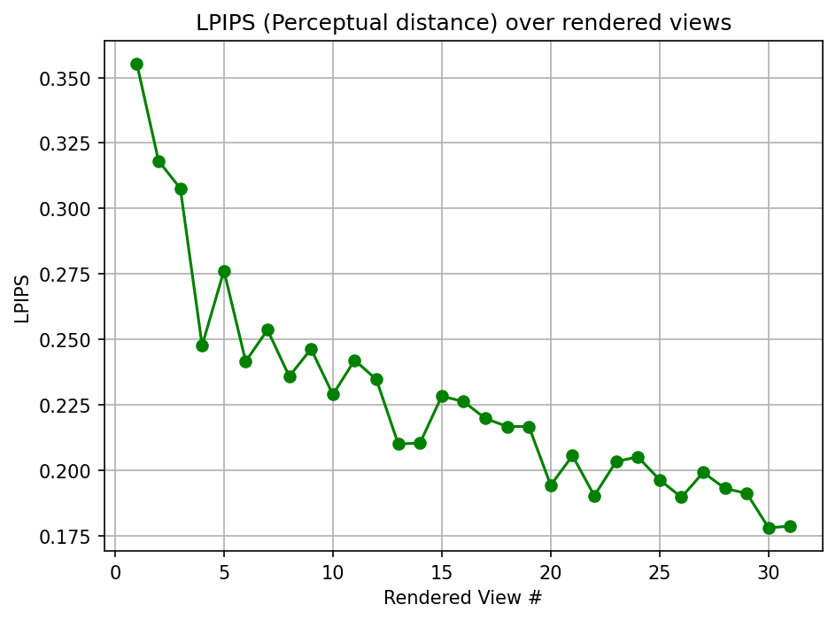
  <figcaption style="color: #64748b; font-size: 1.08rem; margin-top: 2px;">
    LPIPS over Training Iterations (lower = better, AlexNet)
  </figcaption>

<h2>Extras Part 4: Automatic Near/Far Suggestion</h2>
After running into a lot of trouble trial and erroring near/far values for my custom scene, I decided to try to make a way to automatically suggest good near/far values for the particular set of calibrated poses. In my 3d_nerf.py file, the analyze_scene_bounds function analyzes camera positions to suggest near and far values for NeRF training. It extracts camera positions from the translation component ([:3, 3]) of the camera-to-world matrices, combines training and validation cameras if provided, and computes statistics about the scene geometry. Primarily, it calculates two distance metrics: distances from the origin (assuming the scene is centered) and pairwise distances between all camera pairs. These help estimate scene scale and camera spread.

From these distances, it computes statistics: minimum, maximum, mean, and median distances from the origin, plus minimum, maximum, and mean pairwise distances.
For suggestions, it sets near to at least 0.1 or half the minimum camera distance from the origin (whichever is larger), and far to 1.5× the maximum pairwise camera distance to cover the scene extent. If cameras are roughly equidistant from the origin (ratio < 2.0), it adjusts near to 0.3× the minimum distance and far to 1.5× the maximum distance, assuming an orbiting setup. It ensures far is at least 2× near to maintain a reasonable sampling range.

Overall, this isnt always accurate, but I found it to give me relatively good suggested values for near/far.
