<script src="https://polyfill.io/v3/polyfill.min.js?features=es6"></script>
<script id="MathJax-script" async src="https://cdn.jsdelivr.net/npm/mathjax@3/es5/tex-mml-chtml.js"></script>
<script src="https://cdnjs.cloudflare.com/ajax/libs/jszip/3.10.1/jszip.min.js"></script>

<link href="https://fonts.googleapis.com/css2?family=Inter:wght@300;400;600;800&family=Playfair+Display:wght@600;700&display=swap" rel="stylesheet">

<div style="max-width: 1100px; margin: 0 auto; padding: 12px 18px; font-family: 'Inter', -apple-system, BlinkMacSystemFont, 'Segoe UI', Roboto, 'Helvetica Neue', Arial, 'Noto Sans', 'Apple Color Emoji', 'Segoe UI Emoji', 'Segoe UI Symbol'; color: #0f172a; line-height: 1.6;">
<style>
/* Gallery appearance: rounded black frame; non-white inner background; images stay square */
figure { background: #f1f5f9; padding: 6px; border: 1px solid #000; border-radius: 10px; }
figure img { border-radius: 0 !important; border: none !important; box-shadow: none !important; display: block; }
/* Lightbox: subtle 1px border, no shadow */
#img-lightbox-img { border-radius: 0 !important; border: 1px solid #000 !important; box-shadow: none !important; }
</style>

<p align="center" style="margin: 0 0 10px;">
  
</p>

<h2 align="center" style="font-family: 'Playfair Display', serif; font-size: 2.2rem; margin: 0.2rem 0 0.4rem; letter-spacing: 0.3px; background: linear-gradient(90deg, #5B8DEF, #A78BFA); -webkit-background-clip: text; background-clip: text; -webkit-text-fill-color: transparent; color: transparent;">Alper Gel — Project 5</h2>
<p style="margin: 0 0 10px; color: #334155;">
NOTE FOR GRADER: All images have been upscaled using the upscale starter code provided. Due to that, there can be artifacts in background elements with low contrast. If the original low-res are needed, I would be happy to provide it. 

<hr style="border: none; border-top: 1px solid #e5e7eb; margin: 12px 0 16px;">
<h2 id="required-part-1">Section A</h2>

<h3 id="required-part-1">Part A.0: Setup</h3>
<p style="margin: 0 0 10px; color: #334155;">
For all of the subsequent parts, I set SEED = 100. I came up with the following prompts:
<ul>
  <li>a watercolor painting of a sunset over the ocean</li>
  <li>a charcoal sketch of a woman reading</li>
  <li>a photo of a crowded city street at night</li>
  <li>a photo of a cat sitting on a windowsill</li>
  <li>an oil painting of a stormy sea</li>
  <li>a high quality photo of a forest path</li>
  <li>a photo of a smiling child</li>
  <li>a photo of an old library interior</li>
  <li>a digital illustration of a cyberpunk city</li>
  <li>a pencil drawing of a flower in a vase</li>
  <li>a photo of a man in a suit</li>
  <li>a photo of a woman wearing headphones</li>
  <li>a photo of a couple walking in the rain</li>
  <li>a photo of a group of friends at a café</li>
  <li>a high quality picture of a sports car</li>
  <li>a photo of a mountain lake at sunrise</li>
  <li>a photo of a busy office</li>
  <li>a photo of a chef cooking in a kitchen</li>
  <li>a photo of a musician on stage</li>
  <li>a photo of a golden retriever running on the beach</li>
</ul>
<p style="margin: 0 0 10px; color: #334155;">
Using three of the prompt embeddings, we are able to generate the following images.For each prompt, we can show how different the output is for 10 output steps versus 20. 
<p style="margin: 32px 0; display: flex; flex-direction: row; justify-content: center; align-items: flex-start; gap: 20px;">
  
  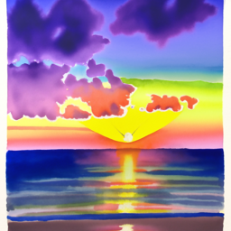
</p>
<p style="text-align: center; color: #64748b; font-size: 1.08rem;">
  <b>Figure 1:</b> Generated using prompt: a watercolor painting of a sunset over the ocean. Left shows 10 inference steps, right shows 20.
</p>
<p style="margin: 32px 0; display: flex; flex-direction: row; justify-content: center; align-items: flex-start; gap: 20px;">
  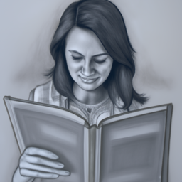
  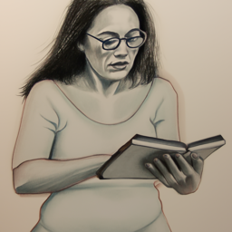
</p>
<p style="text-align: center; color: #64748b; font-size: 1.08rem;">
  <b>Figure 2:</b> Generated using prompt: a charcoal sketch of a woman reading. Left shows 10 inference steps, right shows 20.
</p>
<p style="margin: 32px 0; display: flex; flex-direction: row; justify-content: center; align-items: flex-start; gap: 20px;">
  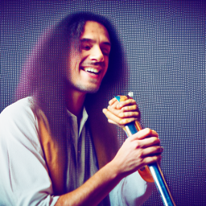
  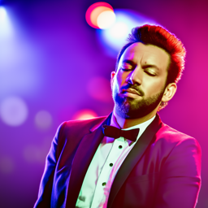
</p>
<p style="text-align: center; color: #64748b; font-size: 1.08rem;">
  <b>Figure 3:</b> Generated using prompt: photo of a musician on stage. Left shows 10 inference steps, right shows 20.
</p>

<h3 id="required-part-1">Part A.1: Sampling Loops</h3>
<p style="margin: 0 0 10px; color: #334155;">
To implement the forward process, we first get the cumulative product of alphas (a_bar_t) at the given timestep t from alphas_cumprod, which is a schedule that controls how much noise is added during the diffusion process. We then reshape a_bar_t to match image dims and sample gaussian noise with the same shape as the image. Finally, we just follow the forward diffusion formula given in the notebook by doing:    

```python
noisy_im = (a_bar_t.sqrt() * im + (1.0 - a_bar_t).sqrt() * noise)
```

This forward function creates a gradual transition from clean image to pure noise, which the actual model learns to reverse during training. 
<p style="margin: 32px 0; display: flex; flex-direction: row; justify-content: center; align-items: flex-start; gap: 20px;">
  
  
  
</p>
<p style="text-align: center; color: #64748b; font-size: 1.08rem;">
  <b>Figure 4:</b> Left image shows Campanille at 250 noise level, middle shows Campanille at 500, and right shows Campanille at 750. 
</p>

<h3 id="required-part-1">Part A.2: Classical Denoising</h3>
<p style="margin: 0 0 10px; color: #334155;">
Using the native torch.nn.functional.gaussian_blur, we can do classical gaussian blur filtering to attempt to reverse the noise added in the previous section. The best result I found was with kernel size = 9. That gives us the following results.
<p style="margin: 32px 0; display: flex; flex-direction: row; justify-content: center; align-items: flex-start; gap: 20px;">
  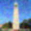
  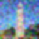
  
</p>
<p style="text-align: center; color: #64748b; font-size: 1.08rem;">
  <b>Figure 5:</b> Left image shows gaussian blur denoised Campanille at 250 noise level, middle shows Campanille at 500, and right shows Campanille at 750. 
</p>
<h3 id="required-part-1">Part A.3: Implementing One Step Denoising</h3>
<p style="margin: 0 0 10px; color: #334155;">
To complete this section, we simply need to pass the respective noisy image into stage_1 of the unet with the respective "t" value. We also pass the prompt embed of "a high quality photo" to guide the denoising process. The first stage then outputs a noise estimate, of which we take the first 3 channels, then plug into the formula given in the equation given in the notebook. 
<p style="margin: 32px 0; display: flex; flex-direction: row; justify-content: center; align-items: flex-start; gap: 20px;">
  
  
  
</p>
<p style="text-align: center; color: #64748b; font-size: 1.08rem;">
  <b>Figure 6:</b> Left image shows original Campanille image,  middle shows Campanille noised at 250, and right shows Campanille denoised by the one-step denoising. 
</p>
<p style="margin: 32px 0; display: flex; flex-direction: row; justify-content: center; align-items: flex-start; gap: 20px;">
  
  
  
</p>
<p style="text-align: center; color: #64748b; font-size: 1.08rem;">
  <b>Figure 7:</b> Left image shows original Campanille image,  middle shows Campanille noised at 500, and right shows Campanille denoised by the one-step denoising. 
</p>
<p style="margin: 32px 0; display: flex; flex-direction: row; justify-content: center; align-items: flex-start; gap: 20px;">
  
  
  
</p>
<p style="text-align: center; color: #64748b; font-size: 1.08rem;">
  <b>Figure 8:</b> Left image shows original Campanille image,  middle shows Campanille noised at 750, and right shows Campanille denoised by the one-step denoising. 
</p>

<h3 id="required-part-1">Part A.4: Implementing Iterative Denoising</h3>
<p style="margin: 0 0 10px; color: #334155;">
To complete this section, we simply need to pass the respective noisy image into stage_1 of the unet with the respective "t" value. We also pass the prompt embed of "a high quality photo" to guide the denoising process. The first stage then outputs a noise estimate, of which we take the first 3 channels, then plug into the formula given in the equation given in the notebook. 
<div style="margin: 32px 0; display: flex; flex-direction: row; justify-content: center; align-items: flex-start; gap: 16px;">
  <figure style="margin: 0; text-align: center; width: 19%;">
    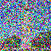
    <figcaption style="font-size: 0.98rem; color: #64748b;">Step 10: t=690</figcaption>
  </figure>
  <figure style="margin: 0; text-align: center; width: 19%;">
    
    <figcaption style="font-size: 0.98rem; color: #64748b;">Step 15: t=540</figcaption>
  </figure>
  <figure style="margin: 0; text-align: center; width: 19%;">
    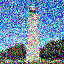
    <figcaption style="font-size: 0.98rem; color: #64748b;">Step 20: t=390</figcaption>
  </figure>
  <figure style="margin: 0; text-align: center; width: 19%;">
    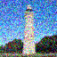
    <figcaption style="font-size: 0.98rem; color: #64748b;">Step 25: t=240</figcaption>
  </figure>
  <figure style="margin: 0; text-align: center; width: 19%;">
    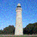
    <figcaption style="font-size: 0.98rem; color: #64748b;">Step 30: t=90</figcaption>
  </figure>
</div>
<p style="text-align: center; color: #64748b; font-size: 1.08rem;">
  <b>Figure 9a:</b> Visualization of 5 iterative denoising steps: each image captioned with its corresponding step and timestep. The image slowly becomes cleaner as we iterate from left to right. 
</p>

<p style="margin: 32px 0; display: flex; flex-direction: row; justify-content: center; align-items: flex-start; gap: 20px;">
  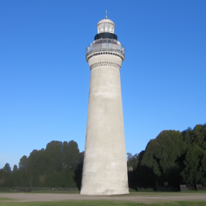
  
  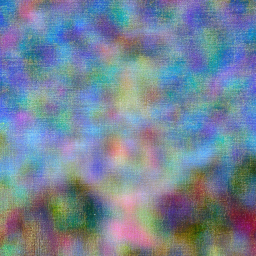
</p>
<p style="text-align: center; color: #64748b; font-size: 1.08rem;">
  <b>Figure 9:</b> Final result comparison. Left image shows final predicted clean image using iterative denoising, middle shows predicted clean image using only a single denoising step, and right shows predicted clean image using gaussian blurring. 
</p>

<h3 id="required-part-1">Part A.5: Diffusion Model Sampling</h3>
