<script src="https://polyfill.io/v3/polyfill.min.js?features=es6"></script>
<script id="MathJax-script" async src="https://cdn.jsdelivr.net/npm/mathjax@3/es5/tex-mml-chtml.js"></script>
<script src="https://cdnjs.cloudflare.com/ajax/libs/jszip/3.10.1/jszip.min.js"></script>

<link href="https://fonts.googleapis.com/css2?family=Inter:wght@300;400;600;800&family=Playfair+Display:wght@600;700&display=swap" rel="stylesheet">

<div style="max-width: 1100px; margin: 0 auto; padding: 12px 18px; font-family: 'Inter', -apple-system, BlinkMacSystemFont, 'Segoe UI', Roboto, 'Helvetica Neue', Arial, 'Noto Sans', 'Apple Color Emoji', 'Segoe UI Emoji', 'Segoe UI Symbol'; color: #0f172a; line-height: 1.6;">
<style>
/* Gallery appearance: rounded black frame; non-white inner background; images stay square */
figure { background: #f1f5f9; padding: 6px; border: 1px solid #000; border-radius: 10px; }
figure img { border-radius: 0 !important; border: none !important; box-shadow: none !important; display: block; }
/* Lightbox: subtle 1px border, no shadow */
#img-lightbox-img { border-radius: 0 !important; border: 1px solid #000 !important; box-shadow: none !important; }
</style>

<p align="center" style="margin: 0 0 10px;">
  
</p>

<h2 align="center" style="font-family: 'Playfair Display', serif; font-size: 2.2rem; margin: 0.2rem 0 0.4rem; letter-spacing: 0.3px; background: linear-gradient(90deg, #5B8DEF, #A78BFA); -webkit-background-clip: text; background-clip: text; -webkit-text-fill-color: transparent; color: transparent;">Alper Gel — Project 5</h2>
<p style="margin: 0 0 10px; color: #334155;">
NOTE FOR GRADER: Some images have been upscaled using the upscale starter code provided. Due to that, there can be artifacts in background elements with low contrast. If the original low-resolution images are needed, I would be happy to provide them.
</p> 

<hr style="border: none; border-top: 1px solid #e5e7eb; margin: 12px 0 16px;">
<h2 id="required-part-1">Section A</h2>

<h3 id="required-part-1">Part A.0: Setup</h3>
<p style="margin: 0 0 10px; color: #334155;">
For all of the subsequent parts, I set SEED = 100. I came up with the following prompts:
<ul>
  <li>a watercolor painting of a sunset over the ocean</li>
  <li>a charcoal sketch of a woman reading</li>
  <li>a photo of a crowded city street at night</li>
  <li>a photo of a cat sitting on a windowsill</li>
  <li>an oil painting of a stormy sea</li>
  <li>a high quality photo of a forest path</li>
  <li>a photo of a smiling child</li>
  <li>a photo of an old library interior</li>
  <li>a digital illustration of a cyberpunk city</li>
  <li>a pencil drawing of a flower in a vase</li>
  <li>a photo of a man in a suit</li>
  <li>a photo of a woman wearing headphones</li>
  <li>a photo of a couple walking in the rain</li>
  <li>a photo of a group of friends at a café</li>
  <li>a high quality picture of a sports car</li>
  <li>a photo of a mountain lake at sunrise</li>
  <li>a photo of a busy office</li>
  <li>a photo of a chef cooking in a kitchen</li>
  <li>a photo of a musician on stage</li>
  <li>a photo of a golden retriever running on the beach</li>
</ul>
<p style="margin: 0 0 10px; color: #334155;">
Using three of the prompt embeddings, we are able to generate the following images. For each prompt, we can show how different the output is for 10 inference steps versus 20. 
<p style="margin: 32px 0; display: flex; flex-direction: row; justify-content: center; align-items: flex-start; gap: 20px;">
  
  
</p>
<p style="text-align: center; color: #64748b; font-size: 1.08rem;">
  <b>Figure 1:</b> Generated using prompt: a watercolor painting of a sunset over the ocean. Left shows 10 inference steps, right shows 20.
</p>
<p style="margin: 32px 0; display: flex; flex-direction: row; justify-content: center; align-items: flex-start; gap: 20px;">
  
  
</p>
<p style="text-align: center; color: #64748b; font-size: 1.08rem;">
  <b>Figure 2:</b> Generated using prompt: a charcoal sketch of a woman reading. Left shows 10 inference steps, right shows 20.
</p>
<p style="margin: 32px 0; display: flex; flex-direction: row; justify-content: center; align-items: flex-start; gap: 20px;">
  
  
</p>
<p style="text-align: center; color: #64748b; font-size: 1.08rem;">
  <b>Figure 3:</b> Generated using prompt: photo of a musician on stage. Left shows 10 inference steps, right shows 20.
</p>

<h3 id="required-part-1">Part A.1: Sampling Loops</h3>
<p style="margin: 0 0 10px; color: #334155;">
To implement the forward process, we first get the cumulative product of alphas (a_bar_t) at the given timestep t from alphas_cumprod, which is a schedule that controls how much noise is added during the diffusion process. We then reshape a_bar_t to match image dimensions and sample Gaussian noise with the same shape as the image. Finally, we follow the forward diffusion formula given in the notebook:    

```python
noisy_im = (a_bar_t.sqrt() * im + (1.0 - a_bar_t).sqrt() * noise)
```

This forward function creates a gradual transition from clean image to pure noise, which the actual model learns to reverse during training. 
<p style="margin: 32px 0; display: flex; flex-direction: row; justify-content: center; align-items: flex-start; gap: 20px;">
  
  
  
</p>
<p style="text-align: center; color: #64748b; font-size: 1.08rem;">
  <b>Figure 4:</b> Left image shows Campanille at 250 noise level, middle shows Campanille at 500, and right shows Campanille at 750. 
</p>

<h3 id="required-part-1">Part A.2: Classical Denoising</h3>
<p style="margin: 0 0 10px; color: #334155;">
Using the native torch.nn.functional.gaussian_blur, we can perform classical Gaussian blur filtering to attempt to reverse the noise added in the previous section. The best result I found was with kernel size = 9, which gives us the following results.
<p style="margin: 32px 0; display: flex; flex-direction: row; justify-content: center; align-items: flex-start; gap: 20px;">
  
  
  
</p>
<p style="text-align: center; color: #64748b; font-size: 1.08rem;">
  <b>Figure 5:</b> Left image shows gaussian blur denoised Campanille at 250 noise level, middle shows Campanille at 500, and right shows Campanille at 750. 
</p>
<h3 id="required-part-1">Part A.3: Implementing One Step Denoising</h3>
<p style="margin: 0 0 10px; color: #334155;">
To complete this section, we simply need to pass the respective noisy image into stage_1 of the UNet with the respective "t" value. We also pass the prompt embed of "a high quality photo" to guide the denoising process. The first stage then outputs a noise estimate, of which we take the first 3 channels, then plug into the formula given in the notebook. 
<p style="margin: 32px 0; display: flex; flex-direction: row; justify-content: center; align-items: flex-start; gap: 20px;">
  
  
  
</p>
<p style="text-align: center; color: #64748b; font-size: 1.08rem;">
  <b>Figure 6:</b> Left image shows original Campanille image, middle shows Campanille noised at 250, and right shows Campanille denoised by the one-step denoising. 
</p>
<p style="margin: 32px 0; display: flex; flex-direction: row; justify-content: center; align-items: flex-start; gap: 20px;">
  
  
  
</p>
<p style="text-align: center; color: #64748b; font-size: 1.08rem;">
  <b>Figure 7:</b> Left image shows original Campanille image, middle shows Campanille noised at 500, and right shows Campanille denoised by the one-step denoising. 
</p>
<p style="margin: 32px 0; display: flex; flex-direction: row; justify-content: center; align-items: flex-start; gap: 20px;">
  
  
  
</p>
<p style="text-align: center; color: #64748b; font-size: 1.08rem;">
  <b>Figure 8:</b> Left image shows original Campanille image, middle shows Campanille noised at 750, and right shows Campanille denoised by the one-step denoising. 
</p>

<h3 id="required-part-1">Part A.4: Implementing Iterative Denoising</h3>
<p style="margin: 0 0 10px; color: #334155;">
To complete this section, we simply need to pass the respective noisy image into stage_1 of the UNet with the respective "t" value. We also pass the prompt embed of "a high quality photo" to guide the denoising process. The first stage then outputs a noise estimate, of which we take the first 3 channels, then plug into the formula given in the notebook. 
<div style="margin: 32px 0; display: flex; flex-direction: row; justify-content: center; align-items: flex-start; gap: 16px;">
  <figure style="margin: 0; text-align: center; width: 19%;">
    
    <figcaption style="font-size: 0.98rem; color: #64748b;">Step 10: t=690</figcaption>
  </figure>
  <figure style="margin: 0; text-align: center; width: 19%;">
    
    <figcaption style="font-size: 0.98rem; color: #64748b;">Step 15: t=540</figcaption>
  </figure>
  <figure style="margin: 0; text-align: center; width: 19%;">
    
    <figcaption style="font-size: 0.98rem; color: #64748b;">Step 20: t=390</figcaption>
  </figure>
  <figure style="margin: 0; text-align: center; width: 19%;">
    
    <figcaption style="font-size: 0.98rem; color: #64748b;">Step 25: t=240</figcaption>
  </figure>
  <figure style="margin: 0; text-align: center; width: 19%;">
    
    <figcaption style="font-size: 0.98rem; color: #64748b;">Step 30: t=90</figcaption>
  </figure>
</div>
<p style="text-align: center; color: #64748b; font-size: 1.08rem;">
  <b>Figure 9a:</b> Visualization of 5 iterative denoising steps: each image captioned with its corresponding step and timestep. The image slowly becomes cleaner as we iterate from left to right. 
</p>

<p style="margin: 32px 0; display: flex; flex-direction: row; justify-content: center; align-items: flex-start; gap: 20px;">
  
  
  
</p>
<p style="text-align: center; color: #64748b; font-size: 1.08rem;">
  <b>Figure 9:</b> Final result comparison. Left image shows final predicted clean image using iterative denoising, middle shows predicted clean image using only a single denoising step, and right shows predicted clean image using gaussian blurring. 
</p>

<h3 id="required-part-1">Part A.5: Diffusion Model Sampling</h3>
<p style="margin: 0 0 10px; color: #334155;">
For this section, we can re-use the iterative_denoise function from earlier, but instead of passing a "noised" ground truth image, we can pass in pure noise in the shape of the expected input (1,3,64,64), and set i_start to 0. Combined with the prompt embedding "a high quality photo", we are able to sample the model's high quality photo image manifold and generate images from pure noise. Of course, since we are sampling from pure noise, there can be quite a few poor results, but typically you should get pretty good results. The following images show 5 such samples:
<div style="margin: 32px 0; display: flex; flex-direction: row; justify-content: center; align-items: flex-start; gap: 16px;">
  <figure style="margin: 0; text-align: center; width: 19%;">
    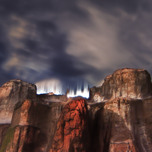
    <figcaption style="font-size: 0.98rem; color: #64748b;">Sample 1</figcaption>
  </figure>
  <figure style="margin: 0; text-align: center; width: 19%;">
    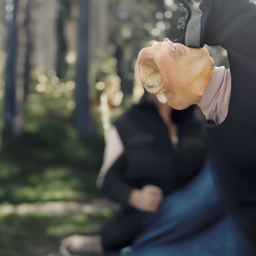
    <figcaption style="font-size: 0.98rem; color: #64748b;">Sample 2</figcaption>
  </figure>
  <figure style="margin: 0; text-align: center; width: 19%;">
    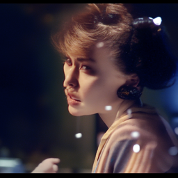
    <figcaption style="font-size: 0.98rem; color: #64748b;">Sample 3</figcaption>
  </figure>
  <figure style="margin: 0; text-align: center; width: 19%;">
    
    <figcaption style="font-size: 0.98rem; color: #64748b;">Sample 4</figcaption>
  </figure>
  <figure style="margin: 0; text-align: center; width: 19%;">
    
    <figcaption style="font-size: 0.98rem; color: #64748b;">Sample 5</figcaption>
  </figure>
</div>
<p style="text-align: center; color: #64748b; font-size: 1.08rem;">
  <b>Figure 10:</b> Five images sampled from the diffusion model by starting from pure noise and denoising with the prompt "a high quality photo".
</p>

<h3 id="required-part-1">Part A.6: Classifier Free Guidance</h3>
<p style="margin: 0 0 10px; color: #334155;">
To perform CFG, we calculate the alpha_cumprod, alpha_cumprod_prev, alpha, and beta values, then we get the conditional and unconditional noise estimates by passing the respective prompts into stage 1 of the UNet. We then split the estimate into noise and variance estimate for the conditional output, and get the unconditional noise estimate for the unconditional output. Using the given equation 4, we are able to calculate the final noise estimate via:

noise_est = uncond_noise_est + scale * (noise_est - uncond_noise_est)

Then we use the DDPM equations to calculate pred_prev image and add the variance to it. 

This gives us the following images:
<div style="margin: 32px 0; display: flex; flex-direction: row; justify-content: center; align-items: flex-start; gap: 16px;">
  <figure style="margin: 0; text-align: center; width: 19%;">
    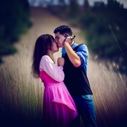
    <figcaption style="font-size: 0.98rem; color: #64748b;">Sample 1</figcaption>
  </figure>
  <figure style="margin: 0; text-align: center; width: 19%;">
    
    <figcaption style="font-size: 0.98rem; color: #64748b;">Sample 2</figcaption>
  </figure>
  <figure style="margin: 0; text-align: center; width: 19%;">
    
    <figcaption style="font-size: 0.98rem; color: #64748b;">Sample 3</figcaption>
  </figure>
  <figure style="margin: 0; text-align: center; width: 19%;">
    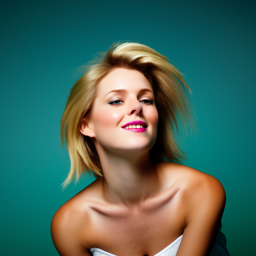
    <figcaption style="font-size: 0.98rem; color: #64748b;">Sample 4</figcaption>
  </figure>
  <figure style="margin: 0; text-align: center; width: 19%;">
    
    <figcaption style="font-size: 0.98rem; color: #64748b;">Sample 5</figcaption>
  </figure>
</div>
<p style="text-align: center; color: #64748b; font-size: 1.08rem;">
  <b>Figure 11:</b> Five images sampled from the diffusion model via CFG process using 'a high quality photo' prompt and null prompt for unconditional.
</p>

<h3 id="required-part-1">Part A.7: Image-to-Image Translation</h3>
<p style="margin: 0 0 10px; color: #334155;">
Using the same iterative_denoise_cfg function from the previous section, we can perform image-to-image translation by iterating through the noise levels provided, passing the image we want to translate through the forward function, then passing that into the iterative_denoise_cfg along with the noise level info, the cond and uncond prompt, and the timesteps. This allows us to translate images like the Campanille example shown below:
<div style="margin: 32px 0; display: flex; flex-direction: row; justify-content: center; align-items: flex-start; gap: 16px;">
  <figure style="margin: 0; text-align: center; width: 19%;">
    
    <figcaption style="font-size: 0.98rem; color: #64748b;">Level 1</figcaption>
  </figure>
  <figure style="margin: 0; text-align: center; width: 19%;">
    
    <figcaption style="font-size: 0.98rem; color: #64748b;">Level 3</figcaption>
  </figure>
  <figure style="margin: 0; text-align: center; width: 19%;">
    
    <figcaption style="font-size: 0.98rem; color: #64748b;">Level 5</figcaption>
  </figure>
  <figure style="margin: 0; text-align: center; width: 19%;">
    
    <figcaption style="font-size: 0.98rem; color: #64748b;">Level 7</figcaption>
  </figure>
  <figure style="margin: 0; text-align: center; width: 19%;">
    
    <figcaption style="font-size: 0.98rem; color: #64748b;">Level 10</figcaption>
  </figure>
   <figure style="margin: 0; text-align: center; width: 19%;">
    
    <figcaption style="font-size: 0.98rem; color: #64748b;">Level 20</figcaption>
  </figure>
  <figure style="margin: 0; text-align: center; width: 19%;">
    
    <figcaption style="font-size: 0.98rem; color: #64748b;">Original</figcaption>
  </figure>
</div>
<p style="text-align: center; color: #64748b; font-size: 1.08rem;">
  <b>Figure 12:</b> Campanille Image-to-Image Translation shown at noise levels: [1, 3, 5, 7, 10, 20]
</p>
<div style="margin: 32px 0; display: flex; flex-direction: row; justify-content: center; align-items: flex-start; gap: 16px;">
  <figure style="margin: 0; text-align: center; width: 19%;">
    
    <figcaption style="font-size: 0.98rem; color: #64748b;">Level 1</figcaption>
  </figure>
  <figure style="margin: 0; text-align: center; width: 19%;">
    
    <figcaption style="font-size: 0.98rem; color: #64748b;">Level 3</figcaption>
  </figure>
  <figure style="margin: 0; text-align: center; width: 19%;">
    
    <figcaption style="font-size: 0.98rem; color: #64748b;">Level 5</figcaption>
  </figure>
  <figure style="margin: 0; text-align: center; width: 19%;">
    
    <figcaption style="font-size: 0.98rem; color: #64748b;">Level 7</figcaption>
  </figure>
  <figure style="margin: 0; text-align: center; width: 19%;">
    
    <figcaption style="font-size: 0.98rem; color: #64748b;">Level 10</figcaption>
  </figure>
  <figure style="margin: 0; text-align: center; width: 19%;">
    
    <figcaption style="font-size: 0.98rem; color: #64748b;">Level 20</figcaption>
  </figure>
  <figure style="margin: 0; text-align: center; width: 19%;">
    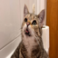
    <figcaption style="font-size: 0.98rem; color: #64748b;">Original</figcaption>
  </figure>
</div>
<p style="text-align: center; color: #64748b; font-size: 1.08rem;">
  <b>Figure 13:</b> Custom Image #1 Image-to-Image Translation shown at noise levels: [1, 3, 5, 7, 10, 20]
</p>


<div style="margin: 32px 0; display: flex; flex-direction: row; justify-content: center; align-items: flex-start; gap: 16px;">
  <figure style="margin: 0; text-align: center; width: 19%;">
    
    <figcaption style="font-size: 0.98rem; color: #64748b;">Level 1</figcaption>
  </figure>
  <figure style="margin: 0; text-align: center; width: 19%;">
    
    <figcaption style="font-size: 0.98rem; color: #64748b;">Level 3</figcaption>
  </figure>
  <figure style="margin: 0; text-align: center; width: 19%;">
    
    <figcaption style="font-size: 0.98rem; color: #64748b;">Level 5</figcaption>
  </figure>
  <figure style="margin: 0; text-align: center; width: 19%;">
    
    <figcaption style="font-size: 0.98rem; color: #64748b;">Level 7</figcaption>
  </figure>
  <figure style="margin: 0; text-align: center; width: 19%;">
    
    <figcaption style="font-size: 0.98rem; color: #64748b;">Level 10</figcaption>
  </figure>
  <figure style="margin: 0; text-align: center; width: 19%;">
    
    <figcaption style="font-size: 0.98rem; color: #64748b;">Level 20</figcaption>
  </figure>
  <figure style="margin: 0; text-align: center; width: 19%;">
    
    <figcaption style="font-size: 0.98rem; color: #64748b;">Original</figcaption>
  </figure>
</div>
<p style="text-align: center; color: #64748b; font-size: 1.08rem;">
  <b>Figure 14:</b> Custom Image #2 Image-to-Image Translation shown at noise levels: [1, 3, 5, 7, 10, 20]
</p>

<h3 id="required-part-1">Part A.7.1: Editing Hand-Drawn and Web Images</h3>
<p style="margin: 0 0 10px; color: #334155;">
We can use the same strategy to edit images from the web or my horribly drawn drawings, as shown in the following figures:


<div style="margin: 32px 0; display: flex; flex-direction: row; justify-content: center; align-items: flex-start; gap: 16px;">
  <figure style="margin: 0; text-align: center; width: 19%;">
    
    <figcaption style="font-size: 0.98rem; color: #64748b;">Level 1</figcaption>
  </figure>
  <figure style="margin: 0; text-align: center; width: 19%;">
    
    <figcaption style="font-size: 0.98rem; color: #64748b;">Level 3</figcaption>
  </figure>
  <figure style="margin: 0; text-align: center; width: 19%;">
    
    <figcaption style="font-size: 0.98rem; color: #64748b;">Level 5</figcaption>
  </figure>
  <figure style="margin: 0; text-align: center; width: 19%;">
    
    <figcaption style="font-size: 0.98rem; color: #64748b;">Level 7</figcaption>
  </figure>
  <figure style="margin: 0; text-align: center; width: 19%;">
    
    <figcaption style="font-size: 0.98rem; color: #64748b;">Level 10</figcaption>
  </figure>
  <figure style="margin: 0; text-align: center; width: 19%;">
    
    <figcaption style="font-size: 0.98rem; color: #64748b;">Level 20</figcaption>
  </figure>
  <figure style="margin: 0; text-align: center; width: 19%;">
    
    <figcaption style="font-size: 0.98rem; color: #64748b;">Original</figcaption>
  </figure>
</div>
<p style="text-align: center; color: #64748b; font-size: 1.08rem;">
  <b>Figure 15:</b> Web Image Editing shown at noise levels: [1, 3, 5, 7, 10, 20]
</p>

<div style="margin: 32px 0; display: flex; flex-direction: row; justify-content: center; align-items: flex-start; gap: 16px;">
  <figure style="margin: 0; text-align: center; width: 19%;">
    
    <figcaption style="font-size: 0.98rem; color: #64748b;">Level 1</figcaption>
  </figure>
  <figure style="margin: 0; text-align: center; width: 19%;">
    
    <figcaption style="font-size: 0.98rem; color: #64748b;">Level 3</figcaption>
  </figure>
  <figure style="margin: 0; text-align: center; width: 19%;">
    
    <figcaption style="font-size: 0.98rem; color: #64748b;">Level 5</figcaption>
  </figure>
  <figure style="margin: 0; text-align: center; width: 19%;">
    
    <figcaption style="font-size: 0.98rem; color: #64748b;">Level 7</figcaption>
  </figure>
  <figure style="margin: 0; text-align: center; width: 19%;">
    
    <figcaption style="font-size: 0.98rem; color: #64748b;">Level 10</figcaption>
  </figure>
  <figure style="margin: 0; text-align: center; width: 19%;">
    
    <figcaption style="font-size: 0.98rem; color: #64748b;">Level 20</figcaption>
  </figure>
  <figure style="margin: 0; text-align: center; width: 19%;">
    
    <figcaption style="font-size: 0.98rem; color: #64748b;">Original</figcaption>
  </figure>
</div>
<p style="text-align: center; color: #64748b; font-size: 1.08rem;">
  <b>Figure 16:</b> Drawing #1 Editing shown at noise levels: [1, 3, 5, 7, 10, 20]
</p>

<div style="margin: 32px 0; display: flex; flex-direction: row; justify-content: center; align-items: flex-start; gap: 16px;">
  <figure style="margin: 0; text-align: center; width: 19%;">
    
    <figcaption style="font-size: 0.98rem; color: #64748b;">Level 1</figcaption>
  </figure>
  <figure style="margin: 0; text-align: center; width: 19%;">
    
    <figcaption style="font-size: 0.98rem; color: #64748b;">Level 3</figcaption>
  </figure>
  <figure style="margin: 0; text-align: center; width: 19%;">
    
    <figcaption style="font-size: 0.98rem; color: #64748b;">Level 5</figcaption>
  </figure>
  <figure style="margin: 0; text-align: center; width: 19%;">
    
    <figcaption style="font-size: 0.98rem; color: #64748b;">Level 7</figcaption>
  </figure>
  <figure style="margin: 0; text-align: center; width: 19%;">
    
    <figcaption style="font-size: 0.98rem; color: #64748b;">Level 10</figcaption>
  </figure>
  <figure style="margin: 0; text-align: center; width: 19%;">
    
    <figcaption style="font-size: 0.98rem; color: #64748b;">Level 20</figcaption>
  </figure>
  <figure style="margin: 0; text-align: center; width: 19%;">
    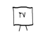
    <figcaption style="font-size: 0.98rem; color: #64748b;">Original</figcaption>
  </figure>
</div>
<p style="text-align: center; color: #64748b; font-size: 1.08rem;">
  <b>Figure 17:</b> Drawing #2 Editing shown at noise levels: [1, 3, 5, 7, 10, 20]
</p>
<h3 id="required-part-1">Part A.7.2: Inpainting</h3>
<p style="margin: 0 0 10px; color: #334155;">
We can also randomly create square masks of an image, and turn the translation/editing task into an image inpainting task. 

To create the mask, you simply pick how many pixels you want to be masked, calculate an appropriate square, randomly pick an x0, y0 value for the square, then mask appropriately. 

To infill, we run the iterative denoising loop, making sure to pass in i_start. We then run CFG and DDPM, but the key difference is that we forward diffuse the original image to timesteps t and prev-t, which allows us to blend the predicted denoised image only in the masked regions, and the original noisy image in unmasked regions. In effect, this preserves the original content outside of the mask. 

<div style="margin: 32px 0; display: flex; flex-direction: row; justify-content: center; align-items: flex-start; gap: 16px;">
  <figure style="margin: 0; text-align: center; width: 19%;">
    
    <figcaption style="font-size: 0.98rem; color: #64748b;">Level 1</figcaption>
  </figure>
  <figure style="margin: 0; text-align: center; width: 19%;">
    
    <figcaption style="font-size: 0.98rem; color: #64748b;">Level 3</figcaption>
  </figure>
  <figure style="margin: 0; text-align: center; width: 19%;">
    
    <figcaption style="font-size: 0.98rem; color: #64748b;">Level 5</figcaption>
  </figure>
  <figure style="margin: 0; text-align: center; width: 19%;">
    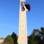
    <figcaption style="font-size: 0.98rem; color: #64748b;">Level 7</figcaption>
  </figure>
  <figure style="margin: 0; text-align: center; width: 19%;">
    
    <figcaption style="font-size: 0.98rem; color: #64748b;">Level 10</figcaption>
  </figure>
  <figure style="margin: 0; text-align: center; width: 19%;">
    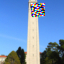
    <figcaption style="font-size: 0.98rem; color: #64748b;">Level 20</figcaption>
  </figure>
  <figure style="margin: 0; text-align: center; width: 19%;">
    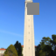
    <figcaption style="font-size: 0.98rem; color: #64748b;">Masked</figcaption>
  </figure>
</div>
<p style="text-align: center; color: #64748b; font-size: 1.08rem;">
  <b>Figure 18:</b> Campanile Infill
</p>

<div style="margin: 32px 0; display: flex; flex-direction: row; justify-content: center; align-items: flex-start; gap: 16px;">
  <figure style="margin: 0; text-align: center; width: 19%;">
    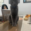
    <figcaption style="font-size: 0.98rem; color: #64748b;">Level 1</figcaption>
  </figure>
  <figure style="margin: 0; text-align: center; width: 19%;">
    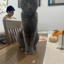
    <figcaption style="font-size: 0.98rem; color: #64748b;">Level 3</figcaption>
  </figure>
  <figure style="margin: 0; text-align: center; width: 19%;">
    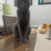
    <figcaption style="font-size: 0.98rem; color: #64748b;">Level 5</figcaption>
  </figure>
  <figure style="margin: 0; text-align: center; width: 19%;">
    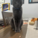
    <figcaption style="font-size: 0.98rem; color: #64748b;">Level 7</figcaption>
  </figure>
  <figure style="margin: 0; text-align: center; width: 19%;">
    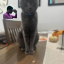
    <figcaption style="font-size: 0.98rem; color: #64748b;">Level 10</figcaption>
  </figure>
  <figure style="margin: 0; text-align: center; width: 19%;">
    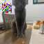
    <figcaption style="font-size: 0.98rem; color: #64748b;">Level 20</figcaption>
  </figure>
  <figure style="margin: 0; text-align: center; width: 19%;">
    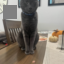
    <figcaption style="font-size: 0.98rem; color: #64748b;">Masked</figcaption>
  </figure>
</div>
<p style="text-align: center; color: #64748b; font-size: 1.08rem;">
  <b>Figure 19:</b> Custom Picture #1 Infill
</p>

<div style="margin: 32px 0; display: flex; flex-direction: row; justify-content: center; align-items: flex-start; gap: 16px;">
  <figure style="margin: 0; text-align: center; width: 19%;">
    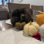
    <figcaption style="font-size: 0.98rem; color: #64748b;">Level 1</figcaption>
  </figure>
  <figure style="margin: 0; text-align: center; width: 19%;">
    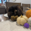
    <figcaption style="font-size: 0.98rem; color: #64748b;">Level 3</figcaption>
  </figure>
  <figure style="margin: 0; text-align: center; width: 19%;">
    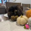
    <figcaption style="font-size: 0.98rem; color: #64748b;">Level 5</figcaption>
  </figure>
  <figure style="margin: 0; text-align: center; width: 19%;">
    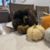
    <figcaption style="font-size: 0.98rem; color: #64748b;">Level 7</figcaption>
  </figure>
  <figure style="margin: 0; text-align: center; width: 19%;">
    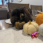
    <figcaption style="font-size: 0.98rem; color: #64748b;">Level 10</figcaption>
  </figure>
  <figure style="margin: 0; text-align: center; width: 19%;">
    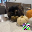
    <figcaption style="font-size: 0.98rem; color: #64748b;">Level 20</figcaption>
  </figure>
  <figure style="margin: 0; text-align: center; width: 19%;">
    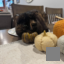
    <figcaption style="font-size: 0.98rem; color: #64748b;">Masked</figcaption>
  </figure>
</div>
<p style="text-align: center; color: #64748b; font-size: 1.08rem;">
  <b>Figure 20:</b> Custom Picture #2 Infill
</p>

<h3 id="required-part-1">Part A.7.3: Text-Conditioned Image-To-Image Translation</h3>
<p style="margin: 0 0 10px; color: #334155;">
Using the same methodology, we can text-condition the translation as shown below:

<div style="margin: 32px 0; display: flex; flex-direction: row; justify-content: center; align-items: flex-start; gap: 16px;">
  <figure style="margin: 0; text-align: center; width: 19%;">
    
    <figcaption style="font-size: 0.98rem; color: #64748b;">Level 1</figcaption>
  </figure>
  <figure style="margin: 0; text-align: center; width: 19%;">
    
    <figcaption style="font-size: 0.98rem; color: #64748b;">Level 3</figcaption>
  </figure>
  <figure style="margin: 0; text-align: center; width: 19%;">
    
    <figcaption style="font-size: 0.98rem; color: #64748b;">Level 5</figcaption>
  </figure>
  <figure style="margin: 0; text-align: center; width: 19%;">
    
    <figcaption style="font-size: 0.98rem; color: #64748b;">Level 7</figcaption>
  </figure>
  <figure style="margin: 0; text-align: center; width: 19%;">
    
    <figcaption style="font-size: 0.98rem; color: #64748b;">Level 10</figcaption>
  </figure>
  <figure style="margin: 0; text-align: center; width: 19%;">
    
    <figcaption style="font-size: 0.98rem; color: #64748b;">Level 20</figcaption>
  </figure>
  <figure style="margin: 0; text-align: center; width: 19%;">
    
    <figcaption style="font-size: 0.98rem; color: #64748b;">Original</figcaption>
  </figure>
</div>
<p style="text-align: center; color: #64748b; font-size: 1.08rem;">
  <b>Figure 21:</b> Campanile to Rocket Ship
</p>

<div style="margin: 32px 0; display: flex; flex-direction: row; justify-content: center; align-items: flex-start; gap: 16px;">
  <figure style="margin: 0; text-align: center; width: 19%;">
    
    <figcaption style="font-size: 0.98rem; color: #64748b;">Level 1</figcaption>
  </figure>
  <figure style="margin: 0; text-align: center; width: 19%;">
    
    <figcaption style="font-size: 0.98rem; color: #64748b;">Level 3</figcaption>
  </figure>
  <figure style="margin: 0; text-align: center; width: 19%;">
    
    <figcaption style="font-size: 0.98rem; color: #64748b;">Level 5</figcaption>
  </figure>
  <figure style="margin: 0; text-align: center; width: 19%;">
    
    <figcaption style="font-size: 0.98rem; color: #64748b;">Level 7</figcaption>
  </figure>
  <figure style="margin: 0; text-align: center; width: 19%;">
    
    <figcaption style="font-size: 0.98rem; color: #64748b;">Level 10</figcaption>
  </figure>
  <figure style="margin: 0; text-align: center; width: 19%;">
    
    <figcaption style="font-size: 0.98rem; color: #64748b;">Level 20</figcaption>
  </figure>
  <figure style="margin: 0; text-align: center; width: 19%;">
    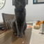
    <figcaption style="font-size: 0.98rem; color: #64748b;">Original</figcaption>
  </figure>
</div>
<p style="text-align: center; color: #64748b; font-size: 1.08rem;">
  <b>Figure 22:</b> Custom Image #1 to Chef
</p>

<div style="margin: 32px 0; display: flex; flex-direction: row; justify-content: center; align-items: flex-start; gap: 16px;">
  <figure style="margin: 0; text-align: center; width: 19%;">
    
    <figcaption style="font-size: 0.98rem; color: #64748b;">Level 1</figcaption>
  </figure>
  <figure style="margin: 0; text-align: center; width: 19%;">
    
    <figcaption style="font-size: 0.98rem; color: #64748b;">Level 3</figcaption>
  </figure>
  <figure style="margin: 0; text-align: center; width: 19%;">
    
    <figcaption style="font-size: 0.98rem; color: #64748b;">Level 5</figcaption>
  </figure>
  <figure style="margin: 0; text-align: center; width: 19%;">
    
    <figcaption style="font-size: 0.98rem; color: #64748b;">Level 7</figcaption>
  </figure>
  <figure style="margin: 0; text-align: center; width: 19%;">
    
    <figcaption style="font-size: 0.98rem; color: #64748b;">Level 10</figcaption>
  </figure>
  <figure style="margin: 0; text-align: center; width: 19%;">
    
    <figcaption style="font-size: 0.98rem; color: #64748b;">Level 20</figcaption>
  </figure>
  <figure style="margin: 0; text-align: center; width: 19%;">
    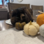
    <figcaption style="font-size: 0.98rem; color: #64748b;">Original</figcaption>
  </figure>
</div>
<p style="text-align: center; color: #64748b; font-size: 1.08rem;">
  <b>Figure 23:</b> Custom Image #2 to Chef
</p>

<h3 id="required-part-1">Part A.8: Visual Anagrams</h3>
<p style="margin: 0 0 10px; color: #334155;">
To make the visual anagrams, we run the UNet with the conditional prompt and unconditional prompt, and calculate the epsilon (ε) via the CFG formula (same as previous parts). The essential part is that you have two prompts p1 and p2, where for each denoising step, you get the noise estimate using p1 on the original image, then flip the image, get the noise estimate using p2 on the flipped image, and flip the noise estimate back. Finally, you average the two noise estimates and run a DDPM update with the averaged epsilon value. 

This creates visual anagrams like shown below:
<p style="margin: 32px 0; display: flex; flex-direction: row; justify-content: center; align-items: flex-start; gap: 20px;">
  
  
</p>
<p style="text-align: center; color: #64748b; font-size: 1.08rem;">
  <b>Figure 24:</b> Prompt used: "a photo of a mountain lake at sunrise" and "a high quality picture of a sports car" 
</p>
<p style="margin: 32px 0; display: flex; flex-direction: row; justify-content: center; align-items: flex-start; gap: 20px;">
  
  
</p>
<p style="text-align: center; color: #64748b; font-size: 1.08rem;">
  <b>Figure 25:</b> Prompt used: "a pencil drawing of a flower in a vase" and "a high quality photo of a forest path"
</p>


<h3 id="required-part-1">Part A.9: Hybrid Images</h3>
<p style="margin: 0 0 10px; color: #334155;">
Similar to the previous part, we use a two-prompt method, where one prompt provides the low-frequency structure, and the second provides the high-frequency details. For each denoising step, we get noise estimates for each prompt on the same image. Then we take an LPF of both noise estimates. We calculate the high frequencies of the second noise estimate by taking the original second noise estimate and subtracting it from its respective low-frequency version. We then combine the low-frequency first noise estimate and high-frequency second noise estimate to get our final epsilon value. Then we perform a standard DDPM denoising step.
<p style="margin: 32px 0; display: flex; flex-direction: row; justify-content: center; align-items: flex-start; gap: 20px;">
  
  
</p>
<p style="text-align: center; color: #64748b; font-size: 1.08rem;">
  <b>Figure 26:</b> Left Image used prompts: "a photo of a woman wearing headphones" and "a photo of a cat sitting on a windowsill", Right Image used prompts: "a photo of a smiling child" and "a photo of a couple walking in the rain"
</p>


<h2 id="required-part-1">Section B</h2>

<h3 id="required-part-1">Part B.1.2: Using the UNet to Train a Denoiser</h3>
<p style="margin: 0 0 10px; color: #334155;">
To carry out the noise process, we sample random noise in the same data shape as the MNIST data, then clamp the input + noise * sigma to a [0.0, 1.0] range to ensure proper normalization/visualization. The figure below visualizes the noising process using sigma values of [0.0, 0.2, 0.4, 0.5, 0.6, 0.8, 1.0]:
<p style="margin: 32px 0; display: flex; flex-direction: row; justify-content: center;">
  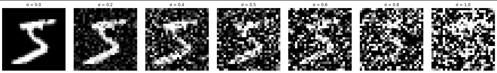
</p>
<p style="text-align: center; color: #64748b; font-size: 1.08rem;">
  <b>Figure 27:</b> Visualization of the noising process for MNIST digits at sigma values [0.0, 0.2, 0.4, 0.5, 0.6, 0.8, 1.0].
</p>

<h3 id="required-part-1">Part B.1.2.1: Setup</h3>
<p style="margin: 0 0 10px; color: #334155;">
After training this initial attempt at a UNet denoiser, we can sample at the end of Epoch 1 and 5, and get the following sampled results:
<p style="margin: 32px 0; display: flex; flex-direction: row; justify-content: center; align-items: flex-start; gap: 24px;">
  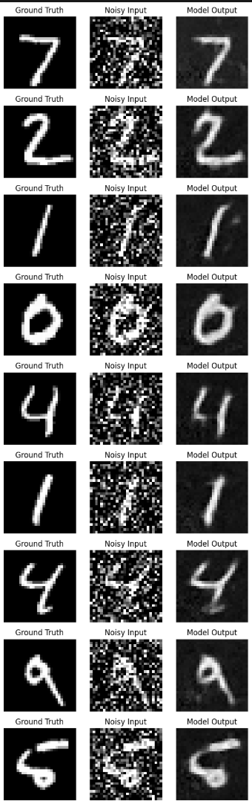
  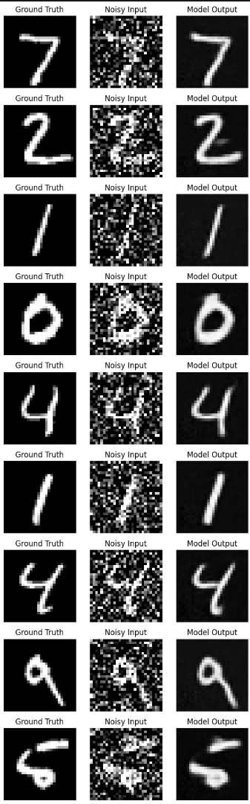
</p>
<p style="text-align: center; color: #64748b; font-size: 1.08rem;">
  <b>Figure 28:</b> Samples generated by the UNet denoiser after epoch 1 (left) and after epoch 5 (right).
</p>
After the full training process, we are left with a training loss curve that looks like:
<p style="margin: 32px 0; display: flex; flex-direction: row; justify-content: center;">
  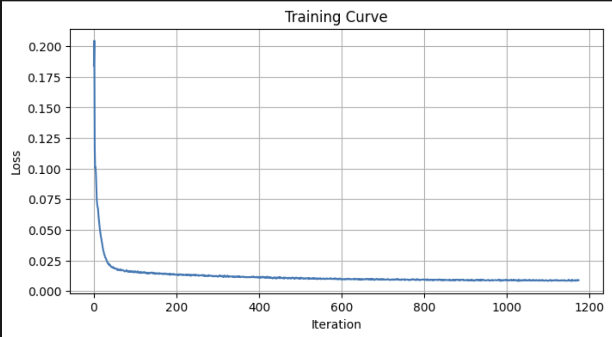
</p>
<p style="text-align: center; color: #64748b; font-size: 1.08rem;">
  <b>Figure 29:</b> UNet Denoiser training loss curve over epochs.
</p>
<h3 id="required-part-1">Part B.1.2.2: Out-of-Distribution Testing</h3>
<p style="margin: 0 0 10px; color: #334155;">
Since the UNet was only trained on data with sigma=0.5 noise, when we visualize its output for other noise values, we see sub-optimal results:
<p style="margin: 32px 0; display: flex; flex-direction: row; justify-content: center;">
  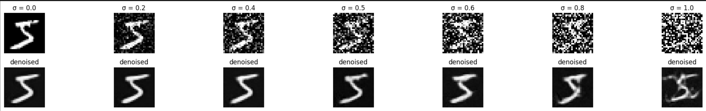
</p>
<p style="text-align: center; color: #64748b; font-size: 1.08rem;">
  <b>Figure 30:</b> Visualization of the UNet denoiser outputs on out-of-distribution noise levels.
</p>

<h3 id="required-part-1">Part B.1.2.3: Denoising Pure Noise</h3>
<p style="margin: 0 0 10px; color: #334155;">
When using the same model for denoising pure noise, we see an interesting relationship emerge where it essentially produces an output that looks like a stack of all digits 0 through 9, which appears as a blob (as seen in the figures below). Since each digit has equal probability to be formed from the random noise, the model tries to create an amalgamation of all the digits in its training data, which can be seen in the samples visualized below.
<p style="margin: 32px 0; display: flex; flex-direction: column; justify-content: center; align-items: center; gap: 24px;">
  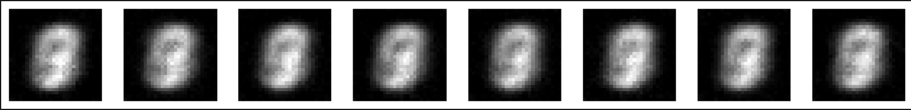
  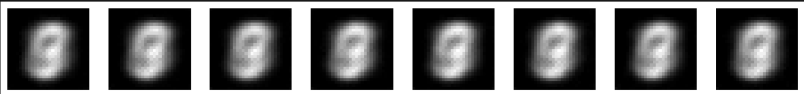
</p>
<p style="text-align: center; color: #64748b; font-size: 1.08rem;">
  <b>Figure 31:</b> UNet Denoiser samples from pure noise at the end of epoch 1 (top) and epoch 5 (bottom).
</p>

The model's weights do converge, as can be seen in the loss plot below, just the output is not what we want, simply due to the problem construction. This leads us to the methods we use in the next sections.
<p style="margin: 32px 0; display: flex; flex-direction: row; justify-content: center;">
  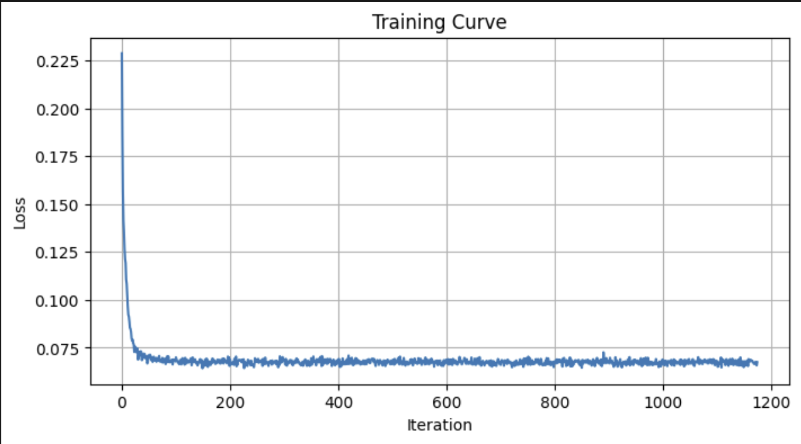
</p>
<p style="text-align: center; color: #64748b; font-size: 1.08rem;">
  <b>Figure 32:</b> Loss curve for pure noise denoising with the UNet model.
</p>

<h3 id="required-part-1">Part B.2.2: Training the UNet</h3>
<p style="margin: 0 0 10px; color: #334155;">
Adding time-conditioning to the UNet architecture better constrains the generation task, and loss converges rapidly, while beginning to give us the flow-matching setup that we would like to see.
<p style="margin: 32px 0; display: flex; flex-direction: row; justify-content: center;">
  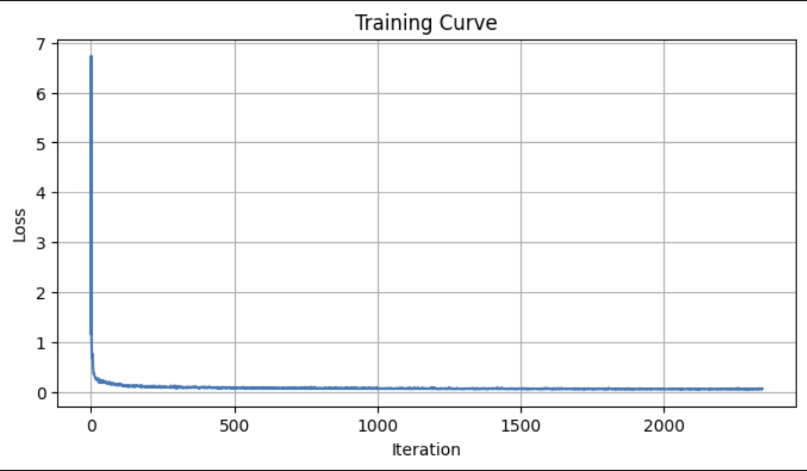
</p>
<p style="text-align: center; color: #64748b; font-size: 1.08rem;">
  <b>Figure 33:</b> Loss curve for time-conditioned UNet during training.
</p>

<h3 id="required-part-1">Part B.2.3: Sampling from the UNet</h3>
<p style="margin: 0 0 10px; color: #334155;">
Using the algorithm provided in the project spec, the sampling process is fairly straightforward with the already trained time-conditioned UNet from the previous step. We can see that the results are already quite a lot better than the previous UNet sampling visualizations, just from this minor modification of time conditioning. This allows us to sample the time-conditioned UNet at various epochs as visualized below:
<p style="margin: 32px 0; display: flex; flex-direction: column; justify-content: center; align-items: center; gap: 24px;">
  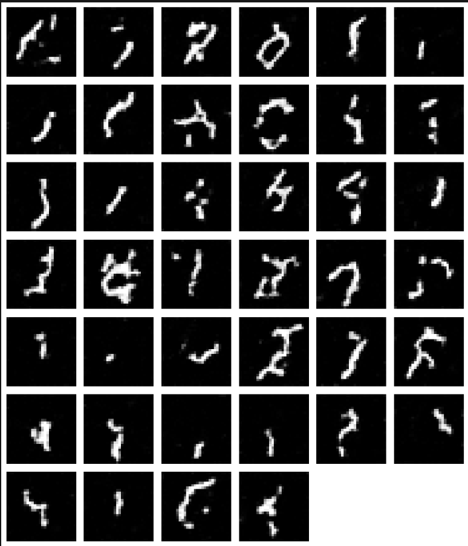
  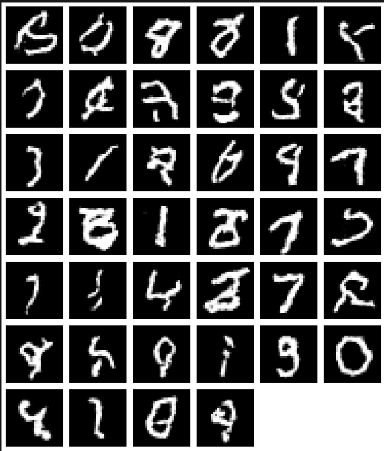
  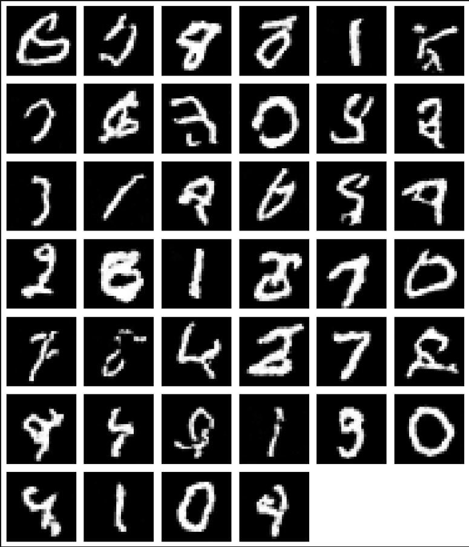
</p>
<p style="text-align: center; color: #64748b; font-size: 1.08rem;">
  <b>Figure 34:</b> Samples generated from the time-conditioned UNet at epoch 1 (top), epoch 5 (middle), and epoch 10 (bottom).
</p>

<h3 id="required-part-1">Part B.2.5: Training the UNet</h3>
<p style="margin: 0 0 10px; color: #334155;">
Using the class-conditioned UNet formulation, we are able to train the model over 10 epochs, giving the following training loss curve, where the model's loss quickly converges:
<p style="margin: 32px 0; display: flex; flex-direction: row; justify-content: center;">
  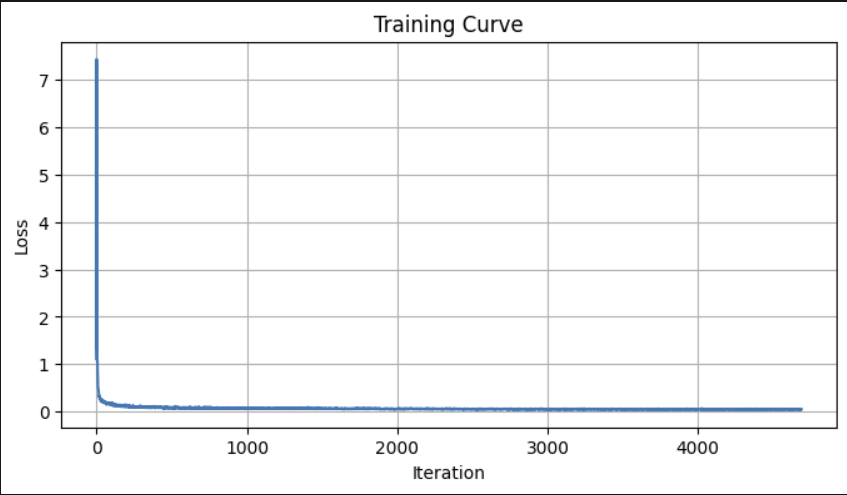
</p>
<p style="text-align: center; color: #64748b; font-size: 1.08rem;">
  <b>Figure 35:</b> Loss curve for class-conditioned UNet during training.
</p>

<h3 id="required-part-1">Part B.2.6: Sampling from the UNet</h3>
<p style="margin: 0 0 10px; color: #334155;">
Once the Class-conditioned UNet is trained, we are able to sample from it over 1, 5, and 10 epochs as requested. Compared to the only time-conditioned UNet model, we can see a significant improvement, even in first epoch convergence. By epoch 10, the model outputs are quite close to MNIST dataset visual style. 
<p style="margin: 32px 0; display: flex; flex-direction: column; justify-content: center; align-items: center; gap: 24px;">
  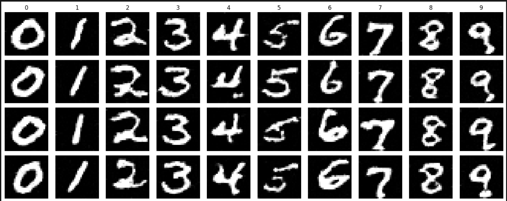
  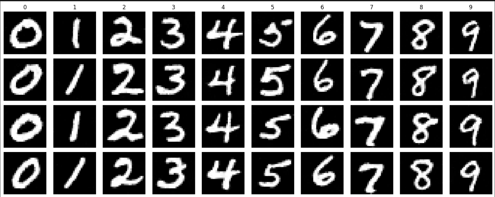
  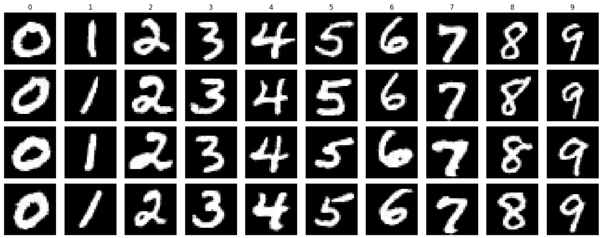
</p>
<p style="text-align: center; color: #64748b; font-size: 1.08rem;">
  <b>Figure 36:</b> Samples generated from the class-conditioned UNet at epoch 1 (top), epoch 5 (middle), and epoch 10 (bottom).
</p>

Furthermore, I was able to remove the ExponentialLR Scheduler by changing the optimizer from Adam to AdamW, which has been shown to have better convergence for UNets in general. This results in the same visual quality, while converging relatively quickly as can be seen below:

<p style="margin: 32px 0; display: flex; flex-direction: row; justify-content: center;">
  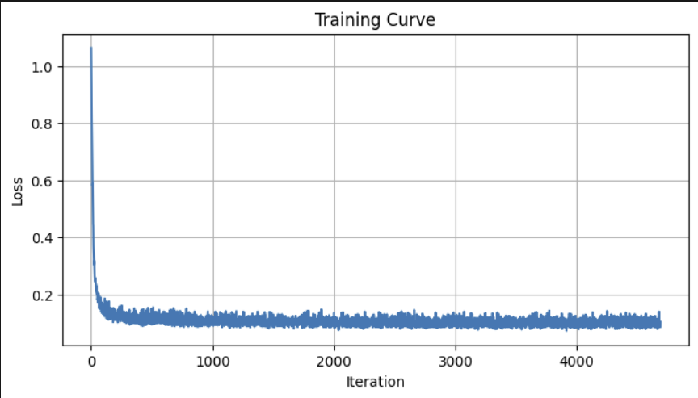
</p>
<p style="text-align: center; color: #64748b; font-size: 1.08rem;">
  <b>Figure 37:</b> Loss curve for class-conditioned UNet trained without scheduler during training.
</p>
<p style="margin: 32px 0; display: flex; flex-direction: column; justify-content: center; align-items: center; gap: 24px;">
  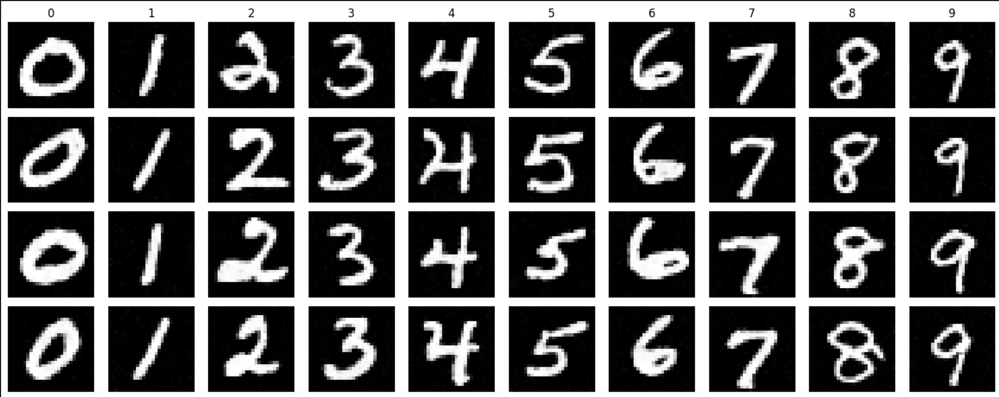
</p>
<p style="text-align: center; color: #64748b; font-size: 1.08rem;">
  <b>Figure 38:</b> Samples generated from the class-conditioned UNet trained without the scheduler at epoch 5.
</p>